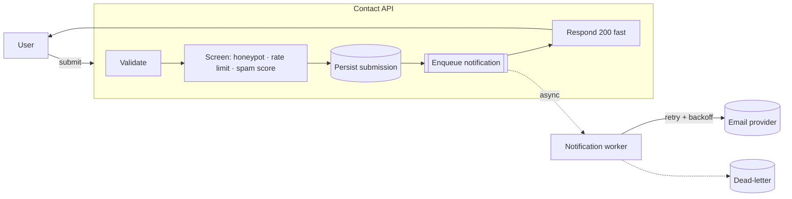
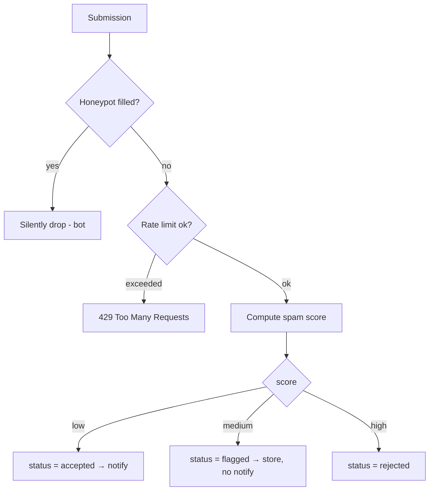
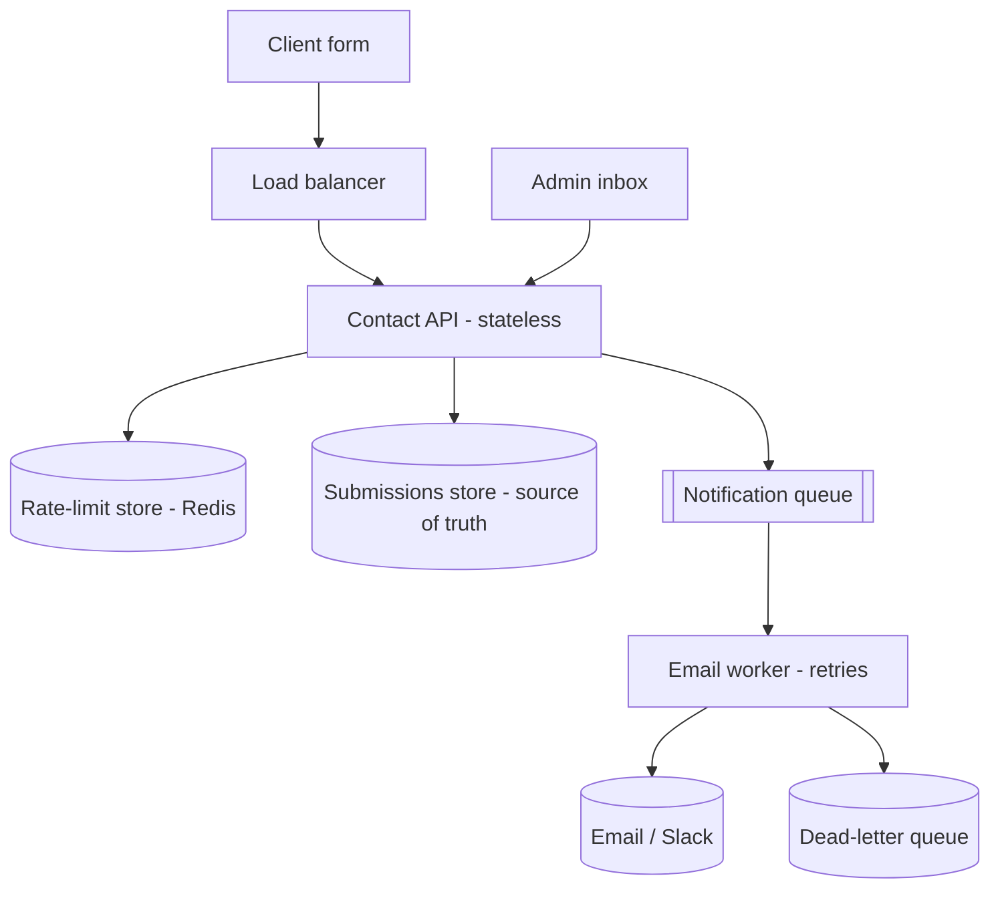

# 24. Design a Contact Form Submission System

> **In one line:** Design the pipeline behind a "Contact us" form — validate the input, stop spam and
> abuse (honeypot + rate limit + content scoring), persist the submission durably, then **asynchronously**
> notify the team — with idempotency so a double-click doesn't create duplicates and a status you can
> track.

> **Original prompt:** Build an endpoint that accepts a contact form, validates it, stores it, and
> triggers a notification (e.g. email) to the team.

## Overview

A contact form looks trivial — "take a name, email, message and send an email" — but it's a **public,
unauthenticated write endpoint**, which makes it a magnet for **spam and abuse**, and the naive version
(send the email inline) is **slow and fragile**: if the mail provider is down or rate-limits you, the
user sees a 500 and may resubmit, creating duplicates. Doing it well is a small but complete distributed
systems problem.

The pipeline is: **validate → screen for spam/abuse → persist → enqueue notification → respond fast**,
with the actual email sent by a **background worker** with retries. Persisting *before* notifying means a
submission is never lost even if email delivery fails.

This write-up covers:

- **Validation** at the boundary (name/email/message, length caps).
- **Spam & abuse defense** — honeypot field, per-IP/email **rate limiting**, and a lightweight
  **content spam score** (with CAPTCHA as the escalation).
- **Durability & decoupling** — persist first, then **enqueue** an async notification (don't send inline).
- **Idempotency** — a client key so retries/double-clicks don't duplicate.
- **Ops** — submission status, admin listing, PII handling, and how it scales.

It ships a runnable implementation in [`./implementation/`](./implementation/): a **NestJS + Zod** service
with validation, a **honeypot**, a **sliding-window per-IP rate limiter**, a **spam scorer**, idempotent
persistence, and an **async notification queue** (simulated email worker with retries) — plus a **Next.js
+ React + Redux Toolkit** app with the public contact form and an admin inbox showing status and spam
flags.

## Functional Requirements

1. Accept a submission: **name, email, message** (+ optional subject), validated.
2. **Screen** each submission: honeypot, rate limit, and a spam score → `accepted` / `flagged` / `rejected`.
3. **Persist** every accepted/flagged submission durably (source of truth).
4. **Notify** the team **asynchronously** (queue → email worker with retries); never block the response.
5. **Idempotency** — a client-supplied key collapses duplicate submits into one record.
6. Expose **status** of a submission and an **admin list** (filter by status/spam).

## Non-Functional Requirements

| Attribute | Target / approach |
|---|---|
| **Fast response** | Respond in ms after persist+enqueue; email happens in the background |
| **Durability** | An accepted submission is never lost even if the mailer is down (persist-first) |
| **Abuse resistance** | Honeypot + rate limit + spam score; CAPTCHA escalation; bounded sizes |
| **Idempotency** | Duplicate submits (retry/double-click) don't create duplicate records or emails |
| **Deliverability** | Notification retried with backoff → dead-letter after N tries |
| **Privacy** | PII minimized, access-controlled, retained per policy |
| **Scalability** | Stateless API + shared rate-limit store + queue; scales horizontally |

## A Realistic Interview Conversation

> **I** = Interviewer, **C** = Candidate.

**I:** Design the backend for a "Contact us" form.

**C:** The endpoint is **public and unauthenticated**, so two things dominate: **abuse resistance** and
**not losing submissions**. The pipeline is: **validate** the input, **screen** it for spam/abuse,
**persist** it as the source of truth, then **enqueue** an async notification and respond fast. The email
is sent by a **background worker**, not inline.

**I:** Why not just send the email in the request?

**C:** Because email is a slow, flaky external dependency. If I send inline and the provider is down or
throttling, the user gets a 500 and resubmits — now I've got duplicates *and* an unhappy user. If I
**persist first, then enqueue**, the submission is safe the moment it's stored; the worker retries
delivery with backoff and dead-letters after N attempts. The user gets an instant 200.

**I:** How do you stop spam?

**C:** Layered, cheapest-first. **(1) Honeypot** — a hidden field real users never fill; if it's set,
it's a bot → silently drop. **(2) Rate limiting** per IP (and per email) with a sliding window, so one
source can't flood. **(3) A content spam score** — heuristics like too many links, all-caps, known spam
phrases, gibberish, or a mismatched/disposable email domain; above a threshold I **flag** (store but
don't notify) or **reject**. **(4) CAPTCHA** as an escalation when the score is borderline or rate is
high. I keep good submissions frictionless and only add friction when signals are bad.

**I:** Honeypot vs CAPTCHA?

**C:** Honeypot is **invisible** and free — no user friction — and catches naive bots. CAPTCHA adds
friction and hurts conversion/accessibility, so I reserve it for **suspicious** cases. Defense in depth:
honeypot + rate limit always on; CAPTCHA conditionally.

**I:** How do you make it idempotent?

**C:** The client generates an **idempotency key** (a UUID) per form instance and sends it; the server
**upserts** on that key, so a double-click or a retry after a network blip returns the *same* record
instead of creating a second one — and only enqueues **one** notification. Without a key I'd fall back to
a short-window dedupe on (email + message hash).

**I:** What's the data model?

**C:** A `submissions` record: `id`, `name`, `email`, `subject`, `message`, `status`
(`accepted|flagged|rejected`), `spamScore`, `ip`, `idempotencyKey` (unique), `notificationStatus`
(`queued|sent|failed`), timestamps. The queue holds notification jobs referencing the submission id.

**I:** Privacy?

**C:** It's **PII** (name, email, message, IP). Minimize what I collect, **access-control** the admin
view, encrypt at rest/in transit, set a **retention** policy (auto-delete after N days), and support
deletion requests. Don't log full message bodies with PII.

**I:** How does it scale?

**C:** The API is **stateless** → scale horizontally behind a load balancer. The rate limiter needs a
**shared store** (Redis) so limits hold across instances. The notification queue (SQS/BullMQ) decouples
spikes — a burst becomes queue depth, and workers drain it. The DB write is the only synchronous
dependency; it's a cheap insert.

## What & Why: persist-first, notify-async



The synchronous path ends at **persist + enqueue**; delivery is decoupled, so a slow/broken mailer never
blocks the user or loses the message.

## Screening Pipeline (cheapest checks first)



## High-Level Design (HLD)



Related: [Rate Limiting](../../05-reliability-performance-and-modern-concepts/02-rate-limiting.md),
[Message Queue](../../04-messaging-and-communication-concepts/01-message-queue.md),
[Dead-Letter Queue](../../04-messaging-and-communication-concepts/03-dead-letter-queue.md),
[Idempotency](../../03-distributed-systems-concepts/07-idempotency.md),
[Idempotency Key](../../03-distributed-systems-concepts/08-idempotency-key.md).

## Low-Level Design (LLD)

### Submission record

```text
Submission {
  id, name, email, subject?, message,
  status: 'accepted' | 'flagged' | 'rejected',
  spamScore: number,               // 0..100
  spamReasons: string[],
  ip: string,
  idempotencyKey: string (unique),
  notificationStatus: 'queued' | 'sent' | 'failed' | 'skipped',
  createdAt, updatedAt
}
```

### Submit algorithm

```text
submit(input, ip, idempotencyKey):
  if idempotencyKey seen → return existing submission        # idempotent
  validate(input)                                            # 400 on bad shape
  if input.website (honeypot) not empty → return {accepted, silently dropped}
  if !rateLimiter.allow(ip) → 429                            # sliding window
  { score, reasons } = spamScore(input)
  status = score >= REJECT ? 'rejected'
         : score >= FLAG   ? 'flagged'
         : 'accepted'
  persist(submission)                                        # source of truth
  if status === 'accepted' → queue.enqueue(notify, submissionId)
  return submission                                          # fast response
```

### Spam scoring (lightweight heuristics)

```text
score = 0
+ links > 2                       → +30   (link farms)
+ ALL CAPS ratio high             → +15
+ known spam phrases              → +25   ("free money", "viagra", "SEO services")
+ message too short / gibberish   → +20
+ disposable / mismatched email   → +20
reasons[] collected for transparency; thresholds: FLAG=40, REJECT=70
```

Real systems add Bayesian filters / ML and reputation lists; heuristics are the transparent baseline.

### Rate limiting (sliding window per IP)

```text
allow(ip):
  window = last RATE_WINDOW_MS of timestamps for ip
  if window.length >= RATE_MAX → false
  record now; return true
```

### Service contracts (implemented here)

```text
submit(input, ip, idemKey)      → submission (idempotent, screened, persisted, maybe enqueued)
list({ status?, spam? })        → submissions (admin)
get(id)                         → submission + notification status
notificationWorker             → drains queue, "sends", retries w/ backoff → sent | failed
stats() / reset()
```

### Project structure

```text
server/src/
├── contact/
│   ├── contact.types.ts     # Submission, Zod schema (honeypot field), thresholds
│   ├── rate-limiter.ts      # sliding-window per-IP limiter
│   ├── spam.ts              # spamScore(input) → { score, reasons }
│   ├── contact.service.ts   # the submit pipeline + idempotency + persistence   ← the core
│   ├── notifier.ts          # async queue + worker (simulated email, retries)
│   └── contact.controller.ts# POST /contact, GET /contact (admin), GET /contact/:id, stats, reset
└── main.ts
```

## Security

- **Public write endpoint** → assume abuse. Honeypot + rate limit + spam score + optional CAPTCHA;
  bound field sizes (short name/subject, capped message length) to prevent payload abuse.
- **Injection / stored XSS** → validate + **store raw but escape on render**; never interpolate the
  message into HTML emails unescaped (HTML-injection / phishing via your own domain).
- **Header/IP spoofing** → derive the client IP from a trusted proxy config (`X-Forwarded-For` only when
  behind your LB), not blindly.
- **PII** → minimize, encrypt at rest/in transit, access-control the admin view, set **retention** +
  deletion; keep message bodies out of logs.
- **Email bombing / SSRF** → the worker sends only to *your* team address, never to a user-controlled
  recipient; rate-limit outbound.
- **Idempotency key** must be unguessable/namespaced so one user can't clobber another's record.

## Scaling & Performance

- **Stateless API** behind a load balancer → scale horizontally.
- **Shared rate-limit store** (Redis) so limits hold across instances; sliding window or token bucket.
- **Queue decouples spikes** — a burst becomes queue depth; workers drain with retries + DLQ (see
  [problem 13](../13-simple-job-queue/13-simple-job-queue.md)).
- **DB write is the only sync dependency** — a cheap insert; index `idempotencyKey` (unique) and
  `createdAt`/`status` for the admin list.
- **CDN/edge** for the form assets; the endpoint itself is tiny.
- **Backpressure** — if the queue backs up, still accept + persist (never drop a real message); shed only
  obvious spam.

## All Solution Patterns (summary)

| Concern | Options | Chosen here | Why |
|---|---|---|---|
| Notify | inline send · **persist + async queue** | Persist-first + queue | Durable, fast, retryable |
| Spam | none · honeypot · rate limit · score · CAPTCHA | **Honeypot + rate limit + score** (+ CAPTCHA note) | Layered, low friction |
| Duplicates | none · **idempotency key** · dedupe hash | Idempotency key | Exactly-one record |
| Rate limit | fixed window · **sliding window** · token bucket | Sliding window per IP | Smooth, simple |
| Delivery | best-effort · **retry + backoff + DLQ** | Retry + DLQ | Deliverability |
| Storage | fire-and-forget · **persist source of truth** | Persist first | Never lose a message |

## Implementation

A runnable full-stack implementation lives in [`./implementation/`](./implementation/):

| Layer | Stack | Highlights |
|---|---|---|
| **`server/`** | NestJS + Zod | The full pipeline: validation, **honeypot**, **sliding-window per-IP rate limit**, **spam scoring** (transparent reasons), **idempotent** persistence, and an **async notification queue** with a simulated email worker that retries + dead-letters. Admin list + stats. |
| **`web/`** | Next.js + React + Redux Toolkit (RTK Query) | A public **contact form** (with a hidden honeypot + client idempotency key) showing accepted/flagged/rate-limited outcomes, and an **admin inbox** listing submissions with status, spam score/reasons, and notification state. |

| Design element | Where in the code |
|---|---|
| Submit pipeline + idempotency | `server/src/contact/contact.service.ts` |
| Sliding-window rate limiter | `server/src/contact/rate-limiter.ts` |
| Spam scorer (reasons) | `server/src/contact/spam.ts` |
| Async notification queue + worker | `server/src/contact/notifier.ts` |
| Contact form + admin inbox | `web/src/components/*` + `store/contactApi.ts` |

The backend is verified by an **end-to-end test**: a clean submission is **accepted**, **persisted**, and
a notification is **enqueued then delivered**; a **honeypot**-filled submission is silently dropped;
exceeding the **rate limit** returns 429; a spammy message is **flagged/rejected** with reasons; a
repeated **idempotency key** returns the same record (no duplicate, one notification); and the worker
**retries** a failing send.

## Tips

- **Persist first, notify async** — the DB write is the commit point, email is best-effort with retries.
- Layer spam defenses **cheapest-first**: honeypot → rate limit → score → CAPTCHA.
- Make it **idempotent** with a client key so double-clicks/retries don't duplicate.
- Treat submissions as **PII**: minimize, protect, retain-then-delete.
- Escape the message on render/email — store raw, never inject as HTML.

## Trade-offs & Pitfalls

- **Sending email inline** couples the response to a flaky dependency → timeouts, 500s, resubmits.
- **No idempotency** → double-clicks and retries create duplicate records and duplicate emails.
- **CAPTCHA everywhere** kills conversion/accessibility — reserve it for suspicious traffic.
- **In-memory rate limits** don't hold across instances — use a shared store in production.
- **Trusting `X-Forwarded-For`** blindly lets attackers spoof the IP and bypass limits.
- **Logging full messages** leaks PII; **HTML-injecting** the message enables phishing from your domain.

## System Design Cheat Sheet

```text
1.  PUBLIC?      unauthenticated write → assume spam/abuse; defend in layers
2.  PIPELINE?    validate → screen → PERSIST → enqueue notify → respond fast
3.  ASYNC?       never send email inline; worker retries + backoff → DLQ
4.  SPAM?        honeypot (free) → rate limit (per IP) → spam score → CAPTCHA (escalate)
5.  IDEMPOTENT?  client key → upsert; one record, one notification on retry/double-click
6.  DATA?        submission = source of truth; status accepted|flagged|rejected + notifStatus
7.  PII?         minimize, encrypt, access-control, retain-then-delete; keep out of logs
8.  SCALE?       stateless API + shared rate-limit store + queue; DB insert is the only sync dep
9.  SECURE?      escape on render, send only to your address, trust IP only behind your LB
```
