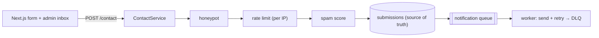

# Contact Form Submission System — full-stack implementation

A runnable version of the [design write-up](../24-contact-form-submission-system.md): a public submit
endpoint runs a **validate → honeypot → rate limit → spam score → persist → async notify** pipeline, is
**idempotent**, and delivers notifications off the request path with retries + a dead-letter queue.

- **`server/`** — NestJS + Zod. The full pipeline + a simulated email worker. No database.
- **`web/`** — Next.js 14 + Redux Toolkit **RTK Query**: a contact form and an admin inbox.

## Architecture



## Endpoints

| Method | Path | Purpose |
| --- | --- | --- |
| POST | `/contact` | Submit `{ name, email, subject?, message, website? }`; `x-idempotency-key` header dedupes. Honeypot → rejected, rate limit → 429, spam → flagged/rejected. |
| GET | `/contact` | Admin list; `?status=accepted\|flagged\|rejected`, `?spam=true`. |
| GET | `/contact/:id` | One submission (+ notification status). |
| GET | `/stats` | Counts per status + notified + dead-letters. |
| POST | `/reset` | Clear everything. |

## Run

**npm is under nvm** — prefix with `export PATH="/root/.nvm/versions/node/v22.23.2/bin:$PATH"` if needed.

```bash
cd server && cp .env.example .env && npm install && npm run build && npm start   # :3014
cd ../web && cp .env.example .env.local && npm install && npm run dev            # :3000
```

### Try it with curl

```bash
# accepted → notification delivered async (poll the record's notificationStatus)
curl -s -X POST :3014/contact -H 'content-type: application/json' -d '{"name":"Ada","email":"ada@example.com","message":"Question about team pricing."}' | jq
# spammy → flagged/rejected with reasons
curl -s -X POST :3014/contact -H 'content-type: application/json' -d '{"name":"X","email":"x@mailinator.com","message":"FREE MONEY CLICK HERE http://a http://b http://c buy now"}' | jq
# honeypot filled → silently rejected (bot)
curl -s -X POST :3014/contact -H 'content-type: application/json' -d '{"name":"B","email":"b@e.com","message":"hi there team","website":"http://x"}' | jq
```

## Where each design element lives

| Element | Code |
| --- | --- |
| Submit pipeline + idempotency + persist | `server/src/contact/contact.service.ts` |
| Sliding-window per-IP rate limiter | `server/src/contact/rate-limiter.ts` |
| Spam scorer (score + reasons) | `server/src/contact/spam.ts` |
| Async notification queue + worker (retry/DLQ) | `server/src/contact/notifier.ts` |
| Contact form (honeypot) + admin inbox | `web/src/components/*` |

Verified end-to-end (engine + HTTP): rate limiting, spam scoring, notifier retries + DLQ, accepted →
async delivery, validation 400, honeypot rejection, idempotent dedupe, and the 429 rate limit.
