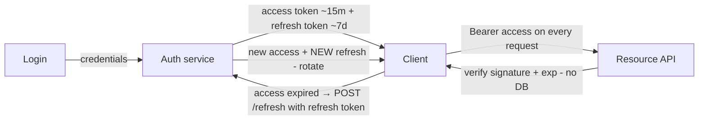

# 25. Implement a Token Refresh Mechanism

> **In one line:** Design short-lived **access tokens** paired with long-lived **refresh tokens** so users
> stay logged in without re-entering credentials — with **rotation** on every refresh, **reuse detection**
> that revokes a whole token family when a stolen token is replayed, and clean revocation on logout.

> **Original prompt:** Implement an endpoint that issues a new access token from a valid refresh token,
> handling expiry and revocation.

## Overview

Authentication has a tension: **access tokens** should be **short-lived** (so a leaked one is useless
quickly and you rarely hit the auth DB — they're verified by signature alone), but users shouldn't have to
log in every 15 minutes. The resolution is a **two-token** scheme:

- An **access token** (JWT, ~15 min) — sent on every request, **stateless**, verified by signature.
- A **refresh token** (opaque or JWT, days/weeks) — used **only** at the `/refresh` endpoint to mint a
  new access token; **stateful** (tracked server-side so it can be revoked).

The subtle, interview-critical part is **what happens when a refresh token is stolen**. The answer is
**rotation + reuse detection**: every refresh issues a *new* refresh token and invalidates the old one;
if an *old* (already-used) refresh token is ever presented again, that's a theft signal → **revoke the
entire token family**, forcing re-login and locking out the attacker.

This write-up covers the token types, the refresh flow, **rotation**, **reuse detection via a token
family/lineage**, storage (httpOnly cookies vs. localStorage), revocation/logout, and scaling. It ships a
runnable implementation in [`./implementation/`](./implementation/): a **NestJS** auth service using
HMAC-signed tokens (`node:crypto`, no external JWT lib), refresh **rotation**, **reuse detection** that
revokes the family, and logout — plus a **Next.js + React + Redux Toolkit** app that logs in, shows the
access-token countdown, auto-refreshes, and lets you **simulate a stolen-token replay** and watch the
family get revoked.

## Functional Requirements

1. **Login** with credentials → issue a short-lived **access token** + a long-lived **refresh token**.
2. **Refresh**: exchange a valid refresh token for a **new access token** (and a **new** refresh token).
3. **Rotation**: each refresh invalidates the old refresh token (single-use).
4. **Reuse detection**: presenting an already-used/old refresh token **revokes the whole family**.
5. **Revoke / logout**: invalidate the current refresh token (and optionally all sessions).
6. **Verify** access tokens statelessly (signature + expiry) to authorize requests (`/me`).

## Non-Functional Requirements

| Attribute | Target / approach |
|---|---|
| **Statelessness (access)** | Access token verified by signature alone — no DB hit on the hot path |
| **Revocability (refresh)** | Refresh tokens tracked server-side; revocable individually or per family |
| **Security** | Short access TTL, rotation, reuse detection, httpOnly storage, signed + expiring |
| **Blast radius** | A stolen refresh token is caught on first reuse; family revoke logs the thief out |
| **Latency** | Refresh is a single indexed lookup + sign; access verify is pure crypto |
| **Scalability** | Access verify scales infinitely; refresh store is small + shardable |

## A Realistic Interview Conversation

> **I** = Interviewer, **C** = Candidate.

**I:** Why not just use one long-lived token?

**C:** Because you can't cheaply **revoke** a stateless long-lived JWT, and if it leaks the attacker has
long access. So I split concerns: a **short-lived access token** (~15 min, stateless, signature-verified
on every request — no DB hit) and a **long-lived refresh token** (days, used only to get new access
tokens, tracked server-side so it's **revocable**). Short access TTL bounds the damage of a leak; the
refresh token keeps the user logged in.

**I:** Walk me through refresh.

**C:** The client calls `/refresh` with its refresh token. The server verifies it (signature, expiry, and
that it's **not revoked and hasn't been used**), then issues a **new access token** *and* a **new refresh
token**, marking the old refresh token as **used/rotated**. That's **rotation** — refresh tokens are
**single-use**.

**I:** Why rotate? What does it buy you?

**C:** It enables **reuse detection**. Because each refresh token is used exactly once, if the server ever
sees an **already-used** refresh token again, something is wrong — most likely the token was **stolen** and
now both the legitimate client and the attacker are trying to use tokens from the same lineage. That's the
signal to **revoke the entire token family**, forcing everyone (attacker *and* user) to re-authenticate.
Without rotation, a stolen refresh token works silently for its whole lifetime.

**I:** Explain the token family.

**C:** When a user logs in, I create a **family** (a lineage id). Every refresh token descends from that
family. On rotation, the new token stays in the same family and points to its parent. On **reuse** of any
consumed token in the family, I **revoke the family** — all descendants become invalid. So the theft is
contained to "one re-login" instead of "attacker has access until the refresh token expires."

**I:** Where do you store tokens on the client?

**C:** Refresh tokens in an **httpOnly, Secure, SameSite cookie** so JavaScript (and thus XSS) can't read
them; the browser sends the cookie only to the auth endpoint. Access tokens are often kept in **memory**
(not localStorage — XSS-readable) and attached as a `Bearer` header. httpOnly cookies need **CSRF**
protection (SameSite=strict/lax + a CSRF token for state-changing requests). It's a trade-off: cookies →
XSS-safe but CSRF-exposed; localStorage → CSRF-safe but XSS-exposed. httpOnly cookie + CSRF is the
standard choice.

**I:** How do you verify an access token on each request?

**C:** Pure crypto: check the **signature** (HMAC or RSA/EC) and the **expiry** (`exp`) claim. No database
lookup — that's the whole point of a stateless access token, and why it scales. The refresh store is only
touched at login/refresh/logout.

**I:** How do you log out / revoke?

**C:** Logout **revokes the current refresh token** (and can revoke the whole family for "log out all
devices"). The access token still works until it expires (up to its short TTL) — that residual window is
the trade-off for statelessness. If you need instant access revocation you add a denylist / short
introspection, but that reintroduces state on the hot path.

**I:** Access token still valid after logout — is that a problem?

**C:** It's a **bounded** problem: at most the access TTL (e.g. 15 min). You tune the TTL to your risk
tolerance; for high-security actions you re-check server-side or keep a small revocation denylist keyed by
token id. Most systems accept the short window.

**I:** How does it scale?

**C:** Access verification is **stateless** → scales horizontally with zero coordination. The **refresh
store** is small (one row per active session), indexed by token id, and easily sharded by user. Signing
keys are shared via a secrets manager and **rotated** (support multiple valid keys during rotation via a
`kid`).

## What & Why: two tokens



Access = stateless & short (hot path, no DB). Refresh = stateful & long (revocable, single-use, rotated).

## The Refresh Flow with Rotation & Reuse Detection

```mermaid
sequenceDiagram
    participant C as Client
    participant A as Auth service
    participant S as Refresh store (families)
    C->>A: POST /refresh (refresh token RT1)
    A->>S: look up RT1
    alt RT1 valid & unused
      A->>S: mark RT1 used; issue RT2 (same family, parent=RT1)
      A-->>C: new access + RT2
    else RT1 already used (REUSE!)
      A->>S: revoke ENTIRE family
      A-->>C: 401 — re-login required (theft contained)
    else RT1 revoked / expired
      A-->>C: 401
    end
```

## High-Level Design (HLD)

```mermaid
flowchart TD
    C[Client] -->|login / refresh / logout| AUTH[Auth service]
    C -->|Bearer access token| API[Resource API]
    API --> VERIFY[Verify: signature + exp - stateless]
    AUTH --> RS[(Refresh-token store<br/>token id → {user, family, used, revoked, exp})]
    AUTH --> KEYS[(Signing keys<br/>secrets manager, rotated)]
    RS -. reuse → revoke family .-> RS
```

Related: [User Authentication](../01-user-authentication-system/01-user-authentication-system.md),
[Idempotency](../../03-distributed-systems-concepts/07-idempotency.md),
[Config Management](../15-config-management/15-config-management.md).

## Low-Level Design (LLD)

### Tokens

```text
Access token  (JWT-like): header.payload.signature
   payload = { sub: userId, exp, iat, type: 'access' }     # verified by signature + exp only
Refresh token (opaque id + signature): id.signature
   server row = { id, userId, familyId, parentId, used, revoked, expiresAt, createdAt }
```

Sign/verify with **HMAC-SHA256** over `base64url(payload)` using a server secret (constant-time compare).
(Production may use RS256/ES256 so verifiers don't hold the signing key.)

### Refresh algorithm (rotation + reuse detection)

```text
refresh(rt):
  row = store.get(rt.id)
  if !row or row.revoked or now > row.expiresAt → 401
  if row.used:                                  # REUSE of a rotated token
     store.revokeFamily(row.familyId)           # contain theft
     return 401
  row.used = true                               # single-use
  child = store.issue({ userId: row.userId, familyId: row.familyId, parentId: row.id })
  return { accessToken: sign(row.userId), refreshToken: child }
```

### Login / logout

```text
login(creds):
   verify credentials
   familyId = newId()
   rt = store.issue({ userId, familyId, parentId: null })
   return { accessToken: sign(userId), refreshToken: rt }

logout(rt, { allDevices? }):
   allDevices ? store.revokeFamily(row.familyId) : store.revoke(row.id)
```

### Verifying access (stateless)

```text
verifyAccess(token):
   [payload, sig] = split(token)
   if hmac(payload) !== sig → 401           # constant-time
   if now > payload.exp → 401
   return payload.sub                        # authorized; NO store lookup
```

### Service contracts (implemented here)

```text
POST /login        { username, password }        → { accessToken, refreshToken, expiresAt }
POST /refresh      { refreshToken }               → new { accessToken, refreshToken } | 401 (reuse→family revoked)
POST /logout       { refreshToken, allDevices? }  → revoke
GET  /me           Authorization: Bearer <access> → { userId } | 401
GET  /sessions     (debug) family/lineage state ; POST /reset
```

### Project structure

```text
server/src/
├── auth/
│   ├── tokens.ts          # HMAC sign/verify access; refresh id + signature       ← crypto core
│   ├── refresh-store.ts   # families, issue/rotate/use/revoke, reuse detection     ← the core
│   ├── auth.service.ts    # login / refresh / logout / verify orchestration
│   └── auth.controller.ts # /login /refresh /logout /me /sessions /reset
└── main.ts
```

## Security

- **Short access TTL** (≈15 min) bounds a leaked access token; refresh TTL bounds a session.
- **Rotation + reuse detection** — single-use refresh tokens turn a theft into a detectable event;
  revoking the family logs the attacker (and user) out, containing the breach.
- **httpOnly + Secure + SameSite cookies** for refresh tokens → not readable by XSS; add **CSRF** defense
  (SameSite + CSRF token) since cookies are auto-sent. Keep access tokens in **memory**, not localStorage.
- **Sign + expire** everything; **constant-time** signature compare; rotate signing keys (`kid`).
- **Bind** refresh tokens to context (user-agent/IP hint) to raise the bar on stolen-cookie reuse.
- **Don't leak** which factor failed; generic 401. Rate-limit `/login` and `/refresh` (credential stuffing).
- **Logout is real** — revoke server-side; don't rely on the client "forgetting" the token.

## Scaling & Performance

- **Access verification is stateless** → infinite horizontal scale, no coordination, no DB on the hot path.
- **Refresh store is small** (one row per active session), indexed by token id, **shardable by user**;
  only touched at login/refresh/logout.
- **Key management** — signing keys in a secrets manager, rotated; verifiers accept multiple keys during
  rotation via `kid` (or use asymmetric keys so resource servers only hold the public key).
- **Cleanup** — expired/used refresh rows are pruned (TTL index) to keep the store lean.
- **Residual access window** is the scale/security trade-off; shorten TTL or add a denylist only if needed.

## All Solution Patterns (summary)

| Concern | Options | Chosen here | Why |
|---|---|---|---|
| Token model | one long token · **access + refresh** | Access + refresh | Stateless hot path + revocability |
| Refresh reuse | static refresh · **rotation (single-use)** | Rotation | Enables reuse detection |
| Theft response | none · denylist · **revoke family** | Revoke family on reuse | Contains stolen-token replay |
| Access verify | stateful introspection · **stateless signature** | Stateless (sig + exp) | Scale, no DB on hot path |
| Storage | localStorage · **httpOnly cookie** (refresh) + memory (access) | httpOnly + memory | XSS-safe; + CSRF defense |
| Signing | **HMAC** · RSA/EC | HMAC here (RS/ES noted) | Simple; asymmetric for multi-verifier |

## Implementation

A runnable full-stack implementation lives in [`./implementation/`](./implementation/):

| Layer | Stack | Highlights |
|---|---|---|
| **`server/`** | NestJS + `node:crypto` | HMAC-signed access tokens (stateless verify), a refresh store with **token families**, **rotation** (single-use), **reuse detection** that **revokes the family**, login/logout (+ all-devices), and a stateless `/me`. |
| **`web/`** | Next.js + React + Redux Toolkit (RTK Query) | Login, a live **access-token countdown**, manual + **auto refresh** (rotating the stored refresh token), `/me` calls, and a **"replay a used refresh token"** button that demonstrates family revocation. |

| Design element | Where in the code |
|---|---|
| HMAC sign/verify (access), refresh ids | `server/src/auth/tokens.ts` |
| Families, rotation, reuse detection, revoke | `server/src/auth/refresh-store.ts` |
| login / refresh / logout / verify | `server/src/auth/auth.service.ts` |
| Login + countdown + replay-attack demo | `web/src/components/*` + `store/authApi.ts` |

The backend is verified by an **end-to-end test**: login issues access + refresh; `/me` accepts a valid
access token and rejects a tampered/expired one; **refresh rotates** (old refresh token stops working, new
one works); **replaying a used refresh token revokes the family** (the latest token also stops working);
expired refresh tokens are rejected; and logout revokes.

## Tips

- Keep the **access token short**; keep the **refresh token server-side & revocable**.
- **Rotate** refresh tokens (single-use) — it's what makes **reuse detection** possible.
- On reuse, **revoke the whole family**, not just the one token.
- Store refresh in an **httpOnly cookie** + CSRF defense; access in **memory**.
- Verify access **statelessly** (signature + exp); only refresh/login/logout touch the store.

## Trade-offs & Pitfalls

- **Long-lived access tokens** can't be cheaply revoked and widen the leak window.
- **No rotation** → a stolen refresh token works silently until it expires; you never detect it.
- **localStorage tokens** are readable by any XSS; **cookies** need CSRF protection — pick and defend.
- **Revoking only the reused token** (not the family) lets the attacker keep the branch they hold.
- **Trusting the client to log out** — always revoke server-side.
- **No key rotation** → a leaked signing key compromises everything and can't be rolled.

## System Design Cheat Sheet

```text
1.  WHY TWO?     access = short + stateless (hot path); refresh = long + stateful (revocable)
2.  ACCESS?      JWT ~15m; verify by signature + exp only — NO DB lookup
3.  REFRESH?     single-use; /refresh issues NEW access + NEW refresh (ROTATION)
4.  REUSE?       an already-used refresh token reappears → theft → REVOKE THE FAMILY
5.  FAMILY?      login starts a lineage; rotations descend it; reuse revokes all descendants
6.  STORE?       refresh in httpOnly+Secure+SameSite cookie (+CSRF); access in memory
7.  LOGOUT?      revoke refresh server-side (family = all devices); access dies at its TTL
8.  KEYS?        sign + expire; rotate signing keys (kid); constant-time compare
9.  SCALE?       stateless access → horizontal; refresh store small, indexed, shardable
```
