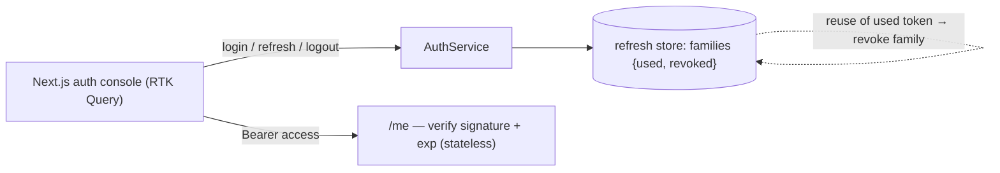

# Token Refresh Mechanism — full-stack implementation

A runnable version of the [design write-up](../25-token-refresh-mechanism.md): short-lived **access
tokens** (stateless, signature-verified) + long-lived **refresh tokens** (server-tracked, revocable) with
**rotation** on every refresh and **reuse detection** that revokes the whole token family on a stolen-token
replay.

- **`server/`** — NestJS + `node:crypto` (no external JWT lib). HMAC tokens, families, rotation, reuse
  detection, revocation. No database.
- **`web/`** — Next.js 14 + Redux Toolkit **RTK Query**: login, access-token countdown, refresh, and a
  reuse-attack demo.

## Architecture



## Endpoints

| Method | Path | Purpose |
| --- | --- | --- |
| POST | `/login` | `{ username, password }` → `{ accessToken, accessExpiresAt, refreshToken }`. |
| POST | `/refresh` | `{ refreshToken }` → new pair (rotates); reuse of a used token → **401 + family revoked**. |
| POST | `/logout` | `{ refreshToken, allDevices? }` → revoke one token (or the whole family). |
| GET | `/me` | `Authorization: Bearer <access>` → `{ userId }` (stateless verify). |
| GET | `/sessions` | Debug view of the refresh-token lineage. |
| POST | `/reset` | Clear all sessions. |

## Run

**npm is under nvm** — prefix with `export PATH="/root/.nvm/versions/node/v22.23.2/bin:$PATH"` if needed.

```bash
cd server && cp .env.example .env && npm install && npm run build && npm start   # :3015
cd ../web && cp .env.example .env.local && npm install && npm run dev            # :3000
```

### Try it with curl

```bash
LOGIN=$(curl -s -X POST :3015/login -H 'content-type: application/json' -d '{"username":"alice","password":"password123"}')
RT=$(echo "$LOGIN" | jq -r .refreshToken)
# rotate: RT → RT2 (RT is now used)
RT2=$(curl -s -X POST :3015/refresh -H 'content-type: application/json' -d "{\"refreshToken\":\"$RT\"}" | jq -r .refreshToken)
# replay the USED token → reuse detected → whole family revoked (401)
curl -s -X POST :3015/refresh -H 'content-type: application/json' -d "{\"refreshToken\":\"$RT\"}" | jq
# RT2 is now dead too:
curl -s -X POST :3015/refresh -H 'content-type: application/json' -d "{\"refreshToken\":\"$RT2\"}" | jq
```

## Where each design element lives

| Element | Code |
| --- | --- |
| HMAC access sign/verify (constant-time), refresh ids | `server/src/auth/tokens.ts` |
| Families, rotation, reuse detection, revoke | `server/src/auth/refresh-store.ts` |
| login / refresh / logout / me orchestration | `server/src/auth/auth.service.ts` |
| Login + countdown + reuse-attack demo | `web/src/components/AuthConsole.tsx` |
| Lineage table | `web/src/components/SessionsTable.tsx` |

Verified end-to-end (engine + HTTP): access sign/verify (tamper + expiry), rotation (old token dies),
reuse → family revoked, logout revocation, and stateless `/me`.
