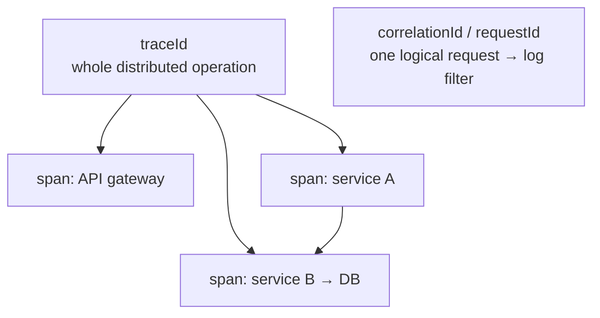
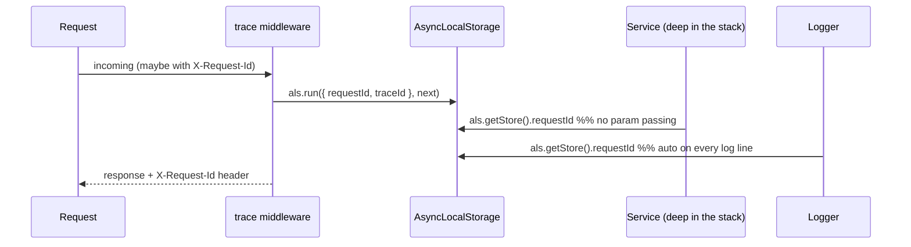
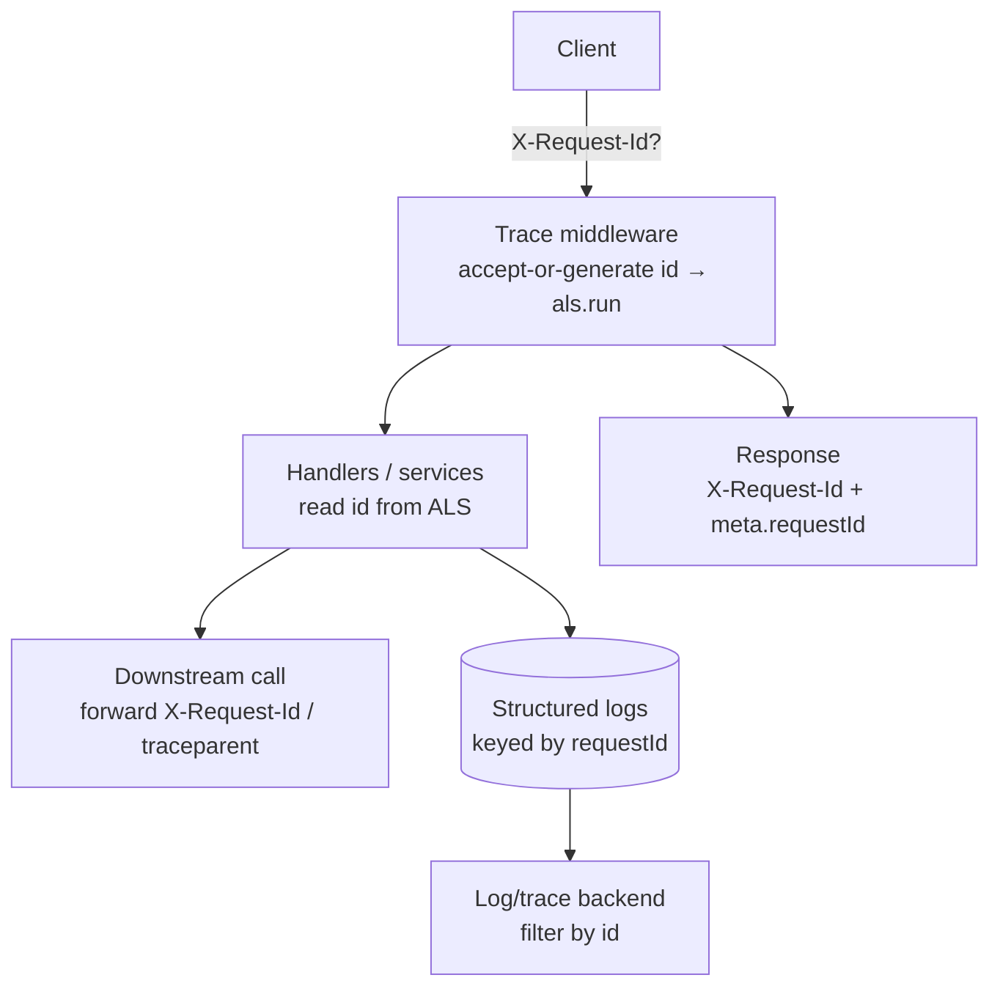
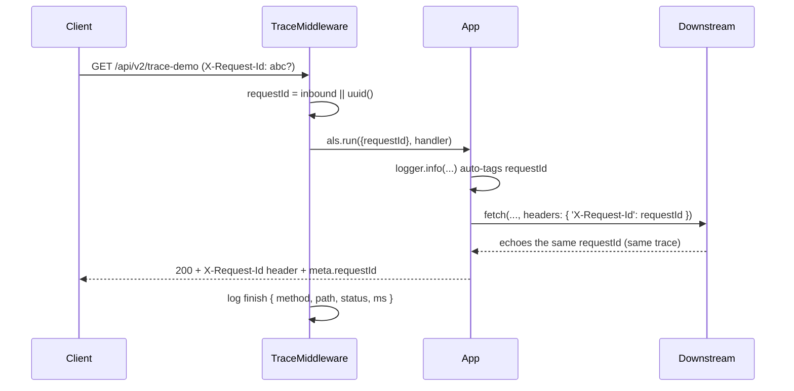
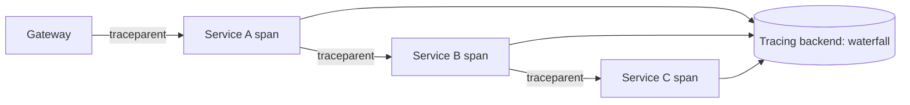

# 27. Implement API Request Tracing

> **In one line:** Give every request a **correlation/trace id**, make it available everywhere in the
> call (logs, response, downstream calls) **without threading it through every function**, and propagate
> it across services so one id lets you follow a request end-to-end.

> **Original prompt:** Use `uuid` to append a unique `X-Correlation-ID` to all incoming Express logs for
> easier debugging.

> **Part of a shared "production-ready API platform"** implemented once in
> [`../12-api-response-standardization/12-api-response-standardization.md`](../12-api-response-standardization/12-api-response-standardization.md)
> — see [`./implementation/`](./implementation/).

## Overview

When a user reports "it failed at 3:04pm", you need to find *their* request among millions of log lines —
and follow it as it fans out to other services. That's **request tracing**: attach a unique id to each
request at the edge, stamp it on every log line and the response, and **propagate** it to downstream
calls. The naive version ("uuid in a middleware, log it") works for one function; the real problem is
making that id available **deep in the code** without passing it as an argument everywhere, and
**carrying it across process boundaries**.

Questions this forces:

- How do you generate/accept a **correlation id** (and honor an inbound one from a gateway)?
- How do you make it available **everywhere** without plumbing it through every call? (**AsyncLocalStorage**)
- How do you get it onto **every log line** automatically?
- How do you **propagate** it to downstream HTTP calls / queues?
- How does this relate to **distributed tracing** (W3C `traceparent`, OpenTelemetry, spans)?

## Functional Requirements

1. Every request gets a **request id** (accept an inbound `X-Request-Id`/`traceparent`, else generate one).
2. The id is on the **response** (`X-Request-Id` header + `meta.requestId`).
3. Every **log line** for that request automatically includes the id (no manual passing).
4. The id is **propagated** to downstream HTTP calls / async work.
5. Log **request start/finish** with method, path, status, and **duration**.
6. Works across `async`/`await` boundaries without losing context.

## Non-Functional Requirements

| Attribute | Target / approach |
|---|---|
| **Debuggability** | One id filters all logs/traces for a request end-to-end |
| **Overhead** | Negligible — AsyncLocalStorage + a header; no hot-path cost |
| **Correctness** | Context never leaks between concurrent requests |
| **Interoperability** | Honor inbound ids; emit W3C-compatible headers |
| **Observability** | Structured (JSON) logs keyed by `requestId`/`traceId` |
| **Scale** | Per-request context works unchanged across many instances |

## A Realistic Interview Conversation

> **I** = Interviewer, **C** = Candidate.

**I:** Add request tracing so we can debug a specific request in production.

**C:** At the edge I add middleware that establishes a **correlation id**: if the incoming request already
has one (`X-Request-Id`, or a W3C `traceparent` from a gateway/mesh), I reuse it; otherwise I generate a
UUID. I echo it back on the response and include it in the standardized `meta.requestId`. The interesting
part is making it available **everywhere** — services, repositories, error handlers — without passing it
as a parameter through every layer.

**I:** How do you do that without threading it through every function?

**C:** **`AsyncLocalStorage`** (Node's built-in). The middleware runs the rest of the request inside
`als.run({ requestId, traceId }, next)`. Anywhere downstream — even deep in an async call chain — I call
`als.getStore()` to read the current request's context. It's like thread-local storage but for async
execution, and it correctly isolates concurrent requests.

**I:** How does it get onto every log line?

**C:** The logger pulls `requestId` from the ALS store on every call, so I never manually pass it. I log
structured JSON: `{ ts, level, msg, requestId, method, path, status, ms }`. One `grep`/filter by
`requestId` gives the whole story of a request.

**I:** Multiple services — how do you follow a request across them?

**C:** **Propagation.** When service A calls service B, it forwards the id as a header (`X-Request-Id`
and/or W3C `traceparent`). B's middleware picks it up and continues the same trace. That's exactly how
distributed tracing works — **OpenTelemetry** standardizes it with `traceparent` (trace id + span id +
flags), and each hop creates a **span**, so you get a waterfall across services. My correlation id is the
lightweight version of the same idea.

**I:** Correlation id vs trace id vs span id?

**C:** A **correlation/request id** identifies one logical request (great for log filtering). A **trace
id** (W3C) spans the *entire* distributed operation across services; each unit of work within it is a
**span** with its own **span id**, forming a parent/child tree. For a single service, a request id is
enough; for microservices, adopt W3C trace context / OpenTelemetry.

**I:** Does ALS hurt performance?

**C:** It has a small cost but it's fine for typical APIs; the debuggability payoff is huge. If you're
ultra-hot-path sensitive you measure it, but for millions of normal requests it's not the bottleneck —
your DB and I/O are.

## Correlation id vs Trace vs Span



- **correlationId / requestId** — one logical request; the key you filter logs by (single service).
- **traceId** — the whole operation across services (W3C `traceparent`).
- **spanId** — one unit of work inside a trace; spans form a parent/child tree (the waterfall).

## The Core Trick: AsyncLocalStorage

The problem with "pass the id everywhere" is it pollutes every signature. `AsyncLocalStorage` stores
per-request context that survives `async`/`await`, so any code can read it on demand:



## High-Level Design (HLD)



## Low-Level Design (LLD)

### Components

```text
trace-context.ts     AsyncLocalStorage<{ requestId, traceId }> + helpers get()/run()
trace.middleware.ts  accept X-Request-Id / traceparent or generate; als.run(...); set response header
logger.ts            reads requestId from ALS on every log; structured JSON + start/finish + duration
downstream           forwards X-Request-Id (and traceparent) on outbound calls
```

### Request lifecycle



### Contracts

```text
getRequestId()               → current request id (from ALS)
withRequest(ctx, fn)         → run fn within a request context
log.info(msg, meta?)         → auto-includes requestId
propagateHeaders()           → { 'X-Request-Id': id, traceparent: ... } for downstream
```

## Distributed Tracing (the bigger picture)

For microservices, graduate from a bare correlation id to **W3C Trace Context + OpenTelemetry**:

- **`traceparent` header** carries `version-traceId-spanId-flags`; every service continues the trace and
  starts a child **span**.
- **OpenTelemetry** auto-instruments HTTP/DB clients, exports **spans** to a backend (Jaeger, Tempo,
  X-Ray, Datadog), and renders a **waterfall** showing where time went across services.
- Your `requestId` should equal (or embed) the `traceId` so **logs and traces cross-reference**.



## Scaling & Production APIs

- **Per-request context scales for free** — ALS is per-request in-process; nothing shared, so it works
  unchanged across many stateless instances.
- **Correlate across the fleet** — because the id is propagated, one id follows a request across all
  instances/services; ship logs to a central store (ELK/Loki/CloudWatch) and filter by `requestId`.
- **Sampling** — at very high volume, **sample** full distributed traces (e.g. 1–10%) to control cost
  while always keeping the cheap correlation id on every request/log.
- **Keep logs structured** (JSON) so they're queryable; avoid logging bodies/PII.

## Security

- **Don't log sensitive data** — the request id is safe; request/response bodies, tokens, and PII are not.
  Log the id, not the secrets.
- **Treat inbound ids as untrusted** — validate/limit length/charset of an incoming `X-Request-Id` so it
  can't inject into logs (log injection) or be abused.
- **Don't leak internals** — trace headers can reveal topology; strip internal `traceparent`/span detail
  at the public edge if necessary.
- **Namespacing** — prefix generated ids (`req_…`) so they're recognizable and greppable.

## All Solution Patterns (summary)

| Concern | Options | Chosen | Why |
|---|---|---|---|
| Context propagation | pass as param · **AsyncLocalStorage** · DI-scoped | ALS | No signature pollution; async-safe |
| Id source | always generate · **accept-or-generate** | Accept-or-generate | Honors gateway/upstream id |
| Log correlation | manual · **logger reads ALS** | Auto from ALS | Every line tagged, zero effort |
| Cross-service | custom header · **W3C traceparent** · OpenTelemetry | Header now → OTel at scale | Standard, tool-friendly |
| Volume control | log all · **sample traces** | Sample | Cost vs coverage |

## Implementation

See the shared platform in
[`../12-api-response-standardization/implementation/`](../12-api-response-standardization/implementation/)
(and this folder's [`./implementation/`](./implementation/) README, which maps the tracing code):

| Design element | Where in the code |
|---|---|
| AsyncLocalStorage context | `server/src/common/trace-context.ts` |
| Accept-or-generate + response header | `server/src/common/trace.middleware.ts` |
| Logger auto-tagging requestId | `server/src/common/logger.ts` |
| Downstream propagation (echo demo) | `server/src/users/users.service.ts` (`traceDemo`) |
| requestId in the response envelope | `server/src/common/response.interceptor.ts` |

Verified by an end-to-end test: a generated `requestId` appears in the `X-Request-Id` **response header**
and `meta.requestId`; an **inbound** `X-Request-Id` is **honored** (echoed, not replaced); and a
downstream call **propagates the same id**.

## Tips

- **Accept an inbound id** (gateway/upstream), else generate one — don't blindly overwrite.
- Use **AsyncLocalStorage** so any code reads the id without parameter threading.
- Make the **logger** pull the id automatically; log **start/finish + duration**, structured as JSON.
- **Propagate** the id on downstream calls (`X-Request-Id` and/or `traceparent`).
- Put the id on the **response** (`X-Request-Id` + `meta.requestId`) so clients can quote it.
- For microservices, adopt **W3C Trace Context / OpenTelemetry** and **sample** at high volume.

## Trade-offs & Pitfalls

- **Threading the id through every function** pollutes signatures — use ALS.
- **Overwriting an inbound id** breaks cross-service correlation — accept-or-generate.
- **Manual per-log tagging** gets forgotten — read from ALS in the logger.
- **Losing context across `await`** happens if you use the wrong mechanism — ALS survives async.
- **Logging bodies/PII** for "debuggability" is a security bug — log the id, not the payload.
- **Trusting inbound id strings** enables log injection — validate/bound them.

## System Design Cheat Sheet

```text
1.  ID        Accept inbound X-Request-Id / traceparent, else generate uuid
2.  CONTEXT   AsyncLocalStorage → als.run({requestId}) for the whole request
3.  LOGS      Logger reads requestId from ALS; structured JSON + duration
4.  RESPONSE  X-Request-Id header + meta.requestId
5.  PROPAGATE Forward id to downstream HTTP/queues
6.  DISTRIBUTED  W3C traceparent + spans + OpenTelemetry (→ waterfall)
7.  SCALE     per-request context (free) + central logs + trace sampling
8.  SECURITY  log the id not the payload; validate inbound ids
```

## Interview Questions & Answers

- **How do you make the request id available everywhere?** — AsyncLocalStorage; `als.run` at the edge, `als.getStore()` anywhere.
- **Generate or accept the id?** — Accept an inbound `X-Request-Id`/`traceparent` if present, else generate — to preserve cross-service correlation.
- **How does every log line get the id?** — The logger reads it from ALS; no manual passing.
- **How do you trace across services?** — Propagate the id via headers; W3C `traceparent` + OpenTelemetry spans for full distributed traces.
- **correlationId vs traceId vs spanId?** — one request (log filter) vs whole distributed op vs a unit of work within it.
- **Does ALS leak between requests?** — No — each request runs in its own `als.run` scope.
- **How do you control tracing cost at scale?** — Sample full traces (e.g. 1–10%); always keep the cheap correlation id.
- **Security concerns?** — Log the id not bodies/PII; validate inbound ids to prevent log injection.
