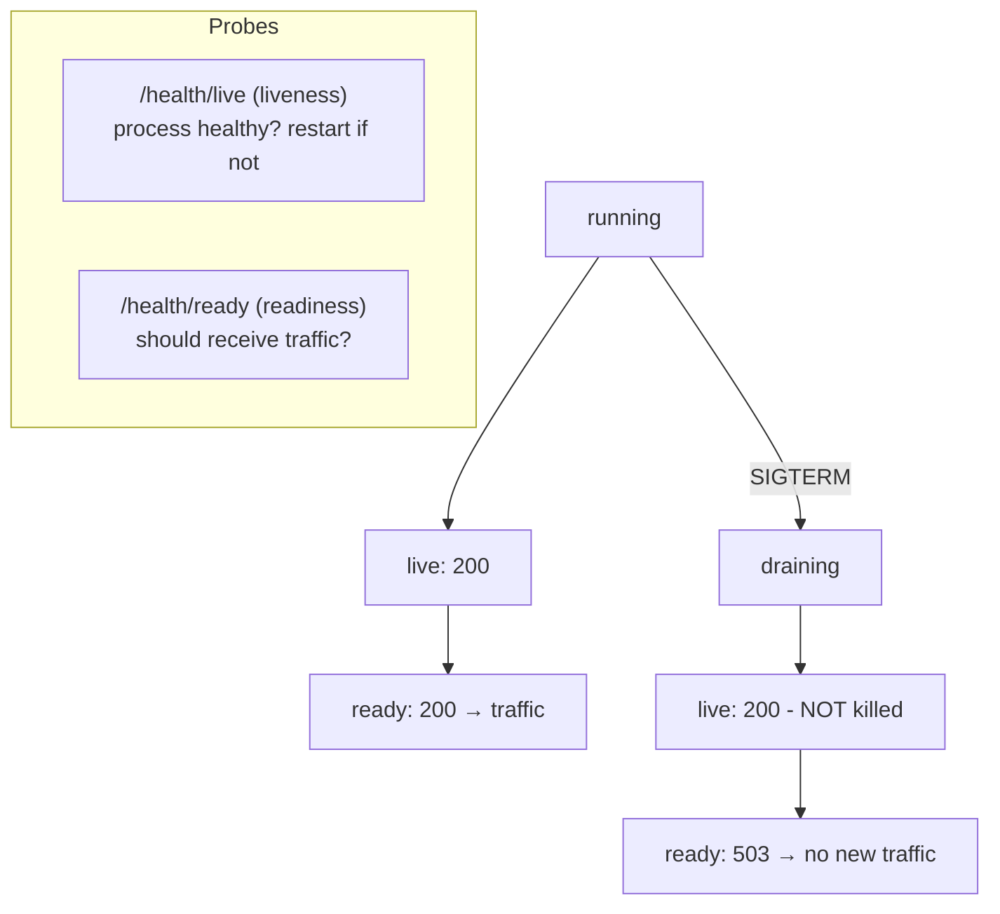
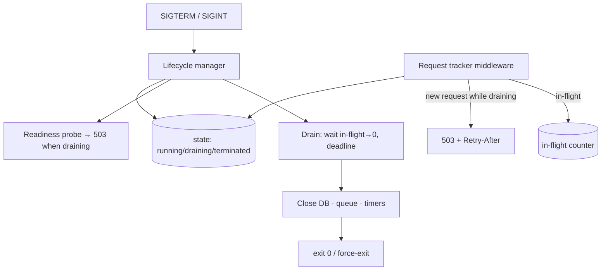
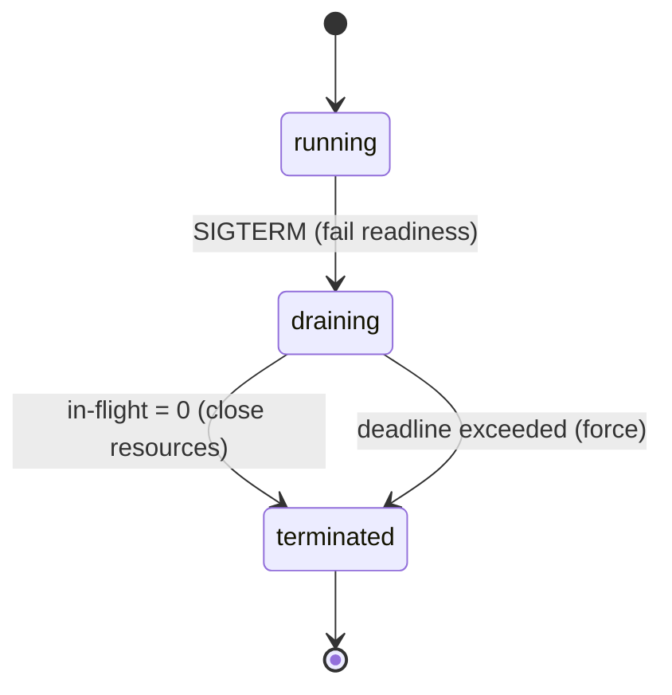

# 29. Implement Graceful Shutdown

> **In one line:** When the platform tells a process to stop (`SIGTERM`), don't drop connections — flip
> readiness to "not ready" so the load balancer stops sending traffic, **drain** in-flight requests, close
> resources (DB, queue) cleanly, and exit within a deadline (force-killing only as a last resort) — the
> foundation of **zero-downtime deploys**.

> **Original prompt:** Handle `SIGTERM` so the server stops accepting new work, finishes in-flight
> requests, and shuts down cleanly.

## Overview

Every deploy, scale-in, or node rotation **kills your process**. Kubernetes (and most orchestrators)
sends **`SIGTERM`**, waits a grace period, then sends **`SIGKILL`**. A process that ignores `SIGTERM` and
just dies takes down whatever it was doing: half-written responses, a payment charged but not recorded, a
job leased but never acked. **Graceful shutdown** is the discipline that makes stopping *safe*, and it's
what makes rolling deploys **zero-downtime**.

The sequence is:

1. **Receive `SIGTERM`** → enter a **draining** state.
2. **Fail readiness** (`/health/ready` → 503) so the **load balancer removes this instance** from
   rotation and stops routing new requests. (Liveness stays green — you're not broken, just leaving.)
3. **Stop accepting** new connections/work; let **in-flight** requests finish.
4. **Close resources** — DB pool, message-queue consumers, timers — in dependency order.
5. **Exit 0** once drained, or **force-exit** if a **deadline** passes (a stuck request can't hold the
   process hostage forever).

A subtle but critical detail: there's a **race** between "fail readiness" and "LB actually stops sending
traffic." So you **keep serving** for a short window *after* flipping readiness (the `preStop` delay),
then drain — otherwise you reject requests the LB is still routing.

This write-up covers the lifecycle, liveness vs. readiness, in-flight draining with a deadline, resource
close order, and the Kubernetes contract. It ships a runnable implementation in
[`./implementation/`](./implementation/): a **NestJS** service with a **lifecycle manager** (running →
draining → terminated), **in-flight request tracking**, separate **liveness/readiness** probes, a
readiness guard that **503s new work while draining but lets in-flight finish**, and a drain-with-timeout
— plus a **Next.js + React + Redux Toolkit** dashboard to launch slow requests, trigger a drain, and watch
the phases and in-flight counter live.

## Functional Requirements

1. On shutdown signal, transition **running → draining → terminated**.
2. **Readiness** returns 503 while draining; **liveness** stays 200 (not crashed, just leaving).
3. **Reject new** requests during draining (503 + `Retry-After`) while **letting in-flight finish**.
4. **Track in-flight** requests; consider drain complete when the count hits 0.
5. **Close resources** (DB, queue consumers, timers) after draining, in order.
6. **Deadline** — force termination if draining exceeds a configured timeout.

## Non-Functional Requirements

| Attribute | Target / approach |
|---|---|
| **Zero-downtime** | No dropped requests during deploys; LB drains before the process exits |
| **Bounded shutdown** | Always exits within the grace period (drain deadline < orchestrator SIGKILL) |
| **No data loss** | In-flight requests/jobs finish or roll back; resources closed cleanly |
| **Observability** | Phase + in-flight count exposed; shutdown steps logged with timings |
| **Idempotent signals** | Repeated `SIGTERM` doesn't restart or corrupt the sequence |
| **Correctness** | Liveness ≠ readiness; draining instance stays "alive" to avoid a kill-restart loop |

## A Realistic Interview Conversation

> **I** = Interviewer, **C** = Candidate.

**I:** What happens when Kubernetes deploys a new version of your service?

**C:** It does a rolling update: start new pods, then terminate old ones. Terminating a pod sends
**`SIGTERM`**, waits `terminationGracePeriodSeconds`, then **`SIGKILL`**. If my process ignores `SIGTERM`
and dies on SIGKILL, any in-flight request is dropped — a 502 to a user mid-deploy. Graceful shutdown
handles `SIGTERM` so those requests finish first. That's what makes the rollout **zero-downtime**.

**I:** Walk me through your `SIGTERM` handler.

**C:** (1) Flip an internal state to **draining**. (2) Make **readiness fail** (`/health/ready` → 503) so
the load balancer takes this instance **out of rotation**. (3) **Stop accepting** new work — new requests
get a 503 with `Retry-After`. (4) Wait for **in-flight** requests to drain to zero. (5) **Close
resources** — DB pool, queue consumers, timers. (6) `process.exit(0)`. And a **timeout**: if draining
takes too long, force-exit so I don't get SIGKILLed mid-cleanup.

**I:** Liveness vs. readiness — why both, and what do they do during shutdown?

**C:** **Liveness** answers "is the process healthy, or should it be **restarted**?" **Readiness** answers
"should it receive **traffic** right now?" During shutdown I fail **readiness** (stop traffic) but keep
**liveness** green — because I'm not broken, I'm intentionally leaving. If I failed liveness, the
orchestrator might think I'm hung and **kill me harder** or trigger a restart loop. So: readiness=503,
liveness=200 while draining.

**I:** There's a race between failing readiness and the LB stopping traffic. How do you handle it?

**C:** Right — readiness probes are polled every few seconds, and the LB has its own propagation delay, so
for a moment after I flip readiness the LB **still routes** to me. If I immediately reject everything, I
drop those. The fix is a **short delay**: keep serving normally for a few seconds after flipping readiness
(in k8s that's a **`preStop` hook** that sleeps), *then* start draining. So the real order is: fail
readiness → **wait out the LB propagation** → stop accepting → drain in-flight → close → exit.

**I:** What if an in-flight request never finishes?

**C:** A **deadline**. I drain for up to, say, 25 seconds (kept safely under the 30s grace period). If the
in-flight count hasn't hit zero by then, I **force-exit** anyway — a single stuck request can't hold the
whole process hostage past SIGKILL. Long operations should be designed to be **resumable/idempotent** so a
forced cut is recoverable.

**I:** What resources need closing, and in what order?

**C:** Reverse dependency order: stop **inbound** first (HTTP server stops accepting), then stop
**consumers** (don't lease new queue jobs), finish in-flight, then close **outbound** (DB pool, cache,
queue connection), flush logs/metrics, and clear timers/intervals. Closing the DB before requests finish
would break them.

**I:** How does this interact with a job worker, not just an HTTP server?

**C:** Same idea: stop **leasing** new jobs, let the current job finish (or extend its lease / nack it so
it's redelivered), then exit. This ties into the queue's visibility-timeout design — a cleanly nacked or
un-acked job just gets redelivered to another worker.

**I:** How do you make the signal handling robust?

**C:** Make it **idempotent** — a second `SIGTERM` while already draining is a no-op, not a restart.
Handle both `SIGTERM` and `SIGINT` (Ctrl-C in dev). Guard against exceptions in the shutdown path so one
failing close doesn't skip the rest. And log each step with timings for post-mortems.

## What & Why: the shutdown sequence

```mermaid
sequenceDiagram
    participant K as Orchestrator
    participant P as Process
    participant LB as Load balancer
    K->>P: SIGTERM
    P->>P: state = draining
    P->>LB: readiness → 503 (out of rotation)
    Note over P,LB: preStop delay — keep serving while LB propagates
    P->>P: stop accepting new requests (503 + Retry-After)
    P->>P: wait for in-flight → 0 (up to deadline)
    P->>P: close DB / queue / timers
    P->>K: exit 0
    Note over K,P: if deadline exceeded → force exit; if still alive at grace end → SIGKILL
```

## Liveness vs. Readiness (the key distinction)



| Probe | Question | Failing → | During drain |
|---|---|---|---|
| **Liveness** | Is it healthy or hung? | orchestrator **restarts** the pod | **stays 200** (don't trigger a restart) |
| **Readiness** | Should it get traffic now? | LB **removes** from rotation | **503** (stop new traffic) |

## High-Level Design (HLD)



Related: [Load Balancer](../../01-core-infrastructure-concepts/04-load-balancer.md),
[Health/Backpressure](../../04-messaging-and-communication-concepts/04-backpressure.md),
[Message Queue](../../04-messaging-and-communication-concepts/01-message-queue.md),
[Circuit Breaker](../../05-reliability-performance-and-modern-concepts/01-circuit-breaker.md).

## Low-Level Design (LLD)

### Lifecycle state machine



### In-flight tracking + readiness guard

```text
onRequest(req):
   if state == draining:
      return 503 + Retry-After          # stop new work (after preStop window)
   inFlight++
   req.onFinish(() => inFlight--)

beginShutdown():
   if state != running: return          # idempotent — ignore repeat SIGTERM
   state = draining                     # readiness now 503
   await sleep(PRESTOP_MS)              # let the LB stop routing (race fix)
   await waitFor(() => inFlight == 0, timeout = DRAIN_DEADLINE_MS)
   await closeResources()               # DB, queue, timers (reverse dep order)
   state = terminated
   exit(0)                              # or force-exit on timeout
```

### Close order (reverse of startup)

```text
1. stop HTTP accept + queue consumers   (no new work in)
2. wait in-flight requests / current job to finish
3. close DB pool, cache, queue connection   (outbound deps)
4. flush logs / metrics; clear timers/intervals
5. exit
```

### Kubernetes contract

```text
terminationGracePeriodSeconds: 30       # SIGTERM → (grace) → SIGKILL
lifecycle.preStop: sleep 5              # keep serving while LB de-registers (race fix)
readinessProbe: GET /health/ready       # 503 while draining → out of rotation
livenessProbe:  GET /health/live        # 200 while draining → not restarted
# app drain deadline (e.g. 25s) < terminationGracePeriodSeconds (30s)
```

### Service contracts (implemented here)

```text
GET  /health/live      → 200 always (unless truly unhealthy)
GET  /health/ready     → 200 running / 503 draining
GET  /work?ms=…         → simulated in-flight request (tracked)
POST /shutdown          → begin drain (models SIGTERM; safe for the web demo)
GET  /status           → { phase, inFlight, drainedAfterMs, deadlineMs }
POST /reset            → back to running (demo convenience)
```

### Project structure

```text
server/src/
├── lifecycle/
│   ├── lifecycle.manager.ts   # state machine, in-flight count, drain w/ deadline, close  ← the core
│   ├── inflight.middleware.ts # count requests; 503 new work while draining
│   ├── health.controller.ts   # /health/live, /health/ready
│   └── lifecycle.controller.ts# /work, /shutdown, /status, /reset
├── main.ts                    # process.on('SIGTERM'/'SIGINT') → manager.beginShutdown()
```

## Scaling & Performance

- **Zero-downtime deploys** depend on this: new instances become ready **before** old ones drain
  (`maxUnavailable: 0`, `maxSurge: 1`), so capacity never dips.
- **Drain deadline < grace period** — always exit before SIGKILL; size the grace period to your longest
  reasonable request (but cap it — don't let one slow request block a rollout).
- **preStop delay** absorbs LB de-registration lag; without it you drop the requests still being routed.
- **Connection draining** at the LB (ALB/NLB "deregistration delay") complements the app-level drain.
- **Stateful workloads** (queue workers) drain by ceasing to lease and letting the visibility timeout
  redeliver anything unfinished — no work lost.
- **Fast startup** matters too (readiness gating): the sooner new pods are ready, the shorter the window.

## Security

- **No new privileged work during drain** — reject writes/logins with 503 rather than half-processing.
- **Don't leak** shutdown internals to clients; the 503 is generic + `Retry-After`.
- **Protect the shutdown trigger** — in a real service, shutdown is driven by OS signals, not a public
  endpoint; the demo's `POST /shutdown` stands in for `SIGTERM` and would be signal-only / admin-guarded
  in production.
- **Finish security-relevant writes** (audit logs, payment records) before closing their store, or ensure
  they're idempotent/resumable so a forced cut is recoverable.

## All Solution Patterns (summary)

| Concern | Options | Chosen here | Why |
|---|---|---|---|
| Signal | ignore · **handle SIGTERM/SIGINT** | Handle, idempotent | Safe, deploy-friendly |
| Traffic stop | kill immediately · **fail readiness + preStop delay** | Readiness 503 + delay | No dropped in-flight (race-safe) |
| In-flight | drop · **drain to zero** | Drain w/ counter | No lost requests |
| Stuck request | wait forever · **deadline force-exit** | Deadline | Bounded shutdown |
| Probes | one health check · **liveness ≠ readiness** | Split | Stop traffic without restart loop |
| Resources | let OS reclaim · **ordered close** | Ordered close | No corruption / lost writes |

## Implementation

A runnable full-stack implementation lives in [`./implementation/`](./implementation/):

| Layer | Stack | Highlights |
|---|---|---|
| **`server/`** | NestJS | A **lifecycle manager** (running → draining → terminated), **in-flight request tracking** middleware that **503s new work while draining but lets in-flight finish**, separate **liveness/readiness** probes, a **preStop delay + drain deadline**, ordered resource close, and real `SIGTERM`/`SIGINT` handlers. A `POST /shutdown` models the signal for the web demo. |
| **`web/`** | Next.js + React + Redux Toolkit (RTK Query) | A dashboard that shows the live **phase** + **in-flight counter**, launches **slow requests**, triggers a **drain**, and watches new requests get **503**'d while in-flight ones complete — then reset. |

| Design element | Where in the code |
|---|---|
| State machine, in-flight, drain + deadline, close | `server/src/lifecycle/lifecycle.manager.ts` |
| In-flight tracking + 503-while-draining | `server/src/lifecycle/inflight.middleware.ts` |
| Liveness vs readiness probes | `server/src/lifecycle/health.controller.ts` |
| SIGTERM/SIGINT wiring | `server/src/main.ts` |
| Phase + in-flight dashboard | `web/src/components/*` + `store/lifecycleApi.ts` |

The backend is verified by an **end-to-end test**: while **running**, readiness is 200 and requests are
served; starting a **slow request** raises the in-flight count; triggering **shutdown** flips readiness to
503 while **liveness stays 200**; new requests are **rejected (503 + Retry-After)** but the in-flight slow
request **completes**; drain finishes when in-flight hits 0; and the **deadline forces** termination if a
request overruns.

## Tips

- Handle `SIGTERM` (and `SIGINT`); make it **idempotent**.
- Fail **readiness**, keep **liveness** green — stop traffic without triggering a restart.
- Add a **preStop delay** so you don't drop requests the LB is still routing.
- Always set a **drain deadline** *below* the orchestrator's grace period.
- Close resources in **reverse dependency order**; stop intake before closing outbound.
- Design long operations to be **idempotent/resumable** so a forced exit is safe.

## Trade-offs & Pitfalls

- **Ignoring SIGTERM** → dropped requests / 502s on every deploy.
- **Failing liveness during drain** → the orchestrator restarts you or kills harder (restart loop).
- **No preStop delay** → you 503 requests the LB hasn't stopped routing yet.
- **No deadline** → one stuck request hangs the process until SIGKILL cuts it anyway (worse).
- **Closing the DB before requests finish** → in-flight requests error out.
- **Non-idempotent signal handling** → a second SIGTERM corrupts or restarts the sequence.

## System Design Cheat Sheet

```text
1.  SIGNAL?      SIGTERM → drain; then SIGKILL after grace period. Handle SIGTERM+SIGINT, idempotent
2.  TRAFFIC?     fail READINESS (503) so LB removes you; keep LIVENESS 200 (don't get restarted)
3.  RACE?        preStop delay — keep serving a few secs while LB de-registers, THEN stop accepting
4.  DRAIN?       reject new (503 + Retry-After); wait for in-flight count → 0
5.  DEADLINE?    force-exit if drain > timeout; keep timeout < grace period
6.  CLOSE?       reverse dep order: stop intake → finish in-flight → close DB/queue → flush → exit
7.  WORKERS?     stop leasing; let current job finish or nack (visibility timeout redelivers)
8.  DEPLOY?      new pods ready before old drain (maxUnavailable 0) → zero downtime
9.  SAFE?        make long ops idempotent/resumable; finish audit/payment writes before close
```
