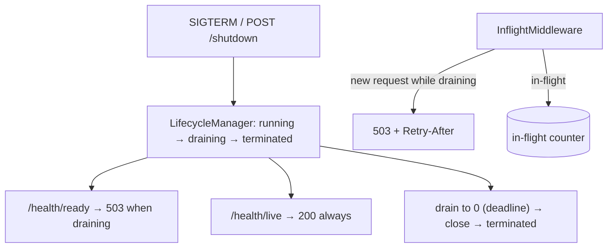

# Graceful Shutdown — full-stack implementation

A runnable version of the [design write-up](../29-graceful-shutdown.md): on SIGTERM the server stops
accepting new requests, keeps **liveness** green while failing **readiness** (so the load balancer
de-registers it), **drains in-flight** requests, then terminates — within a deadline. The basis of
zero-downtime deploys.

- **`server/`** — NestJS. Lifecycle manager, in-flight tracking middleware, liveness/readiness probes,
  preStop delay + drain deadline, real SIGTERM/SIGINT handlers. No database.
- **`web/`** — Next.js 14 + Redux Toolkit **RTK Query** dashboard to drive and observe the drain.

## Architecture



## Endpoints

| Method | Path | Purpose |
| --- | --- | --- |
| GET | `/health/live` | Liveness — 200 even while draining (don't trigger a restart). |
| GET | `/health/ready` | Readiness — 200 running, **503** draining (LB removes from rotation). |
| GET | `/work?ms=` | A tracked in-flight request; rejected with 503 while draining. |
| POST | `/shutdown` | Models SIGTERM — begin draining (returns immediately). |
| GET | `/status` | `{ phase, inFlight, acceptingNew, preStopMs, drainDeadlineMs }`. |
| POST | `/reset` | Return to running (demo convenience). |

## Run

**npm is under nvm** — prefix with `export PATH="/root/.nvm/versions/node/v22.23.2/bin:$PATH"` if needed.

```bash
cd server && cp .env.example .env && npm install && npm run build && npm start   # :3016
cd ../web && cp .env.example .env.local && npm install && npm run dev            # :3000
```

### Try it with curl

```bash
curl -s :3016/work?ms=3000 &          # a slow in-flight request (backgrounded)
sleep 0.2
curl -s -X POST :3016/shutdown | jq   # → draining
curl -s -o /dev/null -w '%{http_code}\n' :3016/health/ready   # 503 (draining)
curl -s -o /dev/null -w '%{http_code}\n' :3016/health/live    # 200 (still alive)
curl -s -o /dev/null -w '%{http_code}\n' :3016/work?ms=10     # 503 (new work rejected)
```

## Where each design element lives

| Element | Code |
| --- | --- |
| State machine + drain + deadline | `server/src/lifecycle/lifecycle.manager.ts` |
| In-flight tracking + 503-while-draining | `server/src/lifecycle/inflight.middleware.ts` |
| Liveness vs readiness probes | `server/src/lifecycle/health.controller.ts` |
| SIGTERM/SIGINT wiring | `server/src/main.ts` |
| Phase + in-flight dashboard | `web/src/components/Dashboard.tsx` |

Verified end-to-end (engine + HTTP): drain-to-zero and deadline-forced termination, readiness 503 while
liveness stays 200, new requests rejected while in-flight ones complete, and reset back to running.
