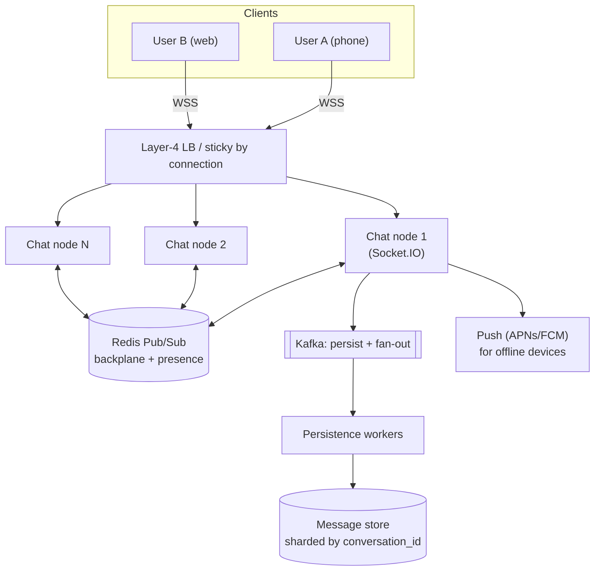
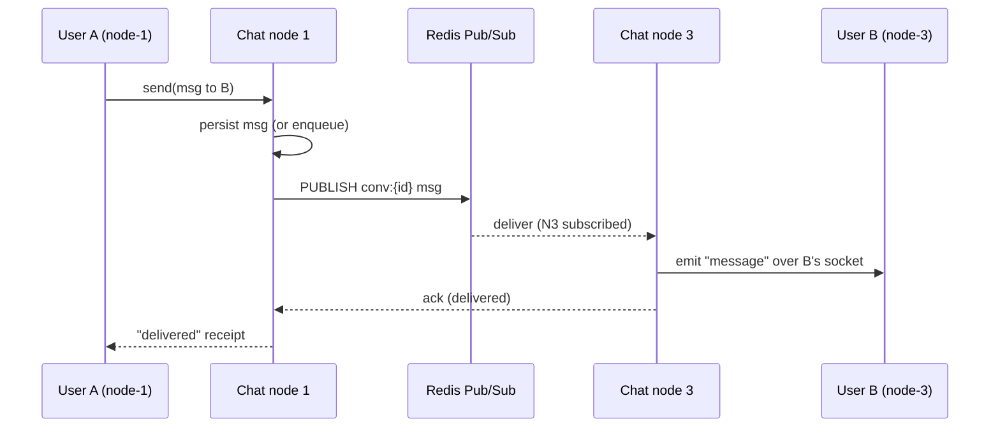
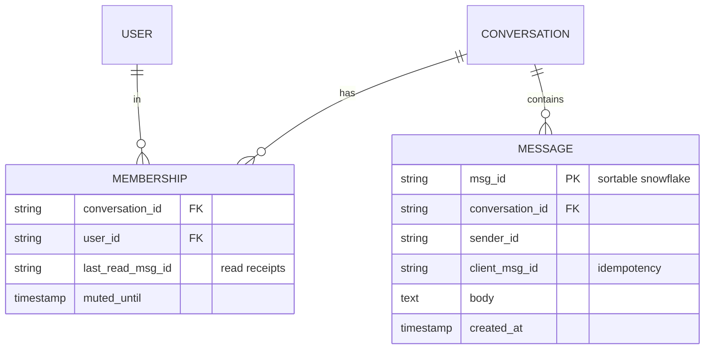
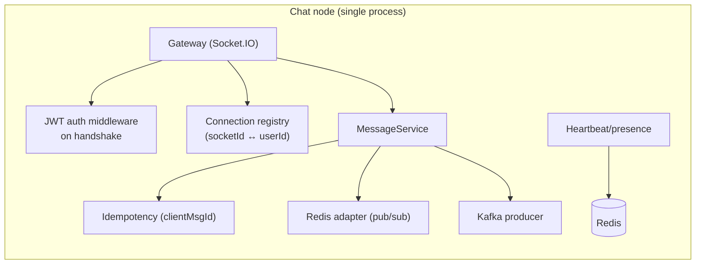

# 1. Design a Real-Time Chat System

> **In one line:** Design a horizontally scalable real-time chat backend — WebSocket fan-out across
> many Node.js instances, message persistence and ordering, delivery/read receipts, presence, and
> offline delivery — starting at 10k concurrent connections and scaling to millions.

> **Original prompt:** Architecture for handling 10k concurrent WebSocket connections using Socket.io
> and a Redis adapter.

## Overview

A chat system looks trivial ("just push a message to the other user") and becomes a genuine
distributed-systems problem the moment you add a second server. The hard parts are not the socket API;
they are: **fan-out across servers**, **message ordering**, **exactly-what-delivery-guarantee**,
**presence**, and **offline/history**.

The single mental model to hold: a WebSocket is a *stateful, long-lived* connection pinned to **one**
server process. User A on `server-1` wants to message User B whose socket lives on `server-3`. Nothing
in `server-1`'s memory knows about `server-3`'s sockets. Every design decision below flows from solving
that one cross-server routing problem.

## Functional Requirements

- 1:1 direct messages and group/room messages.
- Real-time delivery to online recipients; **store-and-forward** for offline recipients.
- Message history (scrollback) with pagination.
- Delivery states: **sent → delivered → read**.
- Presence: online / offline / last-seen, and per-conversation typing indicators.
- Multi-device: the same user logged in on phone + web must both receive messages.

## Non-Functional Requirements

| Property | Target | Why |
|---|---|---|
| Latency | p99 < 200 ms server-side fan-out | Chat feels "instant" below ~200 ms |
| Concurrency | 10k → 10M live connections | Connections, not RPS, are the scaling axis |
| Durability | No acknowledged message ever lost | Persist **before** ack |
| Ordering | Per-conversation monotonic order | Out-of-order chat is unusable |
| Availability | 99.99%, survive a node loss | Reconnect + replay must be seamless |

## A Realistic Interview Conversation

- **Q: One server or many?** → Many. A single Node process handles ~10k–65k sockets before the event
  loop / file descriptors bottleneck; the whole point is scaling past one box.
- **Q: How does a message reach a socket on another server?** → A **pub/sub backplane** (Redis
  Pub/Sub, or Kafka/NATS at scale). Servers subscribe to channels; the sender publishes; the owning
  server delivers to its local socket.
- **Q: TCP WebSocket vs HTTP long-polling?** → WebSocket (full-duplex, low overhead). Keep long-polling
  only as a fallback for hostile networks (Socket.IO does this automatically).
- **Q: Where is the source of truth for a message?** → A durable store (e.g. Cassandra/DynamoDB or
  Mongo for moderate scale). The socket layer is transport, **not** storage.

## Back-of-the-Envelope Estimation

- 10M DAU, avg 40 messages/user/day → 400M msgs/day ≈ **4,600 writes/sec** average, ~5× peak ≈ 23k/sec.
- Concurrent connections: assume 10% online → **1M live sockets**. At ~10k sockets/node → **~100 nodes**.
- Message size ~1 KB. 400M × 1 KB ≈ **400 GB/day** of message data → plan sharding + TTL/archival.

## High-Level Architecture

The connection layer is stateful and horizontally scaled; the **backplane** routes across nodes; a
durable log (Kafka) decouples delivery from persistence.

## Cross-Server Fan-Out: the Core Problem

**Why a backplane and not a service registry of "which user is on which node"?** You *can* keep a
`user → node` map in Redis and target the exact node. Pub/Sub is simpler and self-healing (no stale
routing entries on crash), at the cost of every node seeing a channel's traffic. At very large scale you
shard channels (per-conversation or consistent-hashed) so no node sees all traffic — this is what the
Socket.IO Redis adapter and, at hyperscale, systems built on **Kafka/NATS** do.

## Message Ordering & IDs

- **Do not trust client clocks.** Assign a server-side, sortable ID per message
  (Snowflake-style: time + shard + sequence — see problem 05). Sorting by this ID gives per-conversation
  monotonic order even across nodes.
- Ordering guarantee is **per conversation**, not global — that's all users perceive and it's far cheaper.
- Partition the durable log by `conversation_id` so all messages of a conversation are totally ordered
  within one partition.

## Delivery Semantics: at-least-once + idempotency

TCP does not give you application-level delivery guarantees (a socket can drop after the OS buffered but
before the app read). Use **at-least-once + client dedup**:

1. Client sends with a client-generated `clientMsgId` (UUID).
2. Server persists, assigns a server `msgId`, returns an **ack** carrying both IDs.
3. If the client doesn't get the ack, it **retries** with the same `clientMsgId`; server upserts on
   `clientMsgId` → no duplicate.
4. Recipients dedup on `msgId`.

Exactly-once is impossible end-to-end; at-least-once + idempotent write is the pragmatic standard.

## Data Model

- **Messages sharded by `conversation_id`** → a conversation's history is one partition, cheap to page.
- **Read receipts** are just `last_read_msg_id` per membership — O(1) to update, and "unread count" is a
  range count above it (see problem 21).
- History query: `WHERE conversation_id = ? AND msg_id < cursor ORDER BY msg_id DESC LIMIT 50`
  (keyset/cursor pagination — no `OFFSET`).

## Presence & Typing

- Presence is **soft state**: `SET presence:{userId} online EX 30`, refreshed by a **heartbeat** every
  ~10–15 s. If the key expires, the user is offline. (This is problem 02 in depth.)
- Typing indicators are **ephemeral, not persisted** — publish to the conversation channel with a short
  TTL; never write them to the message store.

## Offline Delivery

If the recipient has no live socket: enqueue to their per-user **inbox** / undelivered set, and trigger a
**push notification** (APNs/FCM). On reconnect the client calls "sync since `last_seen_msg_id`" and the
server replays missed messages from the durable store.

## Low-Level Design (Node.js)

- Authenticate on the **handshake** (JWT in the connection query/header), not per message.
- `join(conversationId)` → Socket.IO room; the Redis adapter turns `io.to(room).emit()` into a cross-node
  publish automatically.
- Backpressure: if a client is slow, its send buffer grows — cap it and drop/disconnect abusive sockets.

## Scaling & Failure Scenarios

| Scenario | Design response |
|---|---|
| One chat node crashes | Its sockets drop; clients auto-reconnect (exp. backoff) to another node and replay since cursor |
| Redis backplane is a bottleneck | Shard channels / use Redis Cluster; at hyperscale move to Kafka/NATS |
| Thundering herd on reconnect | Jittered backoff; token-bucket accept rate at the LB |
| Hot group (celebrity, 1M members) | Fan-out-on-read for huge rooms instead of fan-out-on-write |
| Message store hot partition | Shard by `conversation_id`; archive cold messages to object storage with TTL |

## Security

- **WSS (TLS) only.** Authenticate the handshake; re-check authorization on every `join` (is the user a
  member of that conversation?).
- Rate-limit per socket (messages/sec) to stop spam/DoS.
- Sanitize/escape message bodies (stored XSS in web clients); treat all client input as hostile.
- Encrypt at rest; for private messaging consider **end-to-end encryption** (server stores ciphertext,
  never plaintext) — a product decision with big key-management implications.

## Performance

- Prefer **binary frames / compact payloads**; enable `permessage-deflate` cautiously (CPU vs bandwidth).
- Keep the event loop free: offload persistence to Kafka + workers; never do sync CPU work in the socket
  handler.
- Tune OS limits: file descriptors (`ulimit -n`), ephemeral ports, `SO_REUSEPORT`; one Node process is
  single-threaded, so run one process **per core** (cluster) behind the LB.

## Trade-offs & Pitfalls

- **Sticky sessions vs stateless:** WebSockets are inherently sticky to a node. Don't fight it; make
  reconnect cheap instead.
- **Persist-then-ack vs ack-then-persist:** ack-first is faster but loses messages on crash. Persist (or
  durably enqueue) **before** acking.
- **Storing typing/presence in the DB:** don't — it's high-churn ephemeral state; keep it in Redis.
- **Global ordering:** unnecessary and expensive; per-conversation order is what users see.

## Interview Questions & Answers

- **How do two users on different servers exchange messages?** Pub/sub backplane (Redis adapter / Kafka);
  the owning node delivers to the local socket.
- **How do you guarantee no message is lost?** Persist or durably enqueue before ack; at-least-once +
  idempotent upsert on `clientMsgId`; client replays since a cursor on reconnect.
- **How do you order messages?** Server-assigned sortable IDs, partitioned per conversation.
- **How is presence implemented without hammering the DB?** Redis keys with TTL refreshed by heartbeats.
- **How do you scale to 10M connections?** ~100+ stateful nodes behind an L4 LB, sharded pub/sub, push
  notifications for offline, fan-out-on-read for huge rooms.
