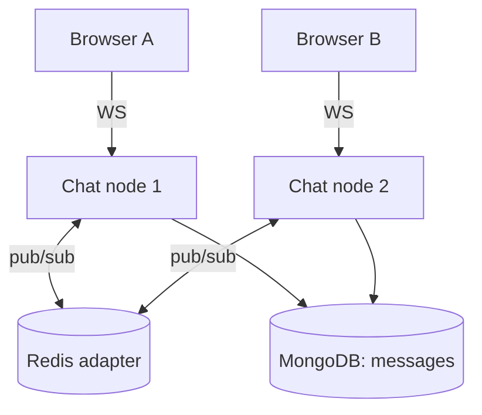

# Real-Time Chat System — implementation

A production-shaped real-time chat backend that implements the
[design doc](../01-real-time-chat-system.md): **Socket.IO** WebSocket transport, a **Redis adapter**
backplane so messages fan out across many stateless instances, **MongoDB** message persistence with
per-conversation ordering, cursor-paginated history, and **at-least-once delivery with idempotency**.

## Stack

- **Node.js + TypeScript + Express** (HTTP + static demo client)
- **Socket.IO** for WebSockets, **@socket.io/redis-adapter** for cross-instance fan-out
- **MongoDB (Mongoose)** for durable messages
- **Redis** as the pub/sub backplane

## Architecture



A WebSocket is pinned to one node; the **Redis adapter** turns `io.to(room).emit()` into a cross-node
publish so a message sent on node 1 reaches a recipient connected to node 2.

## Endpoints

| Method | Path | Purpose |
| --- | --- | --- |
| GET | `/api/health` | Liveness probe |
| GET | `/api/token?userId=` | Mint a demo HMAC token for the WebSocket handshake |
| GET | `/api/conversations/:id/messages?limit=&before=` | Cursor-paginated history (newest-first) |

**WebSocket events:** `join(conversationId)`, `message({conversationId, clientMsgId, body})` → ack
`{ok, messageId}`, and incoming `message` / `typing` broadcasts.

## Key design points (mapped to the doc)

- **Cross-node fan-out** via the Redis adapter (the doc's "backplane").
- **Ordering:** server-assigned sortable `messageId` (`src/lib/ids.ts`), indexed per conversation.
- **At-least-once + idempotency:** client sends a `clientMsgId`; a unique `(conversationId, clientMsgId)`
  index makes retries safe (E11000 → return the original). Recipients dedup on `messageId`.
- **Typing** indicators are ephemeral (never persisted).
- **Auth on the handshake** (HMAC demo token), not per message.

## Run it

```bash
cp .env.example .env
docker compose up --build          # app on http://localhost:3101 (open it for the demo client)
# prove multi-instance fan-out:
docker compose up --build --scale app=3
```

Local dev (needs Redis + Mongo, e.g. via `docker run`):

```bash
npm install
npm run dev        # tsx watch
npm test           # unit tests (ids + token) — no DB required
npm run typecheck
```

## Verification

- `npm run typecheck` and `npm test` pass (id ordering/uniqueness + token sign/verify/tamper).
- Message persistence + cross-node fan-out run under `docker compose up` (Mongo + Redis + app).
