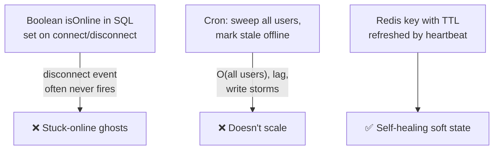
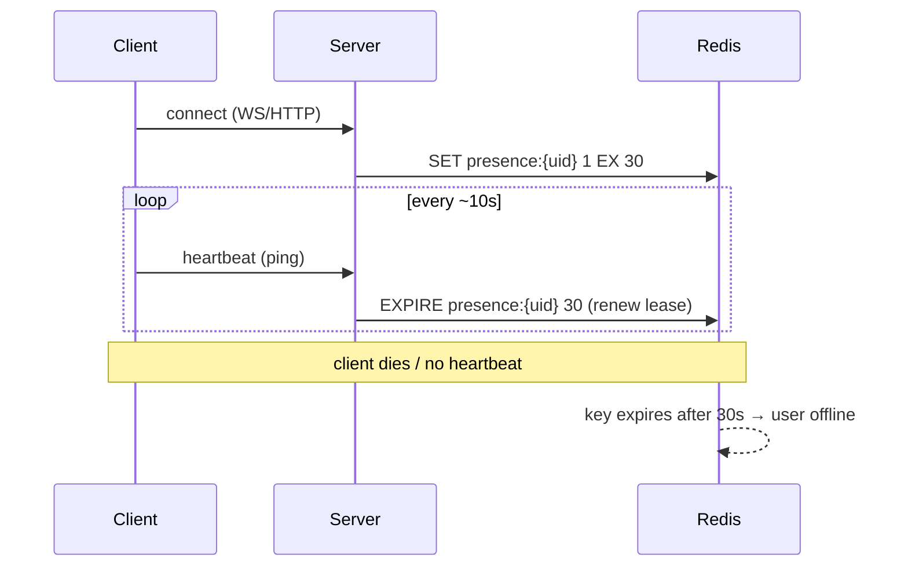
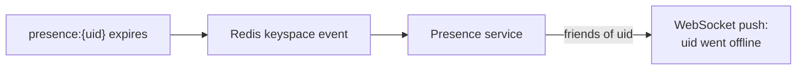

# 2. Design a "Who's Online" Feature

> **In one line:** Track and broadcast which users are currently online at scale using Redis with
> expiry-based heartbeats — turning an unbounded "who is connected right now" question into cheap,
> self-healing soft state.

> **Original prompt:** A specific implementation using Redis sets with expiration (heartbeats).

## Overview

Presence looks like a boolean (`isOnline`) but is really a **liveness** problem: *how do you know a user
is still there without asking them constantly, and how do you notice when they silently vanish?* Browsers
crash, phones go into tunnels, laptops sleep — none of these send a clean "I'm leaving" signal.

The winning idea is **soft state with a TTL**: presence is not a fact you store forever, it is a lease the
client must keep renewing. Stop renewing → the lease expires → you're offline. No cleanup job, no stuck
"online" ghosts.

## Functional Requirements

- Show a user as **online / offline**, plus **last seen** timestamp.
- Show presence of a user's **friends/followers** (not the whole world).
- Update in near-real-time (a few seconds of lag is fine).
- Handle multiple devices/tabs for the same user (online if *any* device is live).

## Non-Functional Requirements

| Property | Target |
|---|---|
| Freshness | Detect offline within ~30 s of disconnect |
| Write cost | O(1) per heartbeat; must survive millions of users |
| Read cost | O(k) for k friends, not O(all users) |
| Correctness | No permanently-stuck "online" ghosts |

## Why Not the Naive Approaches



A DB boolean relies on the disconnect event, which is exactly the event you *can't* rely on. A sweeping
cron re-derives the whole world repeatedly. TTL-based presence deletes itself when heartbeats stop —
correctness for free.

## The Core Mechanism: Heartbeat + TTL



- **TTL ≈ 2–3× heartbeat interval.** Heartbeat every 10 s, TTL 30 s → tolerate one or two lost pings
  without flapping.
- Presence key: `presence:{userId}` (or a per-device key, below). Renewing is a single O(1) `EXPIRE`/`SET`.

## Two Storage Designs (and when to use each)

**Design A — per-user key with TTL (simple, most common):**

```text
SET presence:{uid} <serverId> EX 30      # online + which node holds the socket
EXISTS presence:{uid}                    # is this user online? O(1)
```

To check a friend list, `MGET presence:{f1} presence:{f2} ...` (one round trip). Simple and cheap; "last
seen" stored separately (`SET lastseen:{uid} <ts>` on disconnect/expiry via keyspace notifications).

**Design B — sorted set keyed by expiry (batch queries, "how many online"):**

```text
ZADD online <now+30> {uid}               # score = expiry time
ZRANGEBYSCORE online <now> +inf          # everyone still "alive"
ZREMRANGEBYSCORE online -inf <now>        # lazily reap the expired
```

A single **ZSET** answers "who's online" and "online count" in one place; you sweep expired entries
lazily. Downside: you manage expiry yourself instead of letting Redis TTL do it.

> Rule of thumb: **per-key TTL** for "is my friend online?"; **sorted set** for "give me the set/count of
> online users" (e.g., an admin dashboard).

## Multi-Device Presence

A user is online if **any** device is. Track devices in a set with per-member freshness:

```text
# device-scoped keys, user online if any device key exists
SET presence:{uid}:{deviceId} 1 EX 30
# "is user online?"  → SCAN/known device list, or maintain a small per-user device set
```

At scale, keep a **hash** `HSET presence:{uid} {deviceId} <expiry>` and prune stale fields; the user is
offline only when the hash is empty. This avoids `SCAN` (which is O(N) over the keyspace).

## Broadcasting Changes (edge-triggered, not polling)

Clients shouldn't poll "is my friend online?" every second. Two options:

1. **Redis keyspace notifications** — subscribe to `__keyevent@0__:expired`; when `presence:{uid}` expires,
   publish a `presence:offline` event to that user's friends over their WebSockets.
2. **Explicit transitions** — the server detects offline→online (first heartbeat) and online→offline (TTL
   expiry) and fans out *only the delta* to interested friends via the chat backplane (problem 01).



## Scaling & Failure Scenarios

| Scenario | Response |
|---|---|
| Millions of heartbeats/sec | Heartbeats are O(1) `EXPIRE`; shard with Redis Cluster by `{uid}` |
| Redis restart loses presence | Acceptable — soft state; clients re-heartbeat within seconds and rebuild it |
| Heartbeat storm (all clients sync) | Add jitter to intervals; stagger reconnect backoff |
| "Who's online" for huge friend lists | `MGET` in batches; cap fan-out; consider precomputed per-user online-friend counts |
| Cross-region users | Presence is regional soft state; replicate summaries, not every heartbeat |

## Security

- Presence leaks activity patterns — respect **privacy settings** ("appear offline", invisible mode);
  never expose presence to non-friends.
- Rate-limit heartbeats so a client can't spam `EXPIRE` or forge presence for other users (server derives
  `uid` from the authenticated session, never from client input).
- "Last seen" is sensitive metadata (stalking/OSINT risk) — make it privacy-configurable.

## Performance

- One heartbeat = one O(1) Redis op; no DB writes on the hot path.
- Only persist **last-seen** to durable storage on transition to offline, not on every heartbeat.
- Batch friend-presence reads (`MGET`) into a single round trip; cache friend lists.

## Trade-offs & Pitfalls

- **TTL too short** → flapping (offline blips on one lost ping). **Too long** → stale "online". Tune to
  ~2–3× heartbeat.
- **Storing presence in the primary DB** → write amplification and stuck ghosts. Keep it in Redis.
- **`KEYS`/`SCAN` to list online users** → O(keyspace); use a ZSET or a maintained set instead.
- **Polling for friends' presence** → wasteful; prefer edge-triggered push on transitions.

## Interview Questions & Answers

- **Why TTL instead of a disconnect handler?** Disconnects are unreliable (crashes, network loss). TTL
  makes presence self-expiring and correct without cleanup jobs.
- **How do you pick heartbeat/TTL values?** TTL ≈ 2–3× heartbeat: tolerate a lost ping without flapping,
  detect true offline within ~30 s.
- **How do you show "who's online" efficiently?** `MGET` per-user keys for a friend list, or a sorted set
  scored by expiry for set/count queries.
- **Multi-device?** Track per-device keys/fields; user is offline only when all are gone.
- **How do friends learn about a change without polling?** Redis keyspace-expiry events (or explicit
  transition detection) → push the delta over WebSockets.
