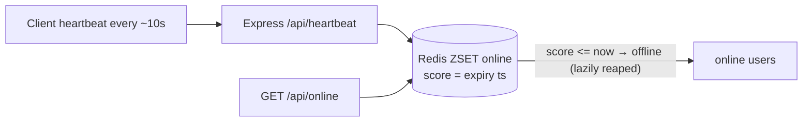

# Who's Online — implementation

A scalable presence service implementing the [design doc](../02-whos-online-feature.md): **self-healing
soft state** via Redis heartbeats + expiry. Presence is a *lease* the client renews; stop renewing and it
expires — no "stuck online" ghosts, no cleanup cron.

## Stack

- **Node.js + TypeScript + Express**
- **Redis** sorted set `online` scored by lease-expiry (ms), plus a `lastseen` hash

## Architecture



## Endpoints

| Method | Path | Purpose |
| --- | --- | --- |
| GET | `/api/health` | Liveness |
| POST | `/api/heartbeat` `{userId}` | Renew presence lease (TTL ≈ 2–3× heartbeat) |
| GET | `/api/status/:userId` | `{online, lastSeen}` |
| GET | `/api/online` | Online users + count |
| GET | `/api/online-among?ids=a,b,c` | Presence for a friend list (one round trip) |

## Design-doc mapping

- **Heartbeat + TTL** → `PresenceStore.heartbeat` (ZADD expiry) renewed by the client.
- **Sorted-set-by-expiry** design → set/count queries in one place; expired entries lazily reaped via
  `ZREMRANGEBYSCORE`.
- **Friend-list presence** → `statusFor` pipelines `ZSCORE` lookups (no `KEYS`/`SCAN`).

## Run it

```bash
cp .env.example .env
docker compose up --build       # app on http://localhost:3102
```

```bash
npm install && npm run dev      # needs Redis (e.g. docker run -p 6379:6379 redis:7-alpine)
npm test                        # pure-logic unit tests (no Redis needed)
npm run typecheck
```

## Verification

- `npm run typecheck` + `npm test` (expiry partitioning) pass.
- Presence flows run against Redis under `docker compose up`.
