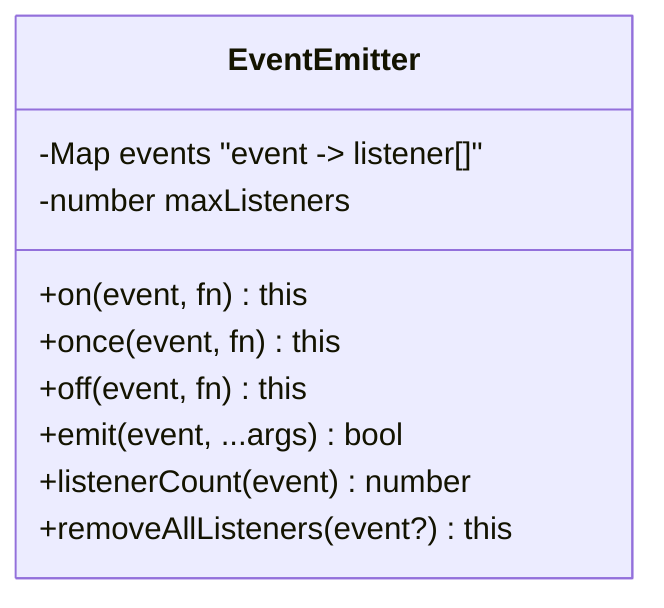
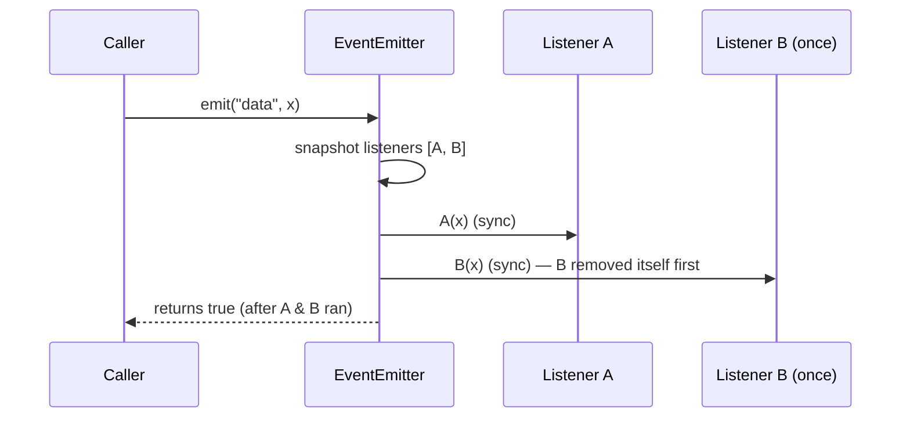

# 3. Implement an Event Emitter

> **In one line:** Build a custom `EventEmitter` (`on`, `once`, `off`, `emit`) from first principles —
> the Observer pattern that underpins Node.js streams, sockets, and HTTP — and reason about its memory,
> ordering, and error-handling semantics.

> **Original prompt:** Write a custom implementation of the Node.js `EventEmitter` class with `on`,
> `emit`, and `off` methods.

## Overview

The `EventEmitter` is the beating heart of Node.js: streams, `http.Server`, sockets, and `process`
itself are emitters. It is a textbook implementation of the **Observer / Pub-Sub** pattern — one subject
holds a registry of listeners keyed by event name and invokes them when the event fires.

The interview value isn't the 20 lines of code; it's the *semantics*: synchronous vs asynchronous
dispatch, listener ordering, removing the right listener, the `once` wrapper, error events, and the
notorious **memory-leak** foot-gun (`MaxListenersExceededWarning`).

## Functional Requirements

- `on(event, listener)` — register; support multiple listeners per event, preserve insertion order.
- `once(event, listener)` — fire at most once, then auto-remove.
- `off(event, listener)` / `removeListener` — remove a specific listener.
- `emit(event, ...args)` — invoke all listeners for `event` synchronously, in order, with args.
- `removeAllListeners([event])`, `listenerCount(event)` — introspection/cleanup.
- Chainable (`on` returns `this`), like Node's.

## Non-Functional Requirements

| Property | Target |
|---|---|
| `emit` cost | O(n) in number of listeners for that event |
| `on`/`off` cost | O(1) add, O(n) remove (find by reference) |
| Memory safety | No unbounded listener growth; warn past a threshold |
| Robustness | One throwing listener shouldn't silently swallow errors |

## The Data Structure



A `Map<string|symbol, Function[]>` — event name → **ordered array** of listeners. An array (not a Set)
because Node guarantees **insertion-order** invocation and allows duplicate listeners.

## Reference Implementation

```js
class EventEmitter {
  constructor() {
    this.events = new Map();      // event -> array of listeners
    this.maxListeners = 10;       // Node's default warn threshold
  }

  on(event, listener) {
    if (typeof listener !== 'function') throw new TypeError('listener must be a function');
    const list = this.events.get(event) ?? [];
    list.push(listener);
    this.events.set(event, list);
    if (list.length > this.maxListeners) {
      console.warn(`MaxListenersExceededWarning: ${list.length} listeners for "${String(event)}"`);
    }
    return this; // chainable
  }

  once(event, listener) {
    // wrapper removes itself before calling, so re-entrant emits are safe
    const wrapper = (...args) => {
      this.off(event, wrapper);
      listener.apply(this, args);
    };
    wrapper.listener = listener;        // keep original ref so off(orig) works
    return this.on(event, wrapper);
  }

  off(event, listener) {
    const list = this.events.get(event);
    if (!list) return this;
    // match direct listener OR a once-wrapper wrapping it
    const idx = list.findIndex((l) => l === listener || l.listener === listener);
    if (idx !== -1) list.splice(idx, 1);
    if (list.length === 0) this.events.delete(event);
    return this;
  }

  emit(event, ...args) {
    const list = this.events.get(event);
    if (!list || list.length === 0) {
      if (event === 'error') throw args[0] instanceof Error ? args[0] : new Error('Unhandled error');
      return false;
    }
    // copy so once()/off() during dispatch doesn't corrupt iteration
    for (const listener of [...list]) listener.apply(this, args);
    return true;
  }

  removeAllListeners(event) {
    if (event === undefined) this.events.clear();
    else this.events.delete(event);
    return this;
  }

  listenerCount(event) {
    return this.events.get(event)?.length ?? 0;
  }
}
```

## The Subtle Parts (what the interviewer probes)

**1. `emit` is synchronous.** Listeners run *before* `emit` returns, on the same tick — not on the next
event-loop turn. This surprises people who expect `setTimeout`-like deferral. If you need async, the
*listener* schedules its own async work.

**2. Copy the array before iterating.** A listener may call `off()` or `once()` fires and removes itself
mid-dispatch. Iterating the live array would skip listeners or throw. `[...list]` snapshots it.

**3. `once` must remove *before* invoking.** Otherwise a listener that re-emits the same event recurses
into itself. Remove first, then call.

**4. `off` must find the wrapper.** `once` registers a *wrapper*, but callers pass the *original*
function to `off`. Store `wrapper.listener = original` and match on either.

**5. The `error` event is special.** An emitted `'error'` with **no** listener throws (crashes the
process in Node). This is intentional: swallowing errors silently is worse than crashing.



## Memory Leaks — the Real-World Motivation

The `MaxListenersExceededWarning` exists because forgetting to `off()` is the #1 Node memory leak: e.g.,
adding a listener to a long-lived emitter on every request. Each listener closure retains its scope, so
the heap grows unbounded.

- Always pair `on` with `off` for transient subscribers; prefer `once` when you truly want one shot.
- Bound the registry (`maxListeners`) and **warn**, don't silently grow.
- For request-scoped listeners, remove on request end (or use `AbortSignal`, which modern Node supports).

## Sync vs Async Dispatch

| Model | Behavior | Use when |
|---|---|---|
| **Synchronous (Node default)** | Listeners run inline, blocking `emit` | Fast, in-process callbacks |
| Deferred (`queueMicrotask`/`setImmediate`) | Listeners run after current stack unwinds | Avoid re-entrancy / long stacks |
| **Distributed pub/sub** | Listeners on other processes/machines | Cross-service events (Redis, Kafka) — a *different* problem (see 01, 06) |

An in-memory emitter is single-process. The moment you need cross-process events, you graduate to a
message broker — same pattern, different transport and durability guarantees.

## Trade-offs & Pitfalls

- **Removing during emit** without snapshotting → skipped/duplicated invocations.
- **Duplicate listeners:** Node allows the same fn added twice (fires twice); a `Set` would silently
  dedupe and break that contract.
- **Throwing listener aborts the rest:** in this simple version, one throw stops the loop. Node behaves
  the same for sync listeners — decide explicitly whether to `try/catch` each listener.
- **Leaks from anonymous listeners:** you can't `off()` a function you don't have a reference to.

## Interview Questions & Answers

- **Is `emit` sync or async?** Synchronous — listeners run before `emit` returns.
- **Why copy the listener array in `emit`?** So `once`/`off` mutations during dispatch don't corrupt
  iteration.
- **How does `off` remove a `once` listener when given the original fn?** The wrapper stores
  `wrapper.listener = original`; `off` matches either reference.
- **Why does an unhandled `'error'` event throw?** Silent error-swallowing is dangerous; Node forces you
  to handle it.
- **What causes `MaxListenersExceededWarning`?** Registering listeners on a long-lived emitter without
  removing them — a classic leak; the warning is an early smoke alarm.
- **Which pattern is this?** Observer / Publish-Subscribe.
