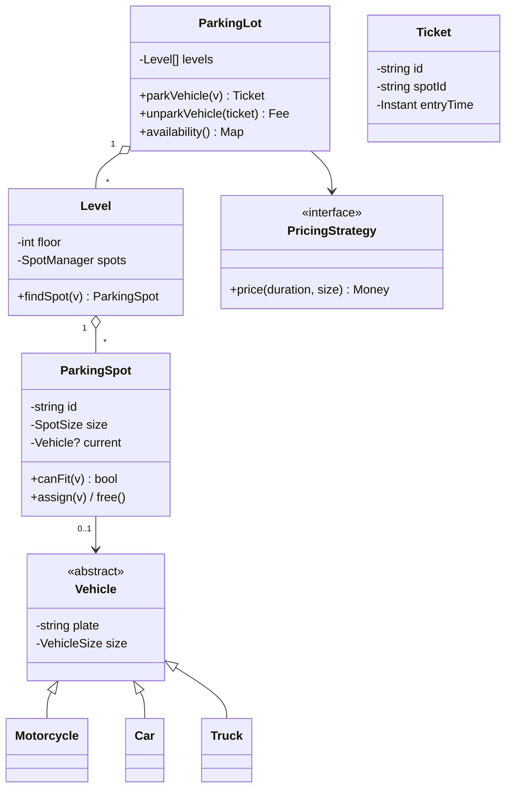
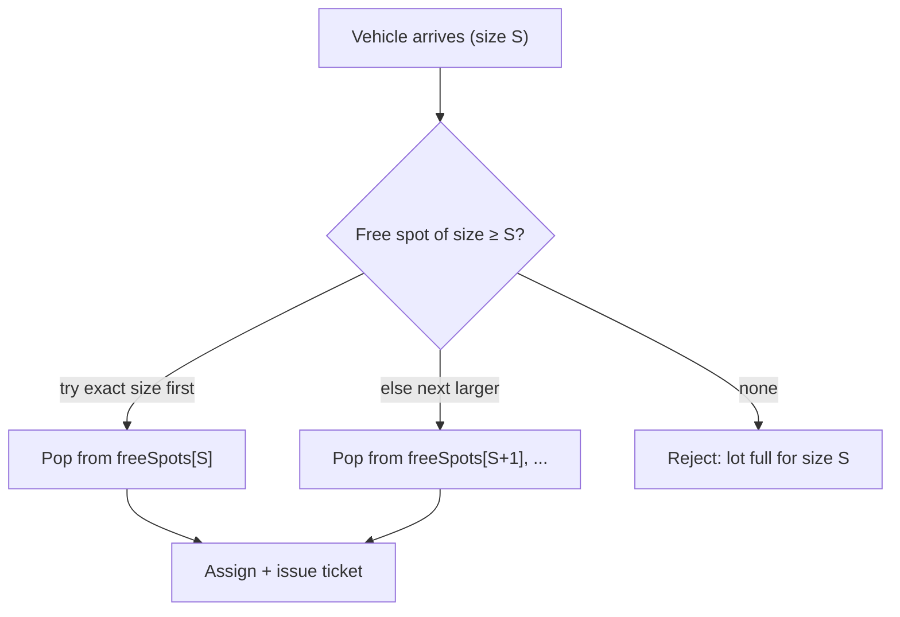
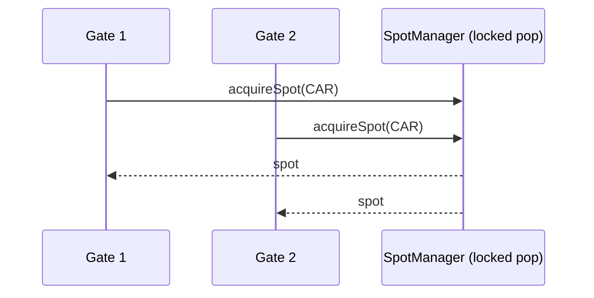

# 4. Design a Parking Lot (Low-Level Design)

> **In one line:** Model a multi-level parking lot as a clean object-oriented system — vehicles, spots,
> levels, tickets, and pricing — with a spot-allocation algorithm and the concurrency control that keeps
> two cars from claiming the same spot.

> **Original prompt:** Create the class hierarchy (Vehicle, Spot, Level) and the allocation algorithm.

## Overview

Parking Lot is the canonical **LLD / OOD** interview: it's less about scale and more about *modeling* —
choosing the right classes, applying SOLID, and picking design patterns (Strategy for allocation, Factory
for tickets, Singleton for the lot). The trap is to jump into code; the skill is to derive entities from
requirements and keep responsibilities cleanly separated.

## Functional Requirements

- Multiple **levels**, each with many **spots**; spots have sizes (motorcycle, compact, large).
- A vehicle enters → system assigns the nearest fitting free spot and issues a **ticket**.
- A vehicle exits → compute **fee** from duration, free the spot, close the ticket.
- Support different vehicle types; a larger vehicle can use a larger spot but not vice-versa.
- Show real-time availability per level / per size; reject entry when full.

## Non-Functional Requirements

| Property | Target |
|---|---|
| Correctness | A spot is assigned to exactly one vehicle (no double-booking) |
| Extensibility | Add vehicle types, spot sizes, pricing rules without rewriting core |
| Allocation | Assign a spot in O(1)–O(log n), not scan-all |
| Concurrency | Safe under many simultaneous entries at busy gates |

## Deriving the Domain Model

Nouns → classes; verbs → methods. From the requirements:



Key decisions:

- **`Vehicle` is abstract** with concrete `Motorcycle`/`Car`/`Truck` (or just a `size` enum — prefer the
  enum unless subtypes carry behavior; avoids a class explosion).
- **Spot size vs vehicle size** are separate enums with a `canFit` rule — a `Car` fits `COMPACT` or
  `LARGE`, a `Truck` needs `LARGE`.
- **`PricingStrategy`** is an interface (Strategy pattern) so hourly/flat/tiered pricing is swappable.

## Spot-Allocation Algorithm

Naively scanning every spot is O(total spots). Keep **free-spot structures per size** so allocation is
fast:



- Maintain a min-heap or queue of free spots **per size per level** (e.g., ordered by distance to the
  entrance for "nearest spot"). Allocation = pop from the smallest fitting size that has capacity → best-fit
  without wasting a large spot on a motorcycle.
- Freeing a spot pushes it back into its structure.
- This is **O(log n)** with a heap (or O(1) with a simple stack/queue if "nearest" doesn't matter).

## Concurrency: the Double-Booking Problem

Two cars at two gates can both see the same "free" spot. This is the real design meat:

| Approach | Mechanism |
|---|---|
| **In-process lock** | Guard the free-spot structure with a mutex; pop is atomic → only one caller gets a given spot |
| **Atomic DB claim** | `UPDATE spots SET vehicle=? WHERE id=? AND vehicle IS NULL` — succeeds for exactly one writer (conditional update) |
| **Redis atomic pop** | `LPOP`/`SPOP` of a free-spot set is atomic; the loser never sees the spot |
| **Optimistic locking** | Version column; the second writer's version check fails and retries (see problem 14) |

The principle: **assignment must be a single atomic operation** — a compare-and-set, not a read-then-write.



## Ticketing & Pricing (Factory + Strategy)

- **Entry:** a `TicketFactory` creates a `Ticket{id, spotId, entryTime}`; store it keyed by ticket id.
- **Exit:** look up ticket → `duration = now - entryTime` → `PricingStrategy.price(duration, size)` →
  free the spot → mark ticket paid.
- Strategy examples: `HourlyPricing` (round up per hour), `FlatDayPricing`, `TieredPricing` (first hour
  free, then escalating). New rule = new class, no edits to `ParkingLot` (Open/Closed principle).

## SOLID & Patterns in Play

| Principle / Pattern | Where |
|---|---|
| **Single Responsibility** | `SpotManager` allocates; `PricingStrategy` prices; `ParkingLot` orchestrates |
| **Open/Closed** | New vehicle sizes / pricing rules added without changing core logic |
| **Strategy** | Pluggable `PricingStrategy` and allocation policy (nearest / random / level-balanced) |
| **Factory** | `TicketFactory` / `VehicleFactory` centralize construction |
| **Singleton** | One `ParkingLot` instance (guard against misuse — inject it, don't `new` everywhere) |

## Suggested Structure

```text
parking/
  domain/       Vehicle, VehicleSize, SpotSize, ParkingSpot, Level, Ticket
  allocation/   SpotManager (per-size free structures), AllocationStrategy
  pricing/      PricingStrategy, HourlyPricing, TieredPricing
  ParkingLot.ts (facade: parkVehicle / unparkVehicle / availability)
```

## Scaling Beyond One Lot

Interviewers sometimes push to "many lots / a city": promote `ParkingLot` to a service with a database of
spots, use **atomic conditional updates** (or Redis) for claims, publish availability changes to a cache,
and expose an API. The class model stays; storage and concurrency move out of process.

## Security & Correctness Considerations

- **Idempotent exit:** paying/exiting twice with the same ticket must not double-charge or double-free.
- Validate the ticket signature/id at exit (prevent forged tickets / fee evasion).
- Availability counters must be derived from the source of truth (spot state), not a separate counter
  that can drift.

## Trade-offs & Pitfalls

- **Class explosion:** subclassing every vehicle/spot combination. Prefer enums + a `canFit` rule.
- **Read-then-write allocation:** the classic race; make the claim atomic.
- **Counting availability separately:** a standalone counter drifts from actual spot state — derive it or
  update both atomically.
- **God object:** `ParkingLot` doing allocation + pricing + ticketing. Split responsibilities.

## Interview Questions & Answers

- **Vehicle/Spot: inheritance or enums?** Enums with a `canFit` rule unless subtypes carry distinct
  behavior — avoids combinatorial subclasses.
- **How do you allocate a spot efficiently?** Per-size free-spot heaps/queues; pop the smallest fitting
  size → O(log n) best-fit.
- **How do you prevent two cars getting one spot?** Make assignment a single atomic op: locked pop,
  conditional `UPDATE ... WHERE vehicle IS NULL`, or Redis `SPOP`.
- **How do you support new pricing?** Strategy pattern — add a `PricingStrategy` implementation, no core
  changes.
- **Which SOLID principles show up?** SRP (separated managers), OCP (new sizes/pricing without edits),
  plus Strategy/Factory patterns.
