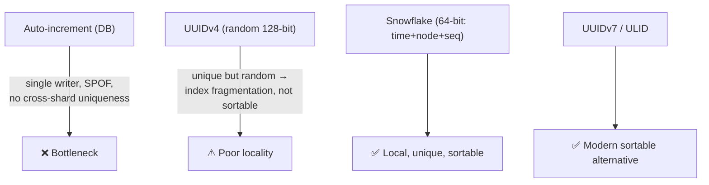
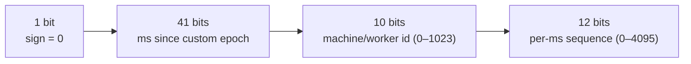
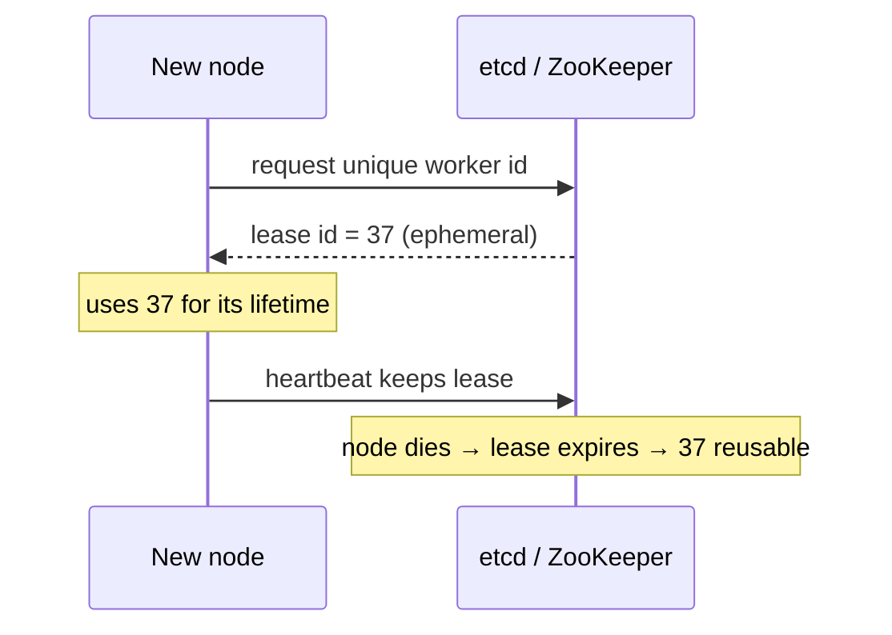

# 5. Distributed ID Generator (Snowflake)

> **In one line:** Generate globally unique, roughly **time-sortable** 64-bit IDs across many Node.js
> processes without coordination on every call — the Snowflake scheme — and handle its sharp edges (clock
> skew, worker-id assignment, sequence overflow).

> **Original prompt:** Implement logic similar to Snowflake ID to generate unique, sortable IDs in a
> distributed Node.js cluster.

## Overview

Every distributed system needs unique IDs for rows, messages, and events. The naive options each break a
requirement: a DB auto-increment needs a single coordinator (bottleneck + SPOF); random UUIDv4 is unique
but **not sortable** and destroys index locality. **Snowflake** threads the needle: 64 bits laid out as
*time + machine + sequence*, so IDs are unique, generated locally (no network call), and monotonic enough
to sort by creation time.

## Functional Requirements

- Generate **unique** IDs across N machines/processes with no per-ID coordination.
- IDs are **k-sortable** (roughly ordered by time) → good index locality, "newest first" is a range scan.
- Fit in **64 bits** (a BIGINT / JS BigInt) so they're cheap to store and index.
- High throughput: thousands+ per node per millisecond.

## Non-Functional Requirements

| Property | Target |
|---|---|
| Uniqueness | Zero collisions, even at peak and across restarts |
| Latency | O(1), in-process, no network round trip |
| Ordering | Monotonic per node; globally time-ordered to the millisecond |
| Lifetime | Enough timestamp bits for decades |

## Why Not the Obvious Choices



- **Auto-increment:** requires one coordinator; sharding breaks global uniqueness; it's a write bottleneck.
- **UUIDv4:** 128 random bits — collision-safe but **random**, so B-tree inserts scatter across the index
  (page splits, cache misses). Also twice the storage of a 64-bit int.
- **Snowflake:** local generation, 64-bit, time-prefixed → sequential-ish inserts, sortable.

## The Snowflake Bit Layout

64 bits = `1 unused sign bit | 41 bits timestamp | 10 bits machine id | 12 bits sequence`:



- **41-bit timestamp** (ms since a custom epoch): `2^41 ms ≈ 69.7 years`. Use a recent epoch (e.g.
  2020-01-01) so you get ~69 years from *then*, not from 1970.
- **10-bit machine id:** up to **1024** nodes. Split into datacenter + worker if you like (5+5).
- **12-bit sequence:** up to **4096** IDs per node **per millisecond** → ~4.096M IDs/sec/node.

## Generation Algorithm

```js
class Snowflake {
  constructor(machineId, epoch = 1577836800000n /* 2020-01-01 */) {
    if (machineId < 0 || machineId > 1023) throw new RangeError('machineId 0..1023');
    this.machineId = BigInt(machineId);
    this.epoch = BigInt(epoch);
    this.lastMs = -1n;
    this.seq = 0n;
  }

  nextId() {
    let now = BigInt(Date.now());

    if (now < this.lastMs) {
      // clock moved backwards (NTP correction) — refuse or wait
      throw new Error(`Clock moved backwards by ${this.lastMs - now}ms`);
    }

    if (now === this.lastMs) {
      this.seq = (this.seq + 1n) & 0xfffn;         // 12-bit mask
      if (this.seq === 0n) now = this.waitNextMs(); // sequence exhausted this ms → spin to next ms
    } else {
      this.seq = 0n;
    }
    this.lastMs = now;

    return ((now - this.epoch) << 22n)  // 10 + 12 bits to the left
         | (this.machineId << 12n)
         | this.seq;
  }

  waitNextMs() {
    let now = BigInt(Date.now());
    while (now <= this.lastMs) now = BigInt(Date.now());
    return now;
  }
}
```

Note the arithmetic uses **BigInt** — JS `Number` only holds 53 integer bits, so a 64-bit ID would lose
precision. Store as `BigInt`/string/`BIGINT`.

## The Two Hard Problems

**1. Clock skew / clock going backwards.** IDs assume a monotonic wall clock. When NTP steps the clock
*backwards*, you could re-mint a timestamp you already used → duplicates. Options:

- **Refuse** to generate and alarm while `now < lastMs` (safest; brief unavailability).
- **Wait** until the clock catches up (small backward steps).
- Use a **monotonic clock** offset, or Twitter's approach of tracking `lastTimestamp` and erroring on
  regression.

**2. Machine-id assignment.** Every node needs a **unique** 10-bit id, or two nodes collide. Assign via:

- **ZooKeeper/etcd** sequential ephemeral nodes (each node leases a unique id).
- A **config/DB registry** handing out ids at boot.
- Kubernetes: derive from a `StatefulSet` ordinal.
- Never hardcode — two pods with id `1` silently produce dup IDs.



## Alternatives & When to Use Them

| Scheme | Bits | Sortable | Coordination | Notes |
|---|---|---|---|---|
| **Snowflake** | 64 | Yes (ms) | worker-id only | Classic; needs id assignment + clock care |
| **UUIDv7** | 128 | Yes (ms prefix) | none | Modern standard; sortable, no worker id, but 128-bit |
| **ULID** | 128 | Yes (ms + random) | none | Lexicographically sortable, URL-safe |
| **Mongo ObjectId** | 96 | Yes (sec) | none | Built into Mongo; second-granularity |
| **DB ticket server (Flickr)** | 64 | Yes | central | Two servers with offset step-2 auto-increment |

**Guideline:** if you're on modern infra and 128 bits is fine, **UUIDv7/ULID** removes the worker-id and
clock-coordination headaches. Choose Snowflake when you need a compact **64-bit** sortable id and can
manage worker ids.

## Scaling & Failure Scenarios

| Scenario | Response |
|---|---|
| Sequence exhausted (>4096 in 1 ms) | Spin to next millisecond (`waitNextMs`) — bounded stall of <1 ms |
| Node restart | Re-lease the same/any free worker id; timestamp always advances so no reuse |
| Need >1024 nodes | Repartition bits (fewer sequence bits) or move to 128-bit UUIDv7 |
| Multi-region | Encode region into machine-id bits so IDs never collide across regions |

## Security & Correctness

- Time-ordered IDs **leak creation time and volume** (an attacker can estimate your growth rate from ID
  deltas). If that matters, don't expose raw IDs externally — map to opaque public slugs.
- Sequential-ish IDs are **enumerable**; never use them as authorization tokens (an ID is not a secret).
- Guarantee worker-id uniqueness operationally — most Snowflake "duplicate" incidents are two nodes sharing
  an id, not algorithm bugs.

## Performance

- Pure in-process bit math → millions/sec/node, no I/O.
- Time-prefixed IDs give **sequential index inserts** (B-tree appends to the right edge) → far better than
  random UUIDv4 for write throughput and cache locality.

## Trade-offs & Pitfalls

- **Using JS `Number`** for a 64-bit id → precision loss above 2^53. Use `BigInt`/string.
- **Ignoring backward clock steps** → duplicates. Detect and refuse/wait.
- **Hardcoded worker ids** → the #1 cause of collisions.
- **Assuming strict global monotonicity** → Snowflake is only monotonic *per node*; across nodes it's
  ordered to the millisecond, not strictly.

## Interview Questions & Answers

- **Why not UUIDv4?** Random → index fragmentation and not sortable; 128 bits doubles storage.
- **Walk me through the 64 bits.** 1 sign + 41 ms-timestamp + 10 machine + 12 sequence.
- **What happens at >4096 IDs in one ms?** Busy-wait to the next millisecond.
- **How do you handle the clock moving backwards?** Detect `now < lastMs` and refuse/wait; never re-mint a
  used timestamp.
- **How is the machine id assigned?** Leased from ZooKeeper/etcd (or StatefulSet ordinal) — must be
  globally unique.
- **Modern alternative?** UUIDv7 / ULID — sortable and coordination-free if 128 bits is acceptable.
