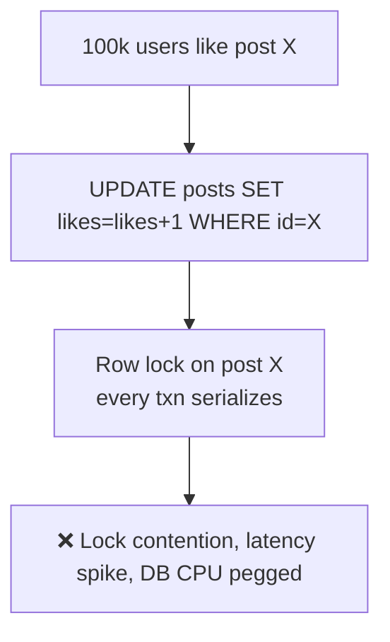
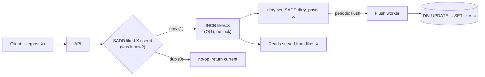
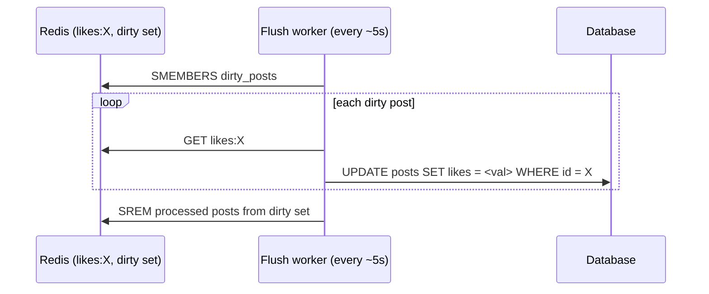

# 6. Design a Like / Reaction System

> **In one line:** Absorb bursts of likes/reactions (a celebrity post spiking to 100k likes/sec) without
> hammering or locking the database — buffer in Redis, aggregate, and flush asynchronously while keeping
> per-user idempotency ("one like per user").

> **Original prompt:** Handle high-throughput "likes" without locking the database (e.g., using Redis
> buffers).

## Overview

A like is the smallest possible write, which is exactly what makes it dangerous: it arrives in enormous
volume and everyone wants the *count* to look live. The naive `UPDATE posts SET likes = likes + 1 WHERE
id = ?` turns a hot post into a **row-lock hotspot** — thousands of transactions serialize on one row and
the DB melts.

The design shifts the write path from "synchronous row update" to "**increment a fast counter, persist
later**", while enforcing two correctness rules: **idempotency** (a user liking twice counts once) and
**eventual accuracy** (the durable count converges to the true number).

## Functional Requirements

- Like / unlike (toggle) and, optionally, multiple reaction types (👍 ❤️ 😆 …).
- One reaction per user per item (idempotent) — re-liking doesn't inflate the count.
- Near-real-time like **count** display.
- "Did *I* like this?" per-user state on read.

## Non-Functional Requirements

| Property | Target |
|---|---|
| Write throughput | 100k+ likes/sec on a hot item, no DB lock contention |
| Read latency | Count served from cache in < 10 ms |
| Idempotency | Exactly one like per (user, item) |
| Durability | No acknowledged like permanently lost; count converges |

## Why the Naive Design Fails

All writers contend for **one row's lock**. This is the "hot key / hot row" problem. Fixes: don't write
the DB synchronously, and don't concentrate all increments on one row.

## Core Design: Redis Counter + Async Flush

- **Idempotency via a Redis set:** `SADD liked:{postId} {userId}` returns `1` only the first time. Only
  then do you `INCR likes:{postId}`. Unlike = `SREM` + `DECR` (guarded the same way).
- **Counter in Redis:** `INCR` is atomic and O(1) — no locks, single-threaded Redis serializes cleanly at
  millions of ops/sec.
- **Async flush:** a worker periodically writes the Redis count back to the DB (write-behind). The DB sees
  a trickle of updates, not the full firehose.

## Idempotency & Storage of "Who Liked What"

Two things to store: the **count** (hot, approximate-then-exact) and the **set of likers** (for "did I
like this?" and for correctness).

| Data | Store | Why |
|---|---|---|
| `likes:{postId}` (count) | Redis `INCR` | Hot path, O(1), cached reads |
| `liked:{postId}` (set of userIds) | Redis set (+ DB for durability) | Enforces one-like-per-user, powers "did I like?" |
| Durable likes | DB table `(user_id, post_id)` unique index | Source of truth; survives Redis loss |

For huge items the "set of all likers" in Redis is memory-heavy; keep the durable `(user_id, post_id)`
unique row as truth and use Redis for the hot subset / recent likers, or a **HyperLogLog** if only the
*approximate count* matters and you don't need per-user state.

## Write-Behind Flush (and its risk)

- Batches many increments into **one** DB write per post per interval — massive write reduction.
- **Risk:** if Redis dies before a flush, un-flushed increments are lost. Mitigate with Redis AOF
  persistence + replication, or make the write path also append to a durable log (Kafka) so the DB can be
  rebuilt. This is the classic **write-behind durability trade-off** (contrast write-through in the cache
  chapters).

## Handling the "Hot Row" Even in the DB

When you must keep the count in a relational DB, avoid single-row contention with **sharded counters**:
maintain `N` sub-counter rows per post (`post_id, shard, count`) and increment a random shard; the total
is `SUM(count)`. Writers spread across shards → no single hot row. (This is how high-write counters are
done when Redis isn't available; it's also the classic Google App Engine pattern.)

## Scaling & Failure Scenarios

| Scenario | Response |
|---|---|
| Celebrity post spike | Redis `INCR` absorbs it; DB sees batched write-behind updates |
| Redis node hot key | The count is one key → use Redis Cluster + client-side caching, or shard the counter |
| Redis crash before flush | AOF + replica; or dual-write to Kafka to replay increments |
| Count drift over time | Periodic **reconciliation**: recompute `COUNT(*)` from the durable likes table |
| Unlike races (like+unlike fast) | Guard both with the set membership check so INCR/DECR stay balanced |

## Security

- Derive `userId` from the authenticated session — **never** trust a client-supplied user id, or one user
  can like as others.
- Rate-limit per user per item (a client shouldn't send 1000 like/unlike toggles/sec) — protects both cost
  and integrity.
- Bot/fraud detection: sudden uniform spikes; likes from one IP across many accounts. Fake-engagement is a
  real abuse vector.

## Performance

- Read path: serve counts from Redis/CDN cache; "did I like?" from the Redis set (or a per-user bitmap).
- Write path: one `SADD` + one `INCR` (both O(1)); zero DB contact on the hot path.
- Display can be **approximate** ("1.2M") — you don't need exact-to-the-unit counts on a viral post, which
  relaxes consistency and lets you cache aggressively.

## Trade-offs & Pitfalls

- **Synchronous DB increment** → hot-row lock meltdown. Buffer instead.
- **Counting without idempotency** → double counts from retries/double-taps. Gate every increment on set
  membership.
- **Write-behind without durability** → lost likes on Redis crash. Add AOF/replica or a durable log.
- **Storing every liker in Redis forever** → memory blowup; keep durable truth in the DB, hot subset in
  Redis, or HLL for approximate-only counts.
- **Strong consistency on counts** → unnecessary; eventual + reconciliation is cheaper and enough.

## Interview Questions & Answers

- **Why not `UPDATE ... likes+1`?** It serializes all writers on one row lock — a hot-row bottleneck.
- **How do you enforce one like per user?** `SADD liked:{post} {user}` returns 1 only on first like; gate
  the counter increment on it (durable unique `(user, post)` row is the source of truth).
- **How does the DB avoid the write firehose?** Write-behind: a worker flushes the Redis count on an
  interval, batching thousands of increments into one update.
- **What if Redis dies before flushing?** Un-flushed counts are lost unless you have AOF/replication or a
  durable log to replay; then reconcile against the likes table.
- **How do you keep counts from drifting?** Periodic reconciliation recomputes the true count from durable
  rows.
- **DB-only high-write counter?** Sharded counter rows summed on read to avoid a single hot row.
