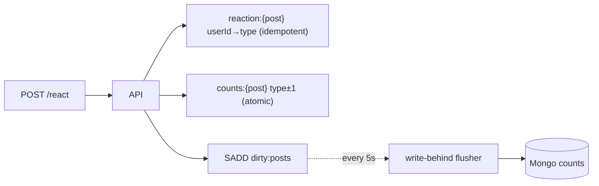

# Like / Reaction System — implementation

High-throughput reactions implementing the [design doc](../06-like-reaction-system.md): absorb bursts in
**Redis** (idempotency set + atomic counters), then **write-behind** to MongoDB — no hot-row `UPDATE`
locking.

## Stack

- **Node.js + TypeScript + Express**
- **Redis** — per-user reaction hash (one-per-user), atomic `HINCRBY` count hash, `dirty` set
- **MongoDB** — durable counts (write-behind flush target)

## Architecture



## Endpoints

| Method | Path | Purpose |
| --- | --- | --- |
| GET | `/api/health` | Liveness |
| POST | `/api/posts/:postId/react` `{userId, reaction}` | Set/change/remove (reaction=null) — returns live counts |
| GET | `/api/posts/:postId/reactions?userId=` | Counts, total, and the caller's reaction |

Reactions: `like love haha wow sad angry`.

## Design-doc mapping

- **No hot-row lock** → counts live in a Redis hash updated by atomic `HINCRBY`.
- **One reaction per user + changeable** → `reaction:{post}` hash; the pure `reactionDeltas(prev,next)`
  computes correct increments (switch = −old +new; re-send = no-op).
- **Write-behind durability** → dirty-set + periodic batch flush to Mongo (the rebuildable source of truth).

## Run it

```bash
docker compose up --build          # http://localhost:3106
npm install && npm test            # 6 unit tests (delta logic) — no DB needed
npm run typecheck
```

## Verification

- `npm test` covers first/remove/change/no-op deltas + validation + total. `npm run typecheck` passes.
- Redis→Mongo write-behind runs under `docker compose up`.
