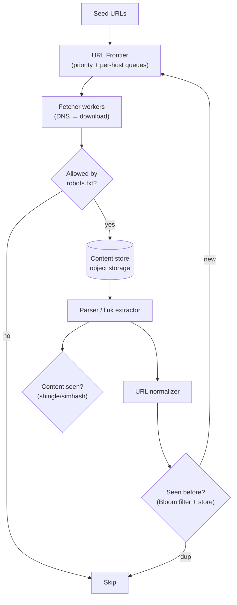
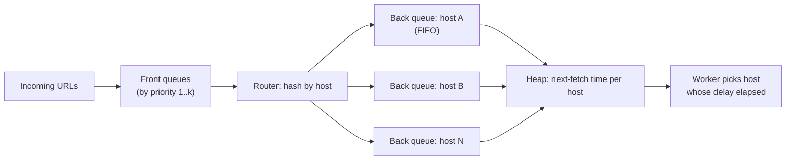
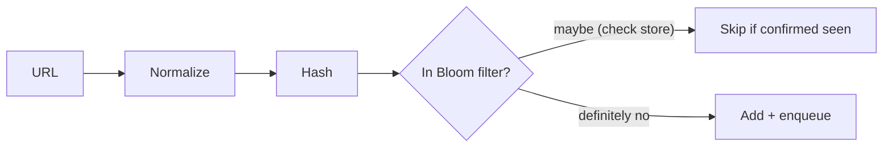

# 7. Web Crawler Architecture

> **In one line:** Design a distributed, worker-based crawler that fetches billions of URLs — a frontier
> queue with politeness, dedup at scale, `robots.txt` compliance, and failure/retry handling — without
> hammering any single site or re-crawling the same page forever.

> **Original prompt:** Design a worker-based system to crawl URLs, respecting `robots.txt` and handling
> failures.

## Overview

A crawler is a **breadth-first graph traversal of the web**: start from seed URLs, download pages, extract
links, enqueue the new ones, repeat. Trivial at 100 URLs; a genuine distributed system at web scale. The
defining constraints are not "how to fetch" but **politeness** (don't DoS a site), **deduplication**
(the web is one giant cycle), **prioritization** (crawl important/fresh pages first), and **resilience**
(the web is full of timeouts, traps, and junk).

## Functional Requirements

- Fetch a page, parse it, extract and normalize outbound links, enqueue new URLs.
- Obey `robots.txt` and crawl-delay directives; honor `nofollow`/`noindex` where relevant.
- Deduplicate URLs (and ideally near-duplicate *content*) so pages aren't crawled repeatedly.
- Re-crawl pages on a freshness schedule (news hourly, archives monthly).
- Store fetched content for downstream indexing.

## Non-Functional Requirements

| Property | Target |
|---|---|
| Scale | Billions of pages; thousands of concurrent fetches |
| Politeness | ≤ 1 concurrent request per host by default; respect crawl-delay |
| Robustness | Survive timeouts, 5xx, redirects loops, crawler traps |
| Extensibility | Pluggable parsers/filters; distributed across many workers |
| Freshness | Important pages re-crawled more often |

## High-Level Architecture

The **URL Frontier** is the heart: it decides *what to crawl next* and *how politely*.

## The URL Frontier (prioritization + politeness)

Two competing goals: crawl the *most valuable* pages first (priority) **and** never send too many
requests to one host (politeness). Mercator's classic design uses **two layers of queues**:

- **Front queues** encode priority (PageRank-ish score, freshness need).
- **Back queues** are *per host* — a worker only pulls a host's URL when that host's **crawl-delay** has
  elapsed (tracked in a min-heap of next-eligible times). This guarantees politeness regardless of how
  many URLs for that host are queued.
- One back queue is worked by one worker at a time → at most one in-flight request per host.

## Deduplication at Scale

The web is a cyclic graph; without dedup you loop forever. You can't fit billions of URLs in memory, so:

- **URL dedup:** normalize (lowercase host, strip default ports, sort query params, remove fragments),
  hash, and test membership in a **Bloom filter** (probabilistic, tiny memory) backed by a durable store
  for confirmation. Bloom filter false-positives occasionally skip a *new* URL — acceptable trade-off.
- **Content dedup:** many URLs serve identical/near-identical content (session ids, mirrors). Use
  **SimHash / MinHash shingling** to detect near-duplicates and skip re-processing.

## robots.txt & Politeness

- Fetch and **cache** `robots.txt` per host (with its own TTL); parse `Disallow`, `Allow`, `Crawl-delay`,
  and `Sitemap`.
- Check every candidate URL against the cached rules before fetching.
- Identify with a proper `User-Agent` and contact URL; respect `Retry-After` on 429/503.
- Politeness is both etiquette and self-preservation: aggressive crawling gets you IP-banned.

## Failure Handling & Crawler Traps

| Hazard | Handling |
|---|---|
| Timeout / connection reset | Retry with exponential backoff + jitter; cap attempts, then dead-letter |
| 5xx / 429 | Back off that host; honor `Retry-After` |
| Redirect loops | Cap redirect chain length; detect cycles |
| Infinite spaces (calendars, faceted URLs) | Depth limits, per-host URL budgets, pattern blacklists |
| Huge/binary pages | `Content-Length` and content-type limits; stream and cap bytes |
| Poison content | Sandboxed parsing; never execute fetched code |

Dead-letter permanently failing URLs for inspection rather than retrying forever.

## Freshness / Re-Crawl

A crawl is never "done" — pages change. Assign each URL a **re-crawl interval** based on observed change
rate (adaptive: pages that change often get shorter intervals). Store `last_crawled` + `next_due`; the
frontier re-enqueues due URLs. This is a priority mixed into the front queues.

## Data & Storage

- **Content store:** raw HTML/blobs in object storage (S3-like), keyed by URL hash — cheap, huge.
- **Metadata store:** URL → {status, last_crawled, next_due, content_hash, etag} in a scalable KV/columnar
  store (Bigtable/Cassandra-style) for billions of rows.
- **Frontier state:** the queues (Kafka/RabbitMQ or a custom sharded queue) + per-host schedules.

## Scaling & Failure Scenarios

| Scenario | Response |
|---|---|
| Billions of URLs | Shard the frontier by host hash across many machines; each owns a host set (keeps politeness local) |
| Worker crash | Queue redelivers unacked URLs; idempotent processing via URL-seen store |
| One giant site | Per-host URL budget + crawl-delay caps its share |
| DNS bottleneck | Cache DNS; dedicated resolver pool |
| Duplicate work across shards | Partition by host so one host is owned by one shard — no cross-shard dup fetches |

## Security & Ethics

- Respect `robots.txt`, rate limits, and legal boundaries (ToS, copyright, personal data laws).
- Sandbox parsers; treat every fetched byte as hostile (XXE, zip bombs, malicious JS you must *not*
  execute).
- Don't crawl authenticated/private areas; strip credentials from URLs.
- Provide an abuse-contact `User-Agent` so site owners can reach you.

## Performance

- **Async, non-blocking I/O** — a crawler is I/O-bound; thousands of concurrent fetches per worker.
- DNS caching and connection reuse (keep-alive) cut latency dramatically.
- Conditional requests (`If-None-Match`/`ETag`, `If-Modified-Since`) avoid re-downloading unchanged pages.

## Trade-offs & Pitfalls

- **Global URL set in memory** → impossible at scale; Bloom filter + durable store.
- **Ignoring per-host politeness** → IP bans and you effectively DoS sites.
- **BFS without priority** → wasting capacity on junk before important pages.
- **Retrying forever** → traps consume the whole crawler; cap and dead-letter.
- **Sharding by URL instead of host** → splits a host across workers, breaking politeness.

## Interview Questions & Answers

- **BFS or DFS?** BFS-like with priority — you want breadth and important pages first, not to tunnel into
  one site.
- **How do you stay polite?** Per-host back queues + crawl-delay heap → ≤1 in-flight request per host,
  honoring `robots.txt`.
- **How do you dedup billions of URLs?** Normalize + hash + Bloom filter (with durable confirm); SimHash
  for near-duplicate content.
- **How do you handle traps/timeouts?** Depth/URL budgets, redirect-chain caps, backoff+retry with a
  dead-letter after N attempts.
- **How do you shard the frontier?** By host hash — one host owned by one shard preserves politeness and
  avoids duplicate fetches.
- **How do you keep the index fresh?** Adaptive re-crawl intervals based on observed change frequency.
