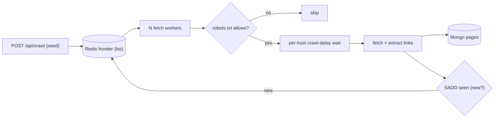

# Web Crawler Architecture — implementation

A worker-based crawler implementing the [design doc](../07-web-crawler-architecture.md): a **Redis
frontier + seen-set** for dedup, **per-host politeness** (crawl-delay), **robots.txt** compliance, and
**MongoDB** page storage.

## Stack

- **Node.js + TypeScript + Express**
- **Redis** — frontier (list), seen-set (dedup), per-host `nextAllowed` politeness key
- **MongoDB** — crawled page metadata

## Architecture



## Endpoints

| Method | Path | Purpose |
| --- | --- | --- |
| GET | `/api/health` | Liveness |
| POST | `/api/crawl` `{seed, maxPages, sameDomainOnly}` | Start a bounded crawl (background) |
| GET | `/api/pages` | Crawled pages + running flag |

## Design-doc mapping

- **URL frontier** → Redis list; **dedup** → `SADD seen` (only new URLs enter the frontier).
- **Politeness** → per-host `nextAllowed:{host}` key enforces ≥ crawl-delay between requests to a host.
- **robots.txt** → fetched + cached per host; `isAllowed` uses longest-match Allow/Disallow precedence.
- **URL normalization** → canonical host/port/fragment/query so the same page isn't re-crawled.
- **Failure handling** → fetch timeouts caught (production: retry+backoff then dead-letter).

## Run it

```bash
docker compose up --build          # http://localhost:3107
curl -XPOST localhost:3107/api/crawl -H 'content-type: application/json' \
  -d '{"seed":"https://example.com","maxPages":10}'
```

```bash
npm install && npm test            # 5 unit tests: URL normalize/extract + robots parse/allow
npm run typecheck
```

## Verification

- `npm test` covers URL canonicalization, link extraction, `sameDomain`, and robots parse + longest-match
  `isAllowed`. `npm run typecheck` passes. Full crawl runs under `docker compose up` (needs internet).
