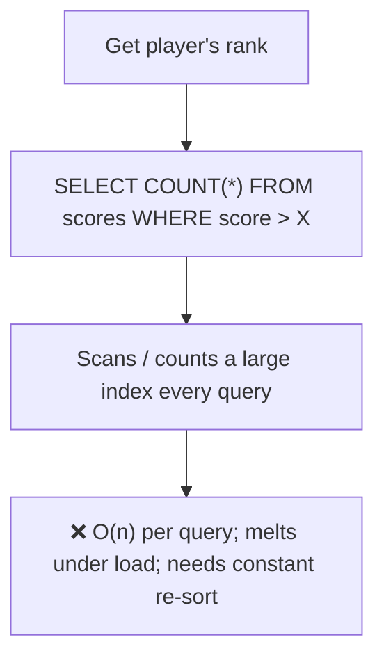
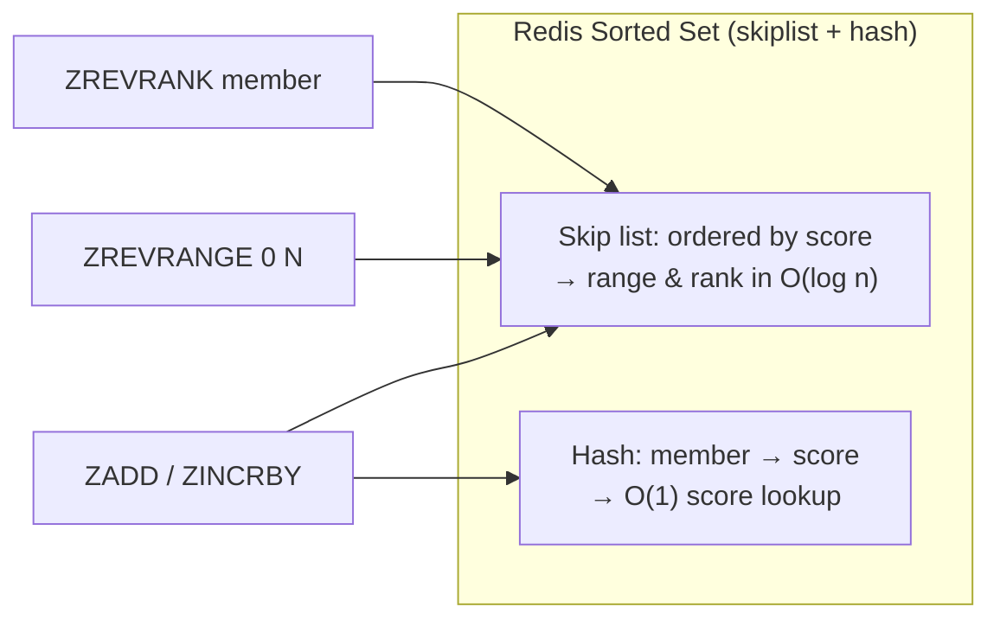
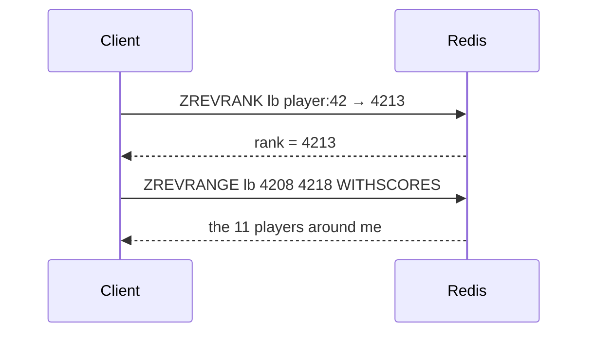

# 8. Design a Leaderboard

> **In one line:** Serve a real-time ranked leaderboard (top-N, a player's rank, and the window around
> them) for millions of players using Redis **sorted sets**, where score updates and rank queries are all
> O(log n).

> **Original prompt:** Use Redis Sorted Sets to implement a real-time gaming leaderboard.

## Overview

The leaderboard question is really "how do I answer **rank** queries cheaply?" A relational
`SELECT COUNT(*) WHERE score > mine` to get a player's rank is O(n) per query and destroys the DB under
load. The insight: a **sorted set** (a skip list + hash) keeps members ordered by score and gives
`O(log n)` inserts, `O(log n + m)` range reads, and `O(log n)` rank lookups — exactly the operations a
leaderboard needs.

## Functional Requirements

- Update a player's score (set or increment) in real time.
- **Top-N** leaderboard (e.g., top 100).
- A given player's **rank** and score.
- The **window around a player** (my rank ± 5) — the "you are #4,214" view.
- Time-scoped boards: daily / weekly / all-time.

## Non-Functional Requirements

| Property | Target |
|---|---|
| Update latency | O(log n), < 1 ms |
| Rank query | O(log n) — not O(n) |
| Scale | 10M+ players per board |
| Freshness | Real-time (no batch recompute) |

## Why Not a Relational Table



Maintaining rank in SQL means counting rows above you on every read, or re-sorting on every write. Neither
scales. A sorted set maintains order **incrementally**.

## The Redis Sorted Set Model

One key per board; member = playerId, score = the score.

```text
ZADD lb:global 1500 player:42        # set score
ZINCRBY lb:global 10 player:42       # increment score (atomic)
ZREVRANGE lb:global 0 99 WITHSCORES  # top 100 (highest first)
ZREVRANK lb:global player:42         # player's 0-based rank
ZSCORE lb:global player:42           # player's score
```

Internally a Redis sorted set is a **skip list** (ordered traversal, range queries) plus a **hash**
(member → score for O(1) score lookup). That combination is what makes both "top-N by score" and "rank of
this member" fast.



## Key Query: "Players Around Me"



Get the player's rank, then read a range centered on it — two O(log n)/O(log n+m) ops. This "±5 around
me" view is what most games actually show.

## Time-Scoped Boards & Ties

- **Daily/weekly boards:** use time-bucketed keys `lb:daily:2026-08-26`, set a TTL so old boards expire
  automatically; "all-time" is a permanent key.
- **Tie-breaking:** equal scores need deterministic order (usually "who reached it first wins"). Encode a
  composite score: `score * 10^k - timestamp_fraction`, or pack `(score, inverseTimestamp)` into the float
  so earlier achievers rank higher. Pure equal scores otherwise order by member lexicographically, which
  isn't fair.

## Persistence & Source of Truth

Redis holds the *hot ranking structure*, but the durable score record should live in a database too:

- Write score changes to the DB (source of truth) **and** the sorted set (serving structure).
- On Redis loss, **rebuild** the sorted set from the DB (`ZADD` in batches). Redis AOF/RDB + replicas make
  loss rare, but the rebuild path must exist.
- For all-time boards with 100M+ members, keep only the **top slice** hot in Redis and compute deep ranks
  approximately (few users care about rank #4,000,000 precisely).

## Scaling & Failure Scenarios

| Scenario | Response |
|---|---|
| 100M members in one ZSET | Memory grows ~linearly; shard by score band or region, or keep only top-K hot |
| Global board hot key | Read replicas for rank/top-N reads; writes go to primary |
| Approximate deep ranks | For "rank ~1M", bucket by score histogram; exact rank only near the top |
| Redis failure | Rebuild ZSET from DB; AOF + replica minimize loss |
| Sharded leaderboards | Per-shard top-K merged for a global top-N (each shard returns its top-K) |

**Sharding a global top-N:** split players across shards, each maintains its own ZSET; to get the global
top-100, fetch top-100 from each shard and merge — correct because a global top-K member is a top-K member
of its own shard.

## Security & Integrity

- Score updates must be **server-authoritative** — never let the client post its own score directly, or it
  will submit `MAX_INT`. Validate against game events server-side.
- Anti-cheat: rate-limit/plausibility-check score deltas; flag impossible jumps.
- Idempotent score events (event id) so a retried "you scored" event doesn't double-count.

## Performance

- All hot operations are O(log n)/O(log n + m) — a single Redis node handles hundreds of thousands of
  ops/sec.
- Reads dominate; use **read replicas** for top-N and rank queries, primary for updates.
- Cache the rendered top-N page (it changes slowly for most boards) with a short TTL to shield Redis.

## Trade-offs & Pitfalls

- **Recomputing rank in SQL** → O(n) per query; use a sorted set's incremental order.
- **Only in Redis, no durable copy** → total ranking loss on failure; keep DB as source of truth.
- **Ignoring ties** → unfair/nondeterministic ordering; encode a tie-breaker into the score.
- **One giant all-time ZSET** for 100M players → shard or keep top-K hot.
- **Trusting client scores** → instant cheating; validate server-side.

## Interview Questions & Answers

- **What data structure and why?** Redis sorted set — skip list + hash gives O(log n) updates and rank,
  O(log n + m) ranges.
- **How do you get a player's rank fast?** `ZREVRANK` in O(log n), not a SQL `COUNT`.
- **How do you show "players around me"?** Get rank, then `ZREVRANGE rank-5 rank+5`.
- **Daily vs all-time?** Time-bucketed keys with TTL for daily/weekly; a permanent key for all-time.
- **How do you break ties?** Encode timestamp into the score so earlier achievers rank higher.
- **How do you get a global top-N when sharded?** Merge each shard's top-K — a global top-K member is top-K
  in its shard.
- **What's the source of truth?** The database; Redis is the serving structure and is rebuildable.
