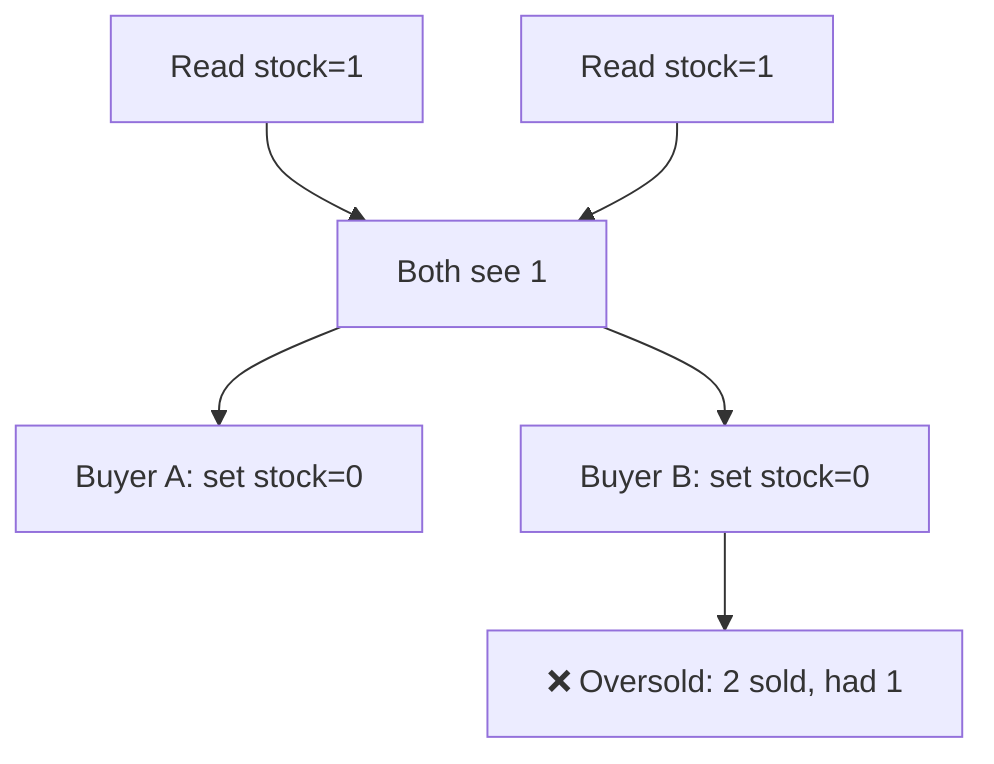
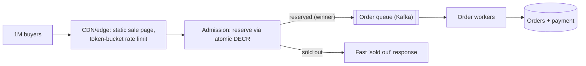
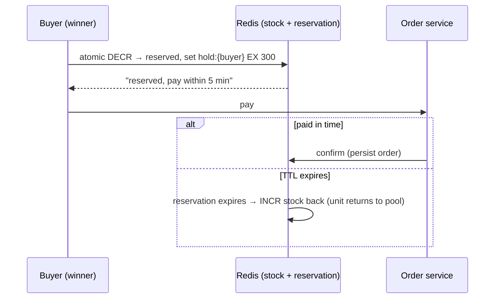

# 9. Flash Sale System

> **In one line:** Sell a limited inventory (1,000 units) to a stampede of buyers (1,000,000 requests in
> the first second) with **zero overselling**, using atomic inventory decrements, request admission
> control, and asynchronous order fulfillment.

> **Original prompt:** Design an inventory-check mechanism that prevents "overselling" during high
> concurrency.

## Overview

A flash sale is a deliberate, extreme **hot-key concurrency** event: enormous read/write contention on a
single item's stock count, for a short window. Two failures define success or ruin: **overselling**
(selling the 1,001st unit of 1,000 — a correctness bug) and **falling over** (the DB/app dies under the
spike — an availability bug). The design attacks both: make the stock decrement **atomic** so it can never
oversell, and shed/queue the flood so the durable system never sees the full firehose.

## Functional Requirements

- Exactly `N` units sold, never more (no oversell) and ideally no undersell (don't strand stock).
- Fairly admit buyers; reject the rest fast ("sold out").
- Place a real order for winners; payment can complete asynchronously.
- Handle reservation **expiry** — a winner who doesn't pay releases stock back.

## Non-Functional Requirements

| Property | Target |
|---|---|
| Correctness | Hard invariant: `sold ≤ N` always |
| Throughput | Absorb ~1M req/s burst without DB meltdown |
| Latency | Instant "you're in / sold out" decision |
| Fairness | First-come-first-served-ish; no starvation |

## The Core Invariant and Why the DB Alone Fails



Read-then-write is a race. The fix is an **atomic conditional decrement** — one indivisible operation that
succeeds for exactly as many callers as there is stock.

## Layer 1 — Atomic Inventory Decrement (correctness)

Whatever store holds the counter, the decrement must be atomic and guarded:

**Redis (the usual hot-path choice):**

```text
DECR stock:{itemId}          # atomic; returns the new value
# if result < 0 → oversold attempt → INCR back and reject
```

Better, a Lua script makes check-and-decrement a single atomic step:

```lua
-- KEYS[1]=stock key ; returns 1 if reserved, 0 if sold out
if tonumber(redis.call('GET', KEYS[1])) > 0 then
  return redis.call('DECR', KEYS[1])   -- reserve one unit
else
  return -1                            -- sold out
end
```

**SQL alternative (conditional update):**

```sql
UPDATE items SET stock = stock - 1
WHERE id = ? AND stock > 0;   -- affects 1 row only if stock remained; 0 rows → sold out
```

Both guarantee `sold ≤ N`: the database/Redis serializes the decrement, so the (N+1)th caller sees `0`
and is rejected. **This single atomic step is the whole anti-oversell mechanism.**

## Layer 2 — Admission Control (availability)

Correctness ≠ survival. A million requests hitting Redis + app still needs shaping so the winners' orders
persist calmly:



- **Shed early, shed cheap:** most requests get an instant "sold out" from Redis without touching the DB.
- **Only ~N winners** proceed; their orders are dropped onto a **queue** and fulfilled by workers at a
  sane rate — the durable order/payment system never sees 1M writes, only ~1,000.
- **Queue-based load leveling** converts a spike into a steady stream.

## Reservation, Payment, and Expiry (the saga)

A "reserved" unit isn't a completed sale — the winner still has to pay. Use a **reservation with TTL**:



- Reservation held with a TTL (e.g., 5 min). Pay → confirm. Don't pay → the hold expires and stock is
  **returned** to the pool (prevents undersell/stranded inventory).
- This is a small **saga**: reserve → pay → confirm, with a compensating "release" on timeout/failure.
- Make confirmation **idempotent** (order key) so a retried payment callback doesn't create two orders.

## Warming Up & Fairness

- **Preload stock into Redis** before the sale opens (don't lazy-load on first hit → cold-start stampede).
- **Waiting room / queue token:** issue a virtual queue position so users get a fair, ordered shot instead
  of a pure thundering herd; this also smooths the spike.
- Per-user purchase caps (`SADD bought:{item} {user}` gate) stop one bot buying everything.

## Scaling & Failure Scenarios

| Scenario | Response |
|---|---|
| 1M concurrent requests | Edge rate-limit + Redis atomic decrement sheds the losers instantly |
| Redis is the hot key | Single key is fine for atomic DECR; replicate for reads; for extreme scale split stock into shards summing to N |
| Redis crash mid-sale | AOF + replica; reconcile reserved vs sold from the durable order log on recovery |
| Winner never pays | TTL reservation returns the unit to the pool |
| Payment service slow | Async queue decouples reservation from payment; workers retry |
| Double-submit / retries | Idempotent reserve (per-user) and confirm (per-order) keys |

**Sharded stock:** to spread even the atomic-decrement load, split 1,000 units into 10 shards of 100
(`stock:item:0..9`); a request hits a random shard. Sum stays ≤ N. Slight fairness/rebalance complexity in
exchange for no single hot key.

## Security

- Bot mitigation: CAPTCHAs/proof-of-work in the waiting room, device fingerprinting, per-account and
  per-IP caps — flash sales attract scalper bots.
- Server-authoritative everything: price, quantity, and eligibility validated server-side; never trust the
  client's "I reserved 5".
- Idempotency + signed reservation tokens prevent replay/forgery of a "winner" status.

## Performance

- The decision path is a single Redis op → sub-millisecond; the DB is shielded behind the queue.
- Static sale assets served from CDN; the dynamic surface is just the reserve call.
- Keep workers' write rate below DB capacity; backpressure the queue rather than overrunning the DB.

## Trade-offs & Pitfalls

- **Read-then-write stock check** → oversell. Always atomic conditional decrement.
- **Synchronous order+payment in the request** → DB meltdown; queue the fulfillment.
- **No reservation expiry** → stranded stock (undersell) when winners abandon.
- **Lazy-loading stock on first request** → cold-start stampede; preload.
- **Non-idempotent confirm** → duplicate orders on retries.
- **Trusting client quantities** → fraud; validate server-side.

## Interview Questions & Answers

- **How do you guarantee no overselling?** A single atomic conditional decrement (Redis Lua / `UPDATE ...
  WHERE stock > 0`) — the store serializes it, so the (N+1)th buyer sees zero.
- **How do you survive 1M requests?** Admission control: edge rate-limit + cheap "sold out" from Redis;
  only ~N winners hit a queue that feeds the DB at a safe rate.
- **How do reservations and payment work?** Reserve with a TTL, pay to confirm; expiry returns stock — a
  reserve→pay→confirm saga with a release compensation.
- **What if a winner doesn't pay?** The TTL reservation expires and the unit goes back to the pool.
- **How do you prevent duplicate orders?** Idempotency keys on reserve (per user) and confirm (per order).
- **How would you remove the single hot key?** Shard the stock counter into buckets summing to N.
