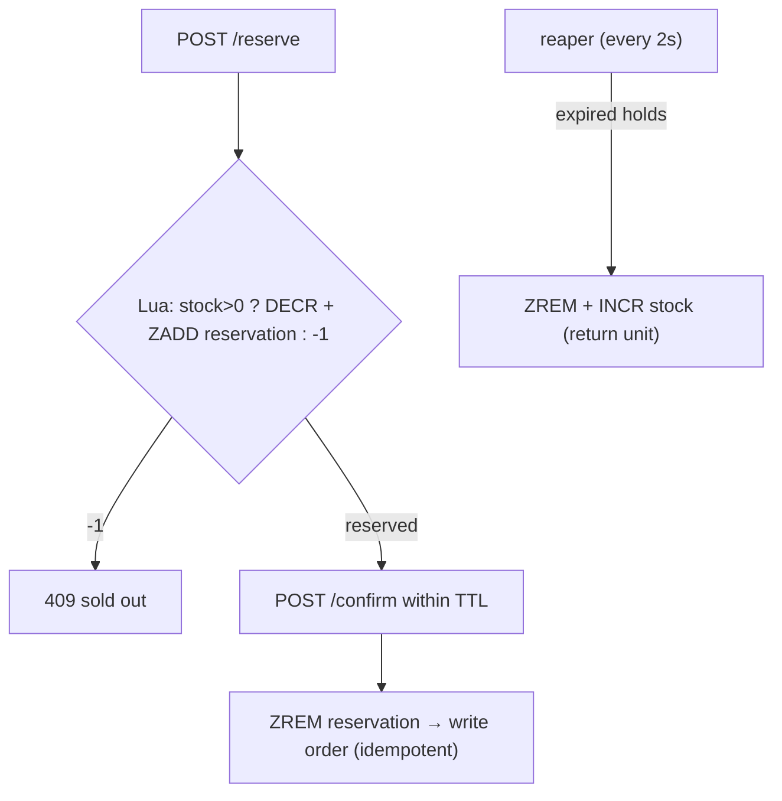

# Flash Sale System — implementation

A flash-sale inventory service implementing the [design doc](../09-flash-sale-system.md): **zero
overselling** via an atomic Redis Lua reserve, a **reservation TTL** that returns unpaid stock, and
**idempotent** order confirmation in MongoDB.

## Stack

- **Node.js + TypeScript + Express**
- **Redis** — stock counter + reservations ZSET (scored by expiry), atomic reserve via Lua
- **MongoDB** — confirmed orders (unique per reservation → idempotent)

## Flow



## Endpoints

| Method | Path | Purpose |
| --- | --- | --- |
| POST | `/api/sales/:item/init` `{stock}` | Preload stock |
| GET | `/api/sales/:item` | Remaining stock |
| POST | `/api/sales/:item/reserve` | Atomic reserve → `reservationId` or 409 sold out |
| POST | `/api/sales/:item/confirm` `{reservationId,userId}` | Capture → order (idempotent) |

## Design-doc mapping

- **Atomic conditional decrement** → `RESERVE_LUA` checks `stock>0` and `DECR`s in one step → the
  (N+1)th buyer always gets `-1`. No read-then-write race, no oversell.
- **Reservation TTL** → reservations ZSET scored by expiry; the reaper `INCR`s stock back for unpaid holds
  (prevents stranded/undersold inventory).
- **Idempotent confirm** → unique `reservationId` order; retries return the same order.

## Run it

```bash
docker compose up --build          # http://localhost:3109
```

```bash
npm install && npm test            # 3 unit tests (reservation-expiry reap logic)
npm run typecheck
```

## Verification

- `npm test` + `npm run typecheck` pass. The **no-oversell** guarantee is additionally smoke-tested by
  firing many concurrent reserves against a small stock and asserting exactly `stock` succeed (see PR
  notes).
