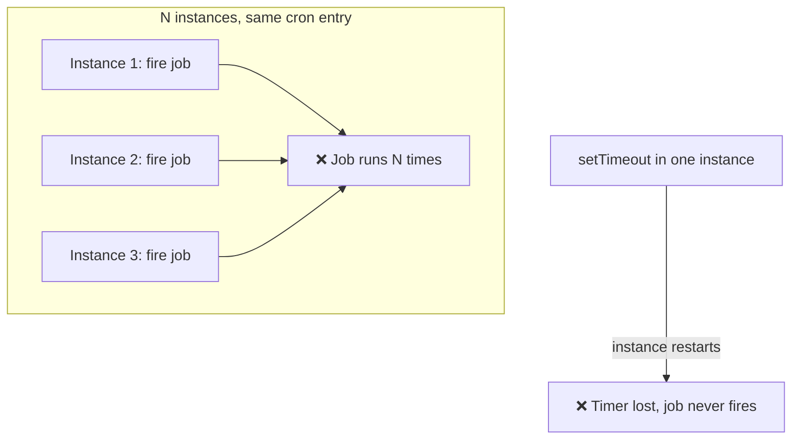
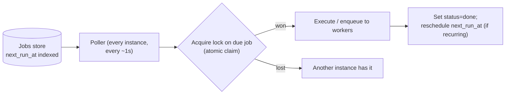
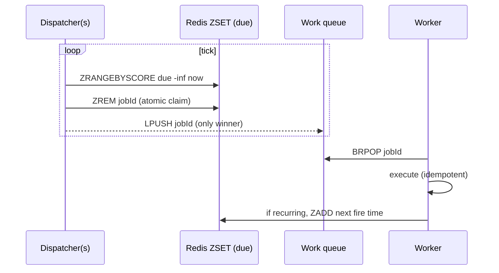

# 10. Distributed Task Scheduler

> **In one line:** Run jobs at specific times (cron-style) and deferred one-off tasks across many server
> instances — so each job fires **exactly once** (not once per instance), survives crashes, and scales to
> millions of scheduled tasks.

> **Original prompt:** Design a system to run specific jobs at specific times (like cron) across multiple
> server instances.

## Overview

A single-server `cron` or `setTimeout` is easy. The problem appears the instant you run **N instances**
for availability: if all N have the same cron entry, the job runs **N times**. And if the one instance
holding a `setTimeout` restarts, the job is silently **lost**. A distributed scheduler must therefore
solve two things at once: **mutual exclusion** (exactly one runner per fired job) and **durability**
(schedules survive restarts and fire even after downtime).

## Functional Requirements

- **Recurring** jobs (cron expressions) and **one-off** deferred jobs ("run at T", "in 30 min").
- Each scheduled firing executes **once**, regardless of instance count.
- Jobs survive process/instance restarts (durable schedule store).
- Retries on failure with backoff; visibility into job status/history.
- Reasonable time precision (seconds), not necessarily millisecond-exact.

## Non-Functional Requirements

| Property | Target |
|---|---|
| Correctness | Exactly-once *dispatch* per firing (with idempotent execution) |
| Durability | No scheduled job lost across restarts |
| Scale | Millions of pending jobs; thousands firing/min |
| Availability | Survive loss of any instance; no SPOF for firing |

## Why setTimeout / naive cron Breaks



In-memory timers are neither shared nor durable. The schedule must live in a **shared, durable store**,
and firing must be **coordinated**.

## Design A — Durable Store + Leader/Locking (poll the due set)



- Jobs stored with an indexed `next_run_at`. Every instance polls `WHERE next_run_at <= now AND status =
  pending`.
- **Exactly-once via atomic claim:** the winner is decided by a conditional update:
  `UPDATE jobs SET status='running', owner=?, locked_until=now+ttl WHERE id=? AND status='pending'` — only
  one instance's update affects a row. Or a Redis lock (`SET lock:{jobId} owner NX EX ttl`).
- `locked_until` is a **lease**: if the owner crashes mid-run, the lease expires and another instance
  reclaims the job (at-least-once execution → require **idempotent** jobs).

## Design B — Time-Bucketed Queue (Redis sorted set)

The canonical Redis pattern: a **sorted set scored by fire time**.

```text
ZADD due <fireTimestamp> jobId          # schedule
# dispatcher loop:
ZRANGEBYSCORE due -inf <now> LIMIT 0 1   # jobs due now
ZREM due jobId                           # atomic claim: only the remover "wins"
→ push jobId to a work queue (BRPOP by workers)
```

`ZREM` (or `ZPOPMIN`) returning the member means *this* dispatcher claimed it — a natural exactly-once
gate. Recurring jobs re-`ZADD` themselves with the next fire time after running. This scales to millions
of pending timers and is how delayed-job libraries (BullMQ, etc.) implement delays.



## Design C — Managed / Purpose-Built

At large scale, dedicated systems separate **scheduling** from **execution**: e.g., a scheduler service
that writes due tasks into Kafka/SQS, workers consume. Cloud primitives (SQS delay queues ≤15 min,
EventBridge/Cloud Scheduler for cron) offload the durability/coordination. Know these exist so you don't
rebuild them needlessly.

## Cron Parsing & Recurrence

- Parse cron expressions to compute the **next** fire time; after a job runs, compute and store the next
  one (don't precompute the infinite series).
- Handle **timezones and DST** explicitly (a "2:30 AM daily" job during a DST transition is a classic bug).
- **Missed windows after downtime:** decide policy — fire once for the missed slot (catch-up) or skip to
  the next (no backfill). Store `last_run_at` to detect misses.

## Retries, Idempotency & Failure

| Concern | Handling |
|---|---|
| Job throws / times out | Retry with exponential backoff + jitter; cap attempts → dead-letter |
| Owner crashes mid-run | Lease (`locked_until`) expires → another instance reclaims → **must be idempotent** |
| Duplicate dispatch (rare races) | Idempotency key per (jobId, scheduledTime); executor dedups |
| Poison job | Dead-letter after N failures; alert |

Because crash-recovery makes execution **at-least-once**, every job body must be idempotent (guard by
`(jobId, fireTime)`).

## Scaling & Failure Scenarios

| Scenario | Response |
|---|---|
| Millions of pending jobs | ZSET / indexed `next_run_at`; shard by job hash across dispatcher partitions |
| Many jobs fire same instant | Dispatchers claim-and-enqueue to a worker pool; workers scale horizontally |
| Dispatcher SPOF | Multiple dispatchers, each claim is atomic → safe; leader election optional |
| Clock skew across instances | Use a single time source (the store's `now`) for due-checks, not local clocks |
| Hot second (thundering herd) | Jitter fire times slightly; batch-claim due jobs |

## Security

- Jobs run code/queries — validate and sandbox job definitions; authorize who can create/modify schedules.
- Prevent a tenant from scheduling jobs that exhaust shared workers (per-tenant quotas / fair scheduling).
- Audit schedule changes (who changed the cron, when) — see the audit-trail problem.

## Performance

- Poll interval trades precision vs load: 1 s polling is fine for second-granularity; the ZSET approach
  wakes only for due items.
- Keep the due-check query index-backed (`next_run_at`); never full-scan the jobs table.
- Separate **dispatch** (lightweight, claims jobs) from **execution** (heavy, on workers) so slow jobs
  don't stall the scheduler.

## Trade-offs & Pitfalls

- **In-memory timers** (`setTimeout`) → lost on restart and duplicated across instances.
- **No atomic claim** → every instance runs every job (N× execution).
- **Assuming exactly-once execution** → crashes force at-least-once; make jobs idempotent.
- **Local clocks for due-checks** → skew fires jobs early/late/twice; use one time source.
- **Precomputing infinite recurrences** → unbounded storage; compute next-run lazily.

## Interview Questions & Answers

- **Why does naive cron break with N instances?** Every instance fires the same entry → N executions;
  in-memory timers are also lost on restart.
- **How do you get exactly-once dispatch?** Atomic claim: conditional `UPDATE ... WHERE status='pending'`
  or Redis `ZREM`/`SET NX` — only one instance wins a given firing.
- **How do you not lose jobs on restart?** Durable schedule store (DB/Redis) with indexed `next_run_at`;
  poll/dispatch from it.
- **How do you handle a runner crashing mid-job?** Lease with `locked_until`; on expiry another instance
  reclaims — so jobs must be idempotent.
- **How do you scale to millions of timers?** Redis sorted set scored by fire time (or sharded
  `next_run_at`), dispatch to a worker pool.
- **Missed schedules after downtime?** Detect via `last_run_at`; choose catch-up vs skip policy explicitly.
