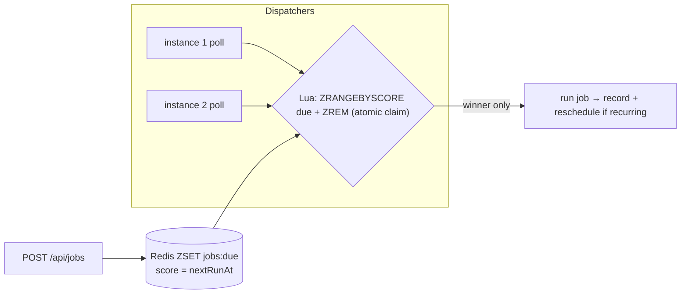

# Distributed Task Scheduler — implementation

A cron-style distributed scheduler implementing the [design doc](../10-task-scheduler.md): a **Redis
sorted set keyed by fire time** with an **atomic Lua claim** so each firing runs exactly once across many
dispatcher instances. Supports one-off, interval, and cron schedules.

## Stack

- **Node.js + TypeScript + Express**
- **Redis** — `jobs:due` ZSET (score = next fire time), per-job metadata + run log

## Architecture



## Endpoints

| Method | Path | Purpose |
| --- | --- | --- |
| GET | `/api/health` | Liveness |
| POST | `/api/jobs` `{name, schedule}` | Schedule (`once`/`interval`/`cron`) |
| GET | `/api/jobs/:id` | Job state + run timestamps |

`schedule` = `{type:'once', at}` \| `{type:'interval', everyMs}` \| `{type:'cron', expr}`.

## Design-doc mapping

- **Exactly-once dispatch** → `CLAIM_LUA` does `ZRANGEBYSCORE due + ZREM` atomically; only the instance
  whose `ZREM` succeeds runs the firing (no N× execution).
- **Durable schedule** → jobs live in Redis (survive restarts); dispatchers just poll the due set.
- **Recurring** → after running, the next fire time is recomputed (`nextRun`) and re-armed.
- **Cron** → `src/cron.ts` supports `*`, ranges, steps, and lists and computes the next fire time.

## Run it

```bash
docker compose up --build          # http://localhost:3110  (scale dispatchers: --scale app=3)
curl -XPOST localhost:3110/api/jobs -H 'content-type: application/json' \
  -d '{"name":"ping","schedule":{"type":"interval","everyMs":5000}}'
```

```bash
npm install && npm test            # 6 unit tests (cron next-time + schedule types)
npm run typecheck
```

## Verification

- `npm test` covers every-minute/step/daily cron, range+list parsing, once/interval/cron `nextRun`, and
  invalid-cron rejection. `npm run typecheck` passes. Exactly-once claim runs against Redis under
  `docker compose up`.
