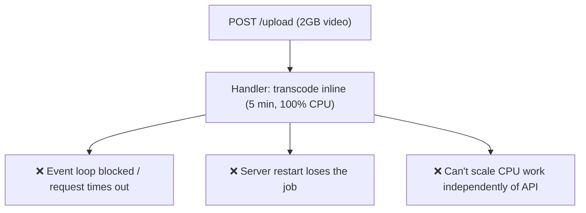
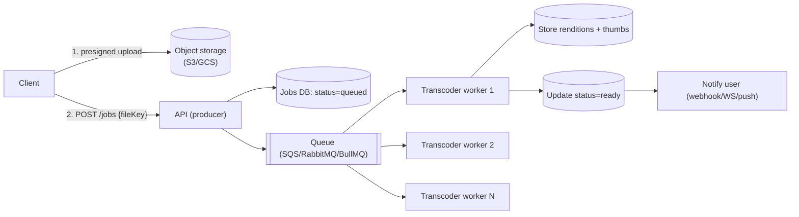
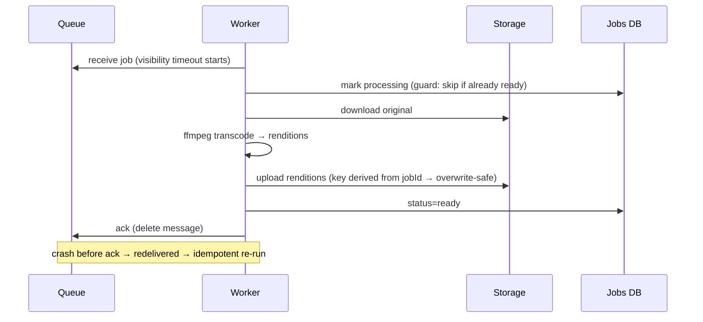
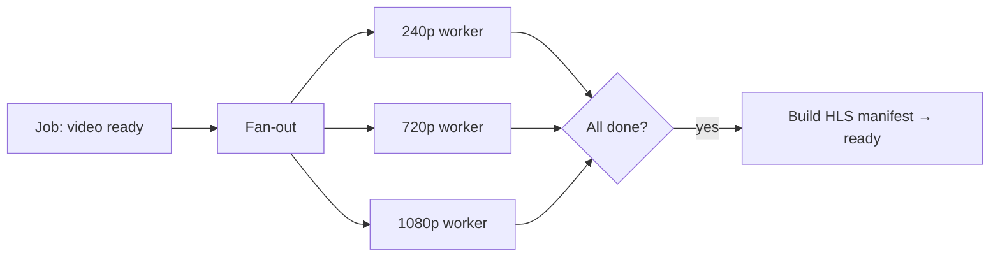

# 12. File Processing Pipeline (Async Transcoding)

> **In one line:** Accept large file uploads (video) and process them — transcode to multiple
> resolutions, extract thumbnails — **asynchronously** via a producer-consumer queue, so the API responds
> instantly and heavy CPU work scales out on workers.

> **Original prompt:** Architecture for a system that accepts video uploads and transcodes them in the
> background (producer-consumer pattern).

## Overview

The rule this problem teaches: **never do slow, CPU-heavy work inside the request-response cycle.** A 2 GB
video transcode takes minutes and pegs a CPU — doing it in the HTTP handler blocks the event loop, times
out the client, and dies on restart. The pattern is **decouple**: the API's only job is to accept the
file and enqueue work; a fleet of **workers** consumes the queue and does the heavy lifting, reporting
progress back.

## Functional Requirements

- Upload large files reliably (resumable / direct-to-storage).
- Transcode to multiple renditions (240p…1080p), extract thumbnails/metadata, maybe generate an HLS/DASH
  manifest.
- Report job status: `uploaded → queued → processing → ready / failed`.
- Retry transient failures; surface permanent ones.
- Notify the user/UI when processing completes.

## Non-Functional Requirements

| Property | Target |
|---|---|
| API latency | Upload accept responds in ms; no transcoding in the request |
| Throughput | Scale workers independently to clear the queue |
| Durability | An accepted job is never lost (survives worker crash) |
| Elasticity | Absorb bursts (queue buffers); scale workers on backlog |

## Why Synchronous Processing Fails

## Architecture: Producer → Queue → Consumers

1. **Upload goes straight to object storage** via a presigned URL — bytes never flow through the API
   server (which would waste its bandwidth/memory). The client then tells the API "here's the file key."
2. **API = producer:** creates a `job` row (`queued`) and pushes a message `{jobId, fileKey}` to the queue.
   Responds `202 Accepted` immediately.
3. **Workers = consumers:** pull a job, download from storage, run `ffmpeg`, upload renditions, update
   status, ack the message.

## Upload Strategy for Large Files

- **Presigned direct upload** (multipart / resumable) so a dropped connection resumes instead of
  restarting a 2 GB transfer.
- Validate type/size and scan for malware **before** enqueuing (don't transcode hostile input blindly).
- Store the original; renditions are derived and regenerable.

## Worker Semantics: at-least-once + idempotency

Queues deliver **at-least-once** — a worker may crash after finishing but before acking, so the job is
redelivered. Make processing idempotent:

- **Visibility timeout / lease:** while a worker holds a job, it's hidden from others; if the worker dies,
  the lease expires and another picks it up.
- **Idempotent outputs:** write renditions to deterministic keys (`{jobId}/720p.mp4`) so a re-run
  overwrites rather than duplicates; guard the status transition.
- **Long jobs:** heartbeat to extend the lease so a 10-min transcode isn't redelivered mid-flight.

## Progress, Retries & Dead-Letter

- Emit progress (percent) via the jobs row / WebSocket for the UI.
- **Retries:** transient failures (network, temp storage) → exponential backoff, capped attempts.
- **Dead-letter queue (DLQ):** after N failures, move to a DLQ for inspection instead of infinite retry;
  alert. Poison inputs (corrupt files) shouldn't loop forever.

## Pipeline / Fan-Out for Multiple Renditions

Transcoding to 5 resolutions can be one job doing all, or **fan-out** into parallel sub-jobs (one per
rendition) that a coordinator joins when all complete. Fan-out parallelizes across workers and isolates a
single-rendition failure.

## Scaling & Failure Scenarios

| Scenario | Response |
|---|---|
| Upload burst | Queue buffers; autoscale workers on queue depth (backlog metric) |
| Worker crash mid-transcode | Visibility timeout → job redelivered → idempotent re-run |
| Poison/corrupt file | Retry cap → DLQ + alert; don't loop |
| Very long jobs | Lease heartbeat; or chunk the file and process segments in parallel |
| Storage/API bandwidth | Direct-to-storage uploads keep bytes off the API tier |
| Backpressure | Bounded queue + autoscaling; shed or throttle new submissions if backlog explodes |

## Security

- Malware scan and validate media before processing; run `ffmpeg` in a **sandbox/container** (media
  parsers have a long CVE history).
- Presigned URLs scoped to a single key with short expiry; authorize who can submit/read a job.
- Strip/normalize metadata (EXIF/GPS) if privacy matters.

## Performance

- Workers are CPU-bound → size instances for CPU (or GPU for transcode); scale count on backlog.
- Keep the API tier lean and I/O-bound; it never touches file bytes.
- Cache/serve renditions from a CDN; the pipeline writes once, many read.

## Trade-offs & Pitfalls

- **Transcoding in the request** → timeouts, blocked event loop, lost jobs on restart.
- **Uploading through the API server** → wastes API bandwidth/memory; go direct to storage.
- **Assuming exactly-once queue delivery** → duplicates on redelivery; make workers idempotent.
- **Infinite retries on poison input** → worker starvation; cap + DLQ.
- **No lease heartbeat on long jobs** → mid-transcode redelivery and wasted work.

## Interview Questions & Answers

- **Why not transcode in the upload handler?** It blocks the event loop, times out clients, can't scale
  independently, and loses work on restart.
- **What's the core pattern?** Producer-consumer: API enqueues, worker fleet consumes; queue decouples and
  buffers bursts.
- **How does the file get uploaded without overloading the API?** Presigned direct-to-object-storage
  (resumable multipart); the API only gets the file key.
- **How do you handle a worker dying mid-job?** Visibility-timeout lease → redelivery; idempotent
  processing with deterministic output keys.
- **How do you handle repeated failures?** Backoff retries capped by N, then dead-letter + alert.
- **How do you produce multiple resolutions efficiently?** Fan-out into parallel per-rendition sub-jobs
  joined by a coordinator that builds the manifest.
