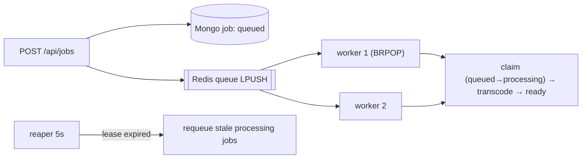

# File Processing Pipeline — implementation

An async file/transcode pipeline implementing the [design doc](../12-file-processing-pipeline.md): the API
**enqueues** work and returns instantly; a pool of **workers** consumes a Redis queue and processes jobs
off the request path; job status lives in **MongoDB** with idempotent, at-least-once processing.

## Stack

- **Node.js + TypeScript + Express** (producer API + in-process consumer workers)
- **Redis** — job queue (`BRPOP`) with atomic claim
- **MongoDB** — job status + rendition plan

> Transcoding is **simulated** (a short delay + rendition plan) to avoid a native `ffmpeg` dependency —
> the architecture (enqueue → workers → status) is the point.

## Architecture



## Endpoints

| Method | Path | Purpose |
| --- | --- | --- |
| POST | `/api/jobs` `{filename, sourceHeight}` | Enqueue → `202 {id, status:queued}` |
| GET | `/api/jobs/:id` | Job status + renditions |
| GET | `/api/jobs` | Recent jobs |

## Design-doc mapping

- **Producer-consumer** → API only enqueues (202); workers do the heavy work.
- **At-least-once + idempotency** → `BRPOP` claim; status-guarded transition (`queued→processing→ready`)
  so a redelivered/duplicate job can't double-process.
- **Lease + requeue** → a crashed worker leaves a `processing` job whose lease expires → reaper requeues.
- **Rendition plan** → pure `planRenditions` (never upscales).

## Run it

```bash
docker compose up --build          # http://localhost:3112 (scale workers: --scale app=3)
```

```bash
npm install && npm test            # 3 unit tests (rendition plan + state machine)
npm run typecheck
```

## Verification

- `npm test` covers `planRenditions` (no upscale, dedupe) and status-transition guards. `npm run
  typecheck` passes. Enqueue→process→ready runs under `docker compose up`.
