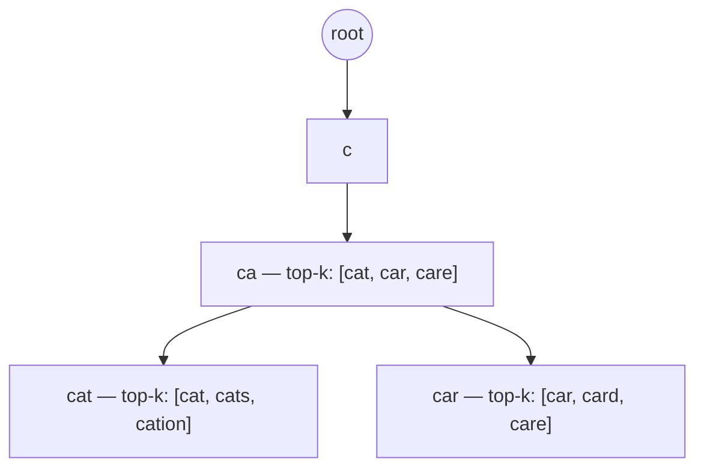
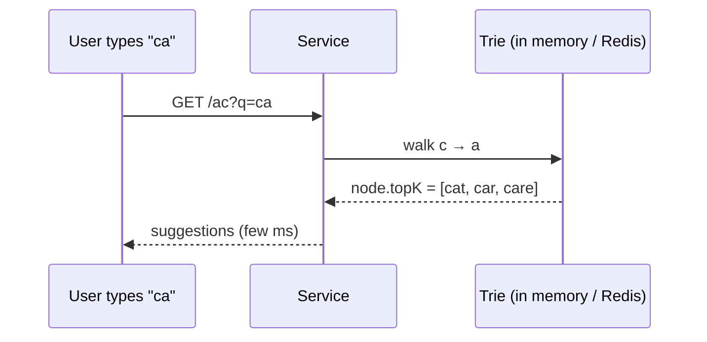
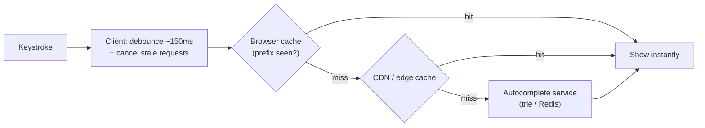

# 13. Design an Autocomplete / Typeahead

> **In one line:** Return the top-k completions for a prefix in single-digit milliseconds as the user
> types — powered by a **trie** of popular queries (with precomputed top-k per node), aggressive caching,
> and debounced requests.

> **Original prompt:** Describe the data structure (Trie) and the API caching strategy for a search bar.

## Overview

Autocomplete is a **latency** problem before it's a data problem: it must respond faster than the user's
next keystroke (~<100 ms end-to-end) while every keystroke is a query. Two ideas carry the design: a
**trie (prefix tree)** so prefix lookup is O(length of prefix), with **top-k completions precomputed at
each node** so you don't rank at query time; and layered **caching + client debouncing** so most
keystrokes never hit the backend.

## Functional Requirements

- Given a prefix, return the top-k (say 5–10) suggestions ranked by popularity/relevance.
- Update suggestions as popularity changes (trending queries surface).
- Tolerate typos (fuzzy) — optional but commonly asked.
- Personalize/localize — optional.

## Non-Functional Requirements

| Property | Target |
|---|---|
| Latency | p99 < 100 ms end-to-end; server lookup ~1–10 ms |
| QPS | Very high — one request *per keystroke* per user |
| Freshness | Trending terms appear within minutes/hours (not real-time) |
| Scale | Millions of terms; huge read volume |

## The Data Structure: Trie with Precomputed Top-K

A trie stores strings by shared prefixes; walking `c→a→t` lands on the node for "cat" in O(len). The
naive version then does a subtree traversal to collect and rank all completions — too slow for hot
prefixes. The fix: **store the top-k completions at every node** (precomputed).

- Each node caches its `topK` list. A prefix query = walk to the node (O(prefix length)) and **return its
  cached list** — no subtree scan, no sort at query time.
- Popularity is a per-term score; top-k lists are rebuilt offline/periodically from query logs.

## Building & Updating the Trie

- Build from **query logs**: count query frequencies, keep the head of the distribution (you don't index
  every string ever typed). Aggregate counts per term, compute top-k per node offline.
- **Update cadence:** autocomplete tolerates staleness — rebuild top-k lists periodically (hourly/daily)
  via a batch job; trending pipelines can nudge scores faster. You do **not** update the trie on every
  search in the hot path.
- **Storage/serving:** the trie can live in memory on the service, or be serialized so each node's top-k
  is a Redis key (`ac:{prefix} → [suggestions]`) — turning autocomplete into a pure cache lookup.

## Caching Strategy (this is half the design)

- **Client debouncing:** wait ~100–200 ms after the last keystroke before firing; cancel superseded
  requests. This alone cuts request volume by a large factor.
- **Prefix results are highly cacheable** (same for everyone if not personalized) → cache at browser, CDN,
  and Redis with a TTL. Popular prefixes ("a", "am", "ama") get near-100% hit rates.
- Order responses: since requests race, tag each with its prefix and **ignore out-of-order/stale**
  responses on the client.

## Fuzzy / Typo Tolerance (optional deep dive)

- **Edit-distance** search over the trie (Levenshtein automaton) for 1–2 typo tolerance — more expensive,
  so bound it.
- Or offload to a search engine (**Elasticsearch completion suggester / n-gram / edge-ngram** analyzers)
  which handles fuzzy + ranking, at higher infra cost.
- N-gram indexing is an alternative to a trie for infix ("contains") matches, not just prefixes.

## Scaling & Failure Scenarios

| Scenario | Response |
|---|---|
| One request per keystroke × millions | Debounce + heavy caching; only cache-miss tails reach the service |
| Hot prefixes ("a") | Cached everywhere; effectively free |
| Huge term set | Only index the popular head; shard trie by first character/prefix across nodes |
| Trending terms | Periodic top-k rebuild + a faster trending signal into scores |
| Service down | Degrade gracefully — empty suggestions never block search submission |

## Security

- Sanitize/escape suggestions (they render as HTML) — a malicious query in the logs shouldn't become
  stored XSS.
- Filter offensive/PII suggestions from the corpus (query logs contain sensitive strings).
- Rate-limit per client to stop scraping the suggestion corpus.

## Performance

- Query time is O(prefix length) + returning a small cached list — independent of corpus size.
- Precomputing top-k moves ranking **off** the hot path entirely.
- Keep the working set in memory/Redis; serialize the trie for fast warm starts.

## Trade-offs & Pitfalls

- **Ranking at query time** (subtree scan + sort) → too slow for hot prefixes; precompute top-k per node.
- **No debounce** → a request per character hammers the backend.
- **Ignoring response races** → suggestions flicker/wrong for the current prefix; drop stale responses.
- **Indexing every string ever typed** → wasted memory; index the popular head.
- **Real-time trie updates in the request path** → contention; update offline/periodically.

## Interview Questions & Answers

- **What data structure and why?** A trie — prefix lookup in O(prefix length), independent of corpus size.
- **How do you avoid ranking at query time?** Precompute and cache the **top-k** completions at each trie
  node; a query just returns the node's list.
- **How do you keep latency under a keystroke?** Client debounce + browser/CDN/Redis caching; only misses
  hit the service.
- **How do you handle out-of-order responses?** Tag responses with their prefix and ignore stale ones.
- **How do trending terms appear?** Periodic offline rebuild of top-k from query-frequency logs.
- **How would you add typo tolerance?** Bounded edit-distance search over the trie, or a search engine's
  fuzzy/edge-ngram suggester.
