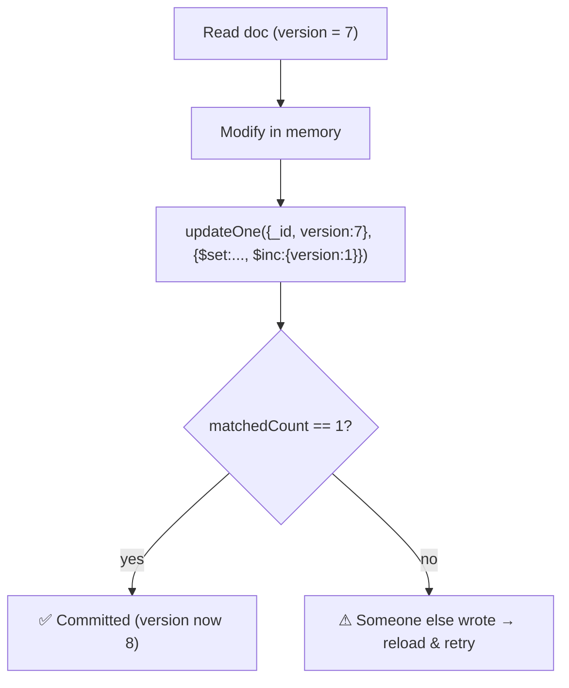
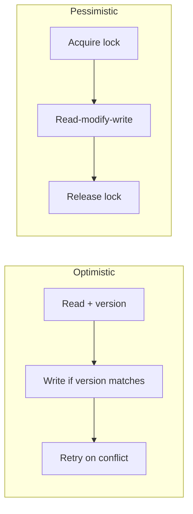

# 14. Optimistic Locking in Mongoose

> **In one line:** Prevent the **lost-update** problem on a single document under concurrent writers by
> versioning it (`__v`) and using a compare-and-set update — succeed only if the document hasn't changed
> since you read it, otherwise retry.

> **Original prompt:** Implement versioning (`__v`) to handle concurrent updates to a single document.

## Overview

Two requests read the same document, both modify it in memory, both save — the second silently overwrites
the first. That's the **lost update** problem, and it's invisible until it corrupts data (double-spent
balance, dropped edit). **Optimistic locking** solves it without holding a lock: attach a **version** to
the document; on write, require the version to match what you read; if it doesn't (someone else wrote
first), the update affects **zero rows** and you retry. It's "optimistic" because it assumes conflicts are
rare and only pays a cost when one actually happens.

## Functional Requirements

- Concurrent updates to one document must not silently lose each other's changes.
- Detect a conflicting concurrent write and handle it (retry or surface to the user).
- No long-held locks; readers/writers stay non-blocking in the common (no-conflict) case.

## Non-Functional Requirements

| Property | Target |
|---|---|
| Correctness | No lost updates; a conflict is always detected |
| Throughput | No blocking under low contention |
| Latency | One extra conditional predicate; retries only on real conflict |

## The Lost-Update Race

```mermaid
sequenceDiagram
  participant A as Request A
  participant B as Request B
  participant DB as Document {qty: 10}
  A->>DB: read qty=10
  B->>DB: read qty=10
  A->>A: qty = 10 - 3 = 7
  B->>B: qty = 10 - 5 = 5
  A->>DB: save qty=7
  B->>DB: save qty=5  (overwrites A)
  Note over DB: ❌ A's decrement lost; qty=5 not 2
```

Both wrote based on a stale read. Optimistic locking makes the second write **fail its version check**.

## How Versioning Works (compare-and-set)

Add a version number. Every update: `WHERE _id = ? AND version = <what I read>` and `$inc version`. Only
one concurrent writer matches the old version; the others match **0 documents** → detected conflict.



## Mongoose Specifics: `__v`, `optimisticConcurrency`, `.save()`

Mongoose keeps a version key `__v`, but by default it only guards **array-position** conflicts, *not*
general field overwrites. To get true optimistic concurrency on `.save()`:

```js
const schema = new mongoose.Schema({ qty: Number }, { optimisticConcurrency: true });
// now .save() adds `WHERE __v = <loaded>` and bumps __v; a stale save throws VersionError
```

```js
async function decrement(id, by) {
  for (let attempt = 0; attempt < 3; attempt++) {
    const doc = await Item.findById(id);          // reads __v
    doc.qty -= by;
    try {
      await doc.save();                            // guarded by __v; VersionError on conflict
      return doc;
    } catch (e) {
      if (e.name === 'VersionError') continue;     // reload & retry
      throw e;
    }
  }
  throw new Error('too much contention');
}
```

Or do it in **one atomic conditional update** (no read-modify-write window at all), which is often better:

```js
// atomic: succeeds only if version unchanged; no retry loop needed for simple deltas
await Item.updateOne({ _id: id, __v: expectedV }, { $inc: { qty: -by, __v: 1 } });
```

For simple counters, a **single atomic operator** (`$inc`) sidesteps the whole problem — the DB serializes
it. Optimistic locking shines when the new value depends on **complex in-app logic** you can't express as
one atomic operator.

## Optimistic vs Pessimistic Locking



| | Optimistic | Pessimistic |
|---|---|---|
| Assumes | Conflicts rare | Conflicts common |
| Cost | Retries when conflict | Blocking/waiting always |
| Deadlocks | None | Possible |
| Best for | Low contention, web apps | High contention, short critical sections |
| Mongo support | `__v` / conditional update | `findOneAndUpdate` acts atomically; true row locks need transactions |

Optimistic is the default for typical web workloads (conflicts are the exception). Under heavy contention
on one document, retries thrash — then reduce contention (shard the counter, queue writes) or use a
different design.

## Retry Strategy

- Bounded retries with small **jittered backoff**; give up after N and surface a 409 Conflict.
- Retrying only re-reads and re-applies — cheap when conflicts are rare.
- For user-facing edits, sometimes the right answer is **not** auto-retry but show "this changed since you
  loaded it" (conflict UX), preserving the user's intent.

## Scaling & Failure Scenarios

| Scenario | Response |
|---|---|
| Low contention (normal) | Version check nearly always matches; ~zero overhead |
| One super-hot document | Retries thrash → shard the value (sub-counters) or serialize via a queue |
| Multi-document invariant | Optimistic per-doc isn't enough → use a transaction (multi-doc ACID) |
| Idempotent retries | Ensure the operation is safe to re-apply after reload (recompute from current state) |

## Security & Correctness

- Version checks protect **integrity**, not authorization — still authorize the writer.
- Beware **TOCTOU** on business rules: re-validate invariants after reload, don't trust the pre-conflict
  computation.
- Don't expose `__v` as a client-controlled field to bypass; the server compares against the loaded value.

## Trade-offs & Pitfalls

- **Relying on Mongoose's default `__v`** for field conflicts → it doesn't guard them; enable
  `optimisticConcurrency` or use conditional `updateOne`.
- **No retry / unbounded retry** → dropped writes or thrashing; bound with backoff.
- **Optimistic on a hot doc** → livelock; reduce contention instead.
- **Cross-document invariants** → single-doc versioning can't help; use transactions.
- **Read-modify-write when `$inc` would do** → unnecessary; prefer one atomic operator for simple deltas.

## Interview Questions & Answers

- **What problem does this solve?** Lost updates: two stale-read writers overwriting each other.
- **How does versioning detect conflicts?** Update predicate `WHERE version = <read value>`; a concurrent
  writer already bumped it → your update matches 0 docs → conflict.
- **Does Mongoose's `__v` do this by default?** No — it only guards array ops; enable
  `optimisticConcurrency` (or use conditional `updateOne`) for field-level protection.
- **Optimistic vs pessimistic?** Optimistic: no locks, retry on conflict, best for low contention.
  Pessimistic: lock upfront, best for high contention/short sections.
- **When is optimistic locking the wrong tool?** A single super-hot document (retries thrash) or
  multi-document invariants (need transactions).
- **When don't you need it at all?** Simple deltas expressible as one atomic operator (`$inc`).
