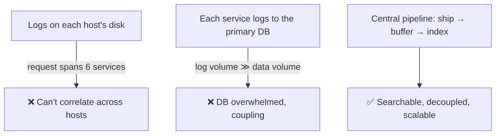
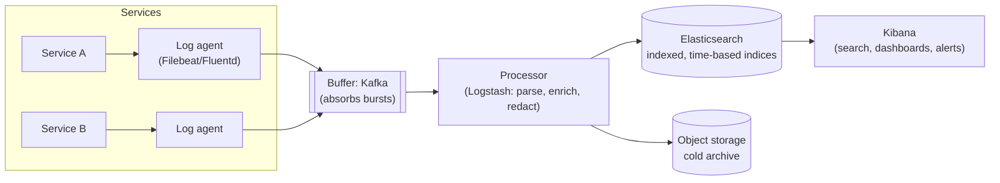
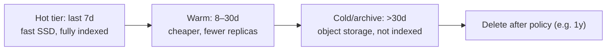

# 15. Design a Centralized Logging System

> **In one line:** Aggregate logs from many microservices into one searchable place — ship structured
> logs through a buffer to an indexed store (the ELK/EFK pattern) — so you can debug across services,
> without logging becoming a bottleneck or a bottomless storage bill.

> **Original prompt:** Architecture for aggregating logs from multiple microservices into a central
> service (ELK stack basics).

## Overview

Once you have more than one service, `ssh`-ing into boxes to `grep` logs stops working: a single user
request touches many services on many hosts, and its story is scattered. Centralized logging **collects,
transports, parses, indexes, and visualizes** logs in one place so you can search across the fleet and
follow one request end-to-end. The recurring tensions are **volume** (logs dwarf your business data),
**not blocking the app** (logging must be async and lossy-tolerant), and **cost** (indexing everything
forever is ruinous).

## Functional Requirements

- Collect logs from all services/hosts/containers.
- **Structured** logs (JSON) with a correlation/trace id to stitch a request across services.
- Full-text + field search, filtering, and time-range queries.
- Dashboards and alerting on patterns (error-rate spikes).
- Retention/archival policy (hot search vs cold storage).

## Non-Functional Requirements

| Property | Target |
|---|---|
| App impact | Logging must be **async**; never block request handling |
| Ingestion | Handle bursty, high-volume writes without loss of critical logs |
| Query | Recent logs searchable in seconds |
| Cost | Tiered retention; don't index everything forever |
| Durability | Buffer so a downstream outage doesn't drop logs |

## Why Not "just write to a file / DB per service"



## The Pipeline (ELK / EFK)



Stages:

1. **Emit (app):** log structured JSON to stdout — async, non-blocking; don't `await` a log write.
2. **Collect (agent):** a lightweight shipper on each host/pod (Filebeat/Fluent Bit) tails and forwards —
   the app doesn't talk to the store directly.
3. **Buffer (Kafka):** decouples producers from the indexer; absorbs spikes and protects against a
   downstream outage (logs queue instead of drop).
4. **Process (Logstash/Fluentd):** parse, add fields, **redact secrets/PII**, drop noise.
5. **Index (Elasticsearch):** store in **time-based indices** (`logs-2026-08-26`) for cheap retention
   rollover.
6. **Visualize (Kibana):** search, dashboards, alerting.

## Structured Logging & Correlation IDs

The single highest-leverage practice: **structured JSON + a correlation id**.

```json
{ "ts":"...", "level":"error", "service":"orders", "traceId":"abc123",
  "userId":"u42", "msg":"payment failed", "orderId":"o99", "latencyMs":812 }
```

- A `traceId`/`requestId` generated at the edge and **propagated** through every downstream call lets you
  reconstruct one request across all services (this is the gateway into distributed tracing).
- Structured fields make queries precise (`level:error AND service:orders`) instead of regex-on-text.
- Standardize levels (DEBUG/INFO/WARN/ERROR) and a common schema across services.

## Async, Non-Blocking, Lossy-Tolerant

- App-side logging writes to a buffer/stdout and returns immediately; a slow log sink must **never** slow
  requests.
- Under extreme pressure, prefer **sampling** low-value logs (e.g., keep all errors, sample 1% of INFO)
  over blocking or OOMing.
- The agent + Kafka provide **at-least-once** delivery with local disk buffering, so a transient
  Elasticsearch outage queues logs rather than losing them.

## Retention & Cost Control (the part people forget)



- **Index lifecycle management (ILM):** roll indices by day/size, move hot→warm→cold, delete on schedule.
- Log volume is enormous; **indexing is the cost driver**. Index searchable fields, archive raw to cheap
  object storage, sample verbose logs.

## Scaling & Failure Scenarios

| Scenario | Response |
|---|---|
| Log volume spikes (incident) | Kafka buffers; indexer catches up; sample noise |
| Elasticsearch cluster overloaded | Backpressure via Kafka; scale ES data nodes; reduce indexed fields |
| A service log-storms | Rate-limit/sample per source; alert on volume anomalies |
| Downstream (ES) outage | Agents + Kafka retain with disk buffers → no loss of critical logs |
| Query over months of data | Search hot tier fast; cold data via rehydrate/archive query |

## Security

- **Redact PII/secrets** in the processing stage (passwords, tokens, PAN, emails) — logs are a top
  data-leak source; never log credentials.
- Access-control the log store (logs contain sensitive context); audit who queries them.
- Encrypt in transit (agents → buffer → store) and at rest; retention must satisfy compliance
  (GDPR right-to-erasure vs "keep everything" tension).
- Tamper-evidence for security-relevant logs (see the audit-trail problem for immutability).

## Performance

- Keep the hot path async; batch and compress shipments (agents flush in batches, not per line).
- Time-based indices make retention rollover O(drop an index) instead of mass-deletes.
- Index only the fields you actually query; store the rest as non-indexed source.

## Trade-offs & Pitfalls

- **Synchronous logging to a remote sink** → logging latency becomes request latency; go async.
- **Logging to the primary DB** → log volume swamps it and couples logging to app storage.
- **Unstructured text logs** → brittle regex parsing; emit JSON.
- **No correlation id** → can't follow a request across services.
- **Index-everything-forever** → runaway cost; tier and expire.
- **Logging secrets** → compliance/security incident; redact.

## Interview Questions & Answers

- **Why centralize logs?** One request spans many services/hosts; you need cross-service search and a
  single place to debug and alert.
- **Walk the pipeline.** App (structured JSON) → agent (Filebeat/Fluentd) → buffer (Kafka) → processor
  (parse/redact) → Elasticsearch (time-based indices) → Kibana.
- **Why a buffer like Kafka?** Decouples producers from the indexer, absorbs bursts, and prevents log loss
  during downstream outages.
- **How do you correlate a request across services?** A `traceId` created at the edge and propagated on
  every downstream call.
- **How do you control cost?** Structured indices with lifecycle management: hot→warm→cold tiers, sample
  verbose logs, archive raw to object storage, delete on policy.
- **How do you keep logging from slowing the app?** Fully async emit + agent shipping; sample under
  pressure rather than block.
