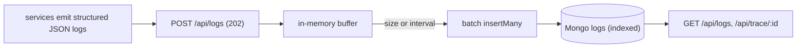

# Centralized Logging System — implementation

A centralized structured-log aggregator implementing the [design doc](../15-logging-system.md): async
**batched ingestion** into MongoDB, field/level/service queries, **request correlation via traceId**, and
**secret redaction** — a lightweight stand-in for the ELK pipeline.

## Stack

- **Node.js + TypeScript + Express**
- **MongoDB** — indexed by time, `service+level+time`, and `traceId+time`

## Architecture



## Endpoints

| Method | Path | Purpose |
| --- | --- | --- |
| POST | `/api/logs` (obj or array) | Ingest structured logs (buffered, 202) |
| GET | `/api/logs?service=&level=&traceId=&q=&limit=` | Query logs, newest-first |
| GET | `/api/trace/:traceId` | All logs for one request (correlation), oldest-first |

## Design-doc mapping

- **Async, non-blocking ingestion** → buffer + batched `insertMany` (flush on size/interval), so
  producers aren't blocked on the store.
- **Structured logs + correlation** → `traceId` indexed for per-request reconstruction across services.
- **Redaction** → `redactSecrets` masks password/token/api-key/PAN-style keys before storage.
- **Query shapes** → compound indexes for the common filters (service+level+time).

## Run it

```bash
docker compose up --build          # http://localhost:3115
curl -XPOST localhost:3115/api/logs -H 'content-type: application/json' \
  -d '{"level":"error","service":"orders","traceId":"t1","message":"payment failed","apiKey":"secret"}'
curl 'localhost:3115/api/trace/t1'
```

```bash
npm install && npm test            # 4 unit tests (normalize + redaction)
npm run typecheck
```

## Verification

- `npm test` covers redaction, defaulting/field-separation, level coercion, and traceId retention.
  `npm run typecheck` passes. Ingestion + query run against Mongo under `docker compose up`.
