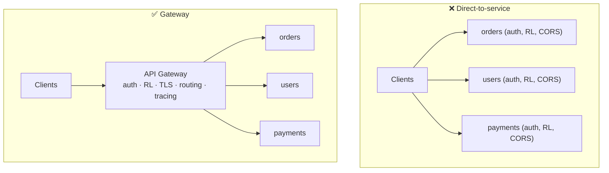
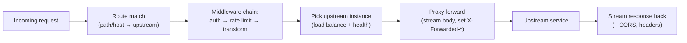
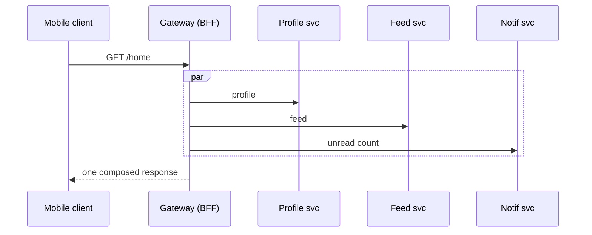

# 16. API Gateway Logic

> **In one line:** Build a single front door for a microservice backend — a reverse proxy that routes by
> path/host to internal services and centralizes the **cross-cutting concerns** (auth, rate limiting,
> TLS, aggregation, observability) so each service doesn't reimplement them.

> **Original prompt:** Design a reverse proxy in Node.js that routes requests to different internal
> services based on paths.

## Overview

When a monolith splits into microservices, clients suddenly face many hosts, ports, and auth schemes —
and every service redundantly implements auth, rate limiting, CORS, and logging. An **API Gateway** is the
single entry point that hides the internal topology behind one address and moves cross-cutting logic to
**one place**. It's a reverse proxy with opinions: route, authenticate, throttle, transform, observe,
forward.

## Functional Requirements

- **Routing:** map inbound paths/hosts to internal services (`/orders/* → orders-svc`).
- **Authentication/authorization:** validate tokens once at the edge; pass identity downstream.
- **Rate limiting & throttling** per client/route.
- **Request/response transformation**, header injection, protocol translation.
- **Aggregation** (optional): fan out to several services and compose one response (BFF pattern).
- **Observability:** central logging, tracing (inject correlation ids), metrics.

## Non-Functional Requirements

| Property | Target |
|---|---|
| Latency overhead | Minimal (a proxy hop, not a bottleneck) |
| Availability | Highly available — it's a SPOF by design, so run many instances |
| Throughput | Handle all ingress; scale horizontally |
| Extensibility | Add routes/policies via config, not redeploys of services |

## Why a Gateway (vs clients hitting services directly)



Without a gateway, clients are coupled to internal topology and every service duplicates edge logic. With
one, concerns are centralized and services stay focused on business logic.

## Routing Core (Node.js reverse proxy)



Minimal routing table + proxy (concept):

```js
const routes = [
  { prefix: '/orders',   target: 'http://orders-svc:3001' },
  { prefix: '/users',    target: 'http://users-svc:3002' },
  { prefix: '/payments', target: 'http://payments-svc:3003', auth: 'required' },
];

app.use(async (req, res) => {
  const route = routes.find(r => req.path.startsWith(r.prefix));
  if (!route) return res.status(404).end();
  if (route.auth === 'required' && !(await verify(req.headers.authorization))) return res.status(401).end();
  // strip prefix, forward with tracing + forwarded headers, stream the body (don't buffer large payloads)
  proxy.web(req, res, { target: route.target, headers: { 'x-request-id': req.id } });
});
```

Key points: **stream** bodies (don't buffer big uploads in the gateway), set `X-Forwarded-For`/`Proto`,
propagate a `x-request-id`/trace id, and handle upstream errors/timeouts gracefully.

## Cross-Cutting Concerns Centralized

| Concern | At the gateway |
|---|---|
| **AuthN/Z** | Verify JWT/session once; forward a trusted identity header (services trust the gateway) |
| **Rate limiting** | Token-bucket per API key/user/route (see problem 35) |
| **TLS termination** | Terminate HTTPS at the edge; internal hops can be mTLS |
| **CORS / headers** | One consistent policy |
| **Aggregation (BFF)** | Compose multiple upstream calls into one client response |
| **Observability** | Central access logs, metrics, trace-id injection |
| **Resilience** | Timeouts, retries, circuit breaking to upstreams (problem 20) |

## Aggregation / Backend-for-Frontend

For chatty clients (mobile), the gateway can **fan out** to several services and merge results, reducing
round trips:



Keep aggregation thin — heavy orchestration belongs in a dedicated service, not the gateway.

## Service Discovery & Load Balancing

- Routes point at **logical** service names resolved via discovery (DNS, Consul, Kubernetes Service) so
  instances can scale/move without config edits.
- The gateway load-balances across healthy instances and **health-checks** upstreams, ejecting bad ones.
- Config (routes, policies) should be reloadable at runtime — a route change shouldn't require a redeploy.

## Scaling & Failure Scenarios

| Scenario | Response |
|---|---|
| Gateway is a SPOF | Run N stateless instances behind an L4 LB; no per-instance state |
| An upstream is slow/down | Per-route timeout + circuit breaker → fail fast, optional fallback |
| Traffic spike | Horizontal scale; rate-limit abusive clients at the edge |
| Config change | Hot-reload routing table; canary new routes |
| Large uploads | Stream through; don't buffer in memory |

## Security

- The gateway is the **security perimeter**: authenticate/authorize here, and services must still not
  blindly trust arbitrary callers (defense in depth / zero-trust; verify the gateway identity via mTLS).
- Centralize input validation, WAF rules, and rate limiting to blunt DoS and injection at the edge.
- Never leak internal topology (host names, stack traces) in responses.

## Performance

- Keep the gateway **stateless** and I/O-bound; offload heavy work.
- Reuse upstream connections (keep-alive pools); stream instead of buffer.
- Cache cacheable GETs at the edge to shield upstreams.

## Trade-offs & Pitfalls

- **Business logic creeping into the gateway** → it becomes a distributed monolith; keep it thin.
- **Single instance** → SPOF; always run a horizontally-scaled pool.
- **Buffering large bodies** → memory blowup; stream.
- **Hardcoded upstream addresses** → brittle; use service discovery.
- **Trusting client identity headers** downstream without the gateway setting them → spoofing; strip
  inbound trust headers and set them yourself.

## Interview Questions & Answers

- **What problem does an API gateway solve?** One entry point that hides internal topology and centralizes
  cross-cutting concerns (auth, rate limiting, TLS, observability).
- **How does routing work?** Match path/host → upstream, run a middleware chain, load-balance across
  healthy instances, stream-forward.
- **Isn't it a SPOF?** It's stateless — run many instances behind an L4 LB; the *role* is centralized, the
  *deployment* is not.
- **What's the BFF pattern?** The gateway aggregates several upstream calls into one response for chatty
  clients.
- **How do services know it's the gateway calling?** mTLS / signed identity; don't trust arbitrary
  callers even internally (zero-trust).
- **How do you avoid coupling to instance addresses?** Service discovery + health-checked load balancing;
  hot-reloadable route config.
