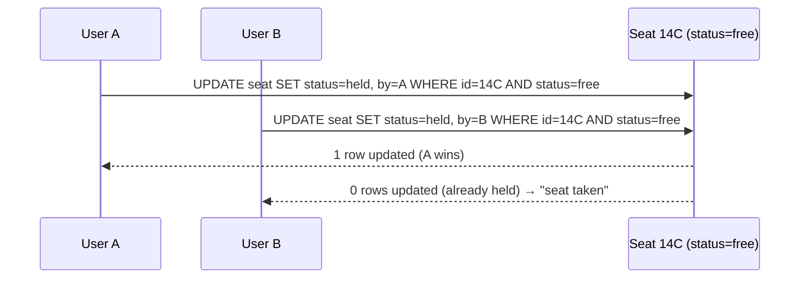
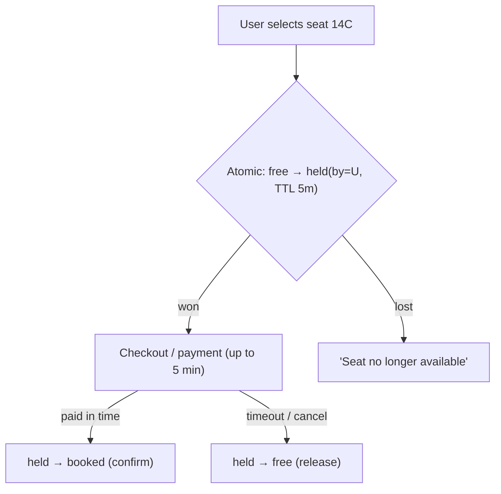

# 17. Ticket Booking Concurrency

> **In one line:** Let two users compete for the same seat and guarantee **exactly one** wins — via atomic
> conditional updates or transactions, plus a **temporary hold** so a user who's mid-checkout isn't
> gazumped, with the hold expiring if they don't pay.

> **Original prompt:** How to handle two users booking the same seat simultaneously
> (transactions / atomic updates).

## Overview

Booking a specific seat (movie, flight, concert) is the archetypal **contended unique-resource** problem.
Unlike a flash sale (any 1 of N identical units), here users want a *specific* seat, so the race is
sharper: A and B both click seat 14C. The design must ensure exactly one booking succeeds, hold the seat
while the winner pays (so they don't lose it at the payment step), and release it if they abandon — all
without deadlocks or double-booking.

## Functional Requirements

- Select a specific seat; place a temporary **hold** during checkout.
- Confirm booking on payment; release the hold on timeout/cancel.
- Never double-book a seat; show live seat availability.
- Handle the payment step taking seconds-to-minutes without blocking others forever.

## Non-Functional Requirements

| Property | Target |
|---|---|
| Correctness | A seat is booked by exactly one user — hard invariant |
| Fairness | First committed writer wins; losers told immediately |
| Liveness | Abandoned holds expire; seats don't get stuck "reserved" |
| Latency | Hold/confirm are fast, single-row/atomic operations |

## The Race and Its Fix



The whole trick: **conditional update** — `SET ... WHERE status = free`. The database serializes it;
exactly one update matches, the other affects zero rows and is cleanly rejected. No read-then-write, no
lost update.

## Two-Phase: Hold, then Confirm

A single "book" click shouldn't require instant payment, but the seat must be protected during checkout.
So booking is **two phases**:



- **Phase 1 — Hold:** atomic `free → held` with an expiry (`held_until`). Winner proceeds.
- **Phase 2 — Confirm:** on payment, atomic `held(by=me) → booked`. The `by=me` guard prevents someone
  else confirming your hold.
- **Expiry:** if the hold TTL passes without confirm, a sweeper (or a lazy check) flips `held → free`.
  This prevents seats stranded forever by abandoned carts.

## Implementations

**Relational (conditional UPDATE / transaction):**

```sql
-- hold
UPDATE seats SET status='held', held_by=:u, held_until=now()+interval '5 min'
WHERE id=:seat AND (status='free' OR (status='held' AND held_until < now()));  -- reclaim expired holds
-- confirm
UPDATE seats SET status='booked' WHERE id=:seat AND status='held' AND held_by=:u;
```

The single conditional `UPDATE` is atomic; row-level locking inside the transaction serializes concurrent
attempts on that row. For a booking that spans **multiple seats atomically** (all-or-nothing), wrap them
in one transaction.

**Redis (fast hold layer):** `SET seat:14C {userId} NX EX 300` — `NX` succeeds for exactly one holder,
`EX` is the auto-expiring TTL (holds release themselves — no sweeper needed). Confirm writes the durable
booking to the DB. This offloads the hot contention from the DB to Redis.

## Optimistic vs Pessimistic Here

| Approach | Fit |
|---|---|
| **Atomic conditional update** (optimistic-ish) | Best default — one statement, no held locks, no deadlock |
| **`SELECT ... FOR UPDATE`** (pessimistic) | Lock the seat row inside a txn; simple but holds a lock during logic; risk of contention/deadlock across multi-seat orders |
| **Redis `SET NX EX`** | Fast, self-expiring holds; DB is source of truth on confirm |

For multi-seat orders, order lock acquisition consistently (e.g., by seat id) to avoid deadlocks, or use
the single-transaction conditional update over the set.

## Handling Payment Asynchrony (saga)

Payment can be slow or fail. Model hold→pay→confirm as a small **saga** with compensation:

- Reserve (hold) → attempt payment → on success confirm; on failure/timeout **release** (compensating
  action).
- Make confirm **idempotent** (booking id / payment intent id) so a retried payment webhook doesn't
  create two bookings or double-charge.
- Payment provider is the source of truth for "paid"; reconcile holds against payment status.

## Scaling & Failure Scenarios

| Scenario | Response |
|---|---|
| Popular event on-sale spike | Redis holds absorb contention; DB sees only confirms |
| User abandons at payment | Hold TTL expires → seat auto-returns to free |
| Service crash after payment, before confirm | Idempotent confirm + reconciliation from payment records |
| Sweeper lag (SQL holds) | Reclaim-expired predicate in the hold UPDATE handles it lazily |
| Multi-seat all-or-nothing | Single transaction over all seats; any conflict rolls back the whole order |
| Hot venue row | Seat-level granularity spreads contention; per-seat keys in Redis |

## Security

- Server-authoritative seat/price/eligibility; never trust client-sent "I hold 14C".
- Bot/scalper mitigation: per-user hold caps, CAPTCHAs, rate limits (secondary-market abuse is rampant).
- Idempotency + signed hold tokens prevent replay/forgery of a "winner" hold.

## Performance

- Hold and confirm are single atomic ops → sub-ms; no long-held DB locks on the hot path.
- Serve seat-map availability from cache, invalidated on state change; don't `SELECT *` the venue per view.
- Redis hold layer keeps the durable DB write rate low (only real confirms).

## Trade-offs & Pitfalls

- **Read-then-write seat check** → double-booking; use conditional update / `NX`.
- **No hold expiry** → seats stranded by abandoned carts (undersell).
- **`FOR UPDATE` held across payment** → locks a row for minutes → contention/timeouts; hold via status +
  TTL instead, not a live DB lock.
- **Non-idempotent confirm** → duplicate bookings / double charges on webhook retries.
- **Multi-seat orders without one transaction** → partial bookings.

## Interview Questions & Answers

- **How do you stop two users booking one seat?** Atomic conditional update `SET held WHERE status=free`
  (or Redis `SET NX`) — the store serializes it; exactly one succeeds.
- **How does a user keep the seat while paying?** A temporary hold with a TTL; confirm on payment, release
  on timeout — a hold→pay→confirm saga.
- **Optimistic or pessimistic locking?** Prefer atomic conditional updates; `SELECT FOR UPDATE` works but
  don't hold the lock across the slow payment step.
- **What frees an abandoned seat?** Hold expiry — Redis TTL auto-expires, or a reclaim-expired predicate /
  sweeper for SQL holds.
- **How do you avoid double bookings on payment retries?** Idempotent confirm keyed on booking/payment
  intent id + reconciliation.
- **Booking multiple seats atomically?** One transaction over all seats — all commit or all roll back.
