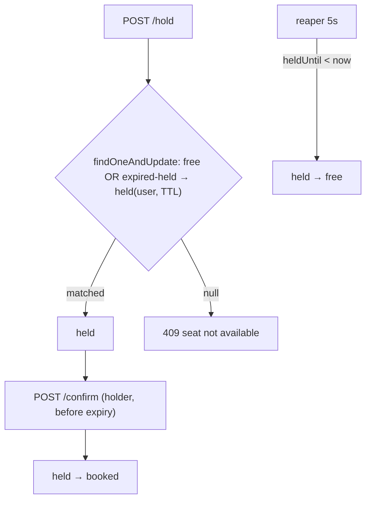

# Ticket Booking Concurrency — implementation

Seat booking with **no double-booking**, implementing the [design doc](../17-ticket-booking-concurrency.md):
an **atomic conditional hold** (`free → held`) with a TTL, then **confirm** (`held → booked`), plus a
reaper that releases expired holds.

## Stack

- **Node.js + TypeScript + Express**
- **MongoDB** — one document per `(eventId, seatId)`; atomic `findOneAndUpdate` as the concurrency guard

## Flow



## Endpoints

| Method | Path | Purpose |
| --- | --- | --- |
| POST | `/api/events/:eventId/seats` `{seatIds}` | Seed seats |
| GET | `/api/events/:eventId/seats` | Seat map |
| POST | `/api/events/:eventId/seats/:seatId/hold` `{userId}` | Atomic hold (409 if taken) |
| POST | `/api/events/:eventId/seats/:seatId/confirm` `{userId}` | Confirm → booked (410 if expired/not yours) |

## Design-doc mapping

- **No double-booking** → a single conditional `findOneAndUpdate` (`free` OR expired-`held` → `held`);
  Mongo serializes it, so exactly one concurrent request wins.
- **Hold TTL** → `heldUntil`; expired holds are reclaimable (both lazily in the hold predicate and by the
  reaper) — prevents seats stranded by abandoned carts.
- **Confirm guard** → only the current holder before expiry can book (`held & heldBy & heldUntil>now`).

## Run it

```bash
docker compose up --build          # http://localhost:3117
```

```bash
npm install && npm test            # 5 unit tests (hold/confirm transition rules)
npm run typecheck
```

## Verification

- `npm test` covers holdable (free / expired / active / booked) and confirmable (holder / not-holder /
  expired) rules. `npm run typecheck` passes. Atomic hold/confirm run against Mongo under `docker compose
  up`.
