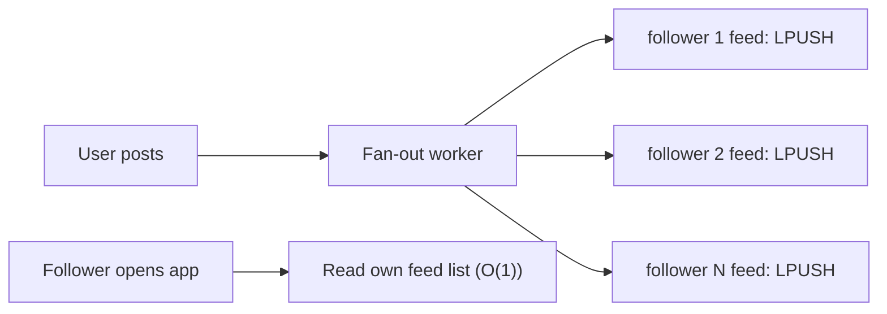
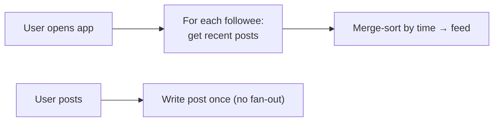
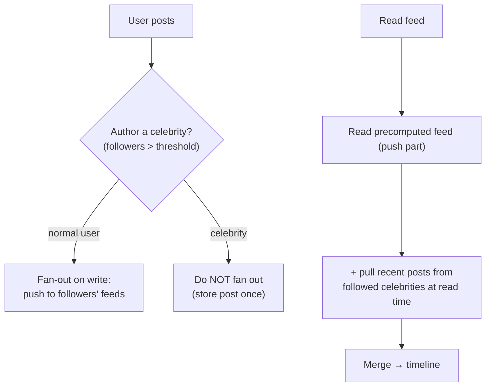

# 18. Social Media Feed Generation

> **In one line:** Build a Twitter/Instagram-style home timeline — decide between **fan-out on write**
> (precompute each follower's feed) and **fan-out on read** (assemble at request time), and use a
> **hybrid** to handle the celebrity problem.

> **Original prompt:** Design the "fan-out on write" vs "fan-out on read" strategy for a Twitter clone.

## Overview

The feed is a **read-vs-write cost trade-off** in its purest form. Reads dominate (users scroll far more
than they post), so you want feed reads to be cheap. But making reads cheap means precomputing feeds at
**write** time — which explodes when someone with 100M followers posts. The entire design is choosing
*when* to do the fan-out work, and the mature answer is **hybrid**.

## Functional Requirements

- Home timeline: recent posts from everyone a user follows, newest-first.
- Post creation propagates to followers' feeds.
- Pagination (infinite scroll) via cursors.
- Reasonable freshness (seconds), not necessarily instant.

## Non-Functional Requirements

| Property | Target |
|---|---|
| Read latency | Feed load in tens of ms (reads dominate) |
| Write amplification | A post must not cause unbounded synchronous work |
| Scale | 100M+ users, power-law follower counts |
| Freshness | New posts appear within seconds |

## Estimation (why reads win)

- Read:write ratio is often **100:1+** — optimize the read path hard.
- Average user: hundreds of follows; celebrities: tens of millions of followers → fan-out cost is wildly
  skewed. This skew is the crux.

## Strategy A — Fan-out on Write (push)

When you post, **push** the post id into every follower's precomputed feed list (in Redis / a feed store).

- **Read = cheap:** the feed is already materialized; just read the list. 
- **Write = expensive:** one post → N inserts. For 1,000 followers, fine; for 50M followers, catastrophic
  ("fan-out storm").
- Best for **most users** (modest follower counts) and read-heavy workloads.

## Strategy B — Fan-out on Read (pull)

Store each post once; at read time, **gather** recent posts from everyone the user follows and merge.

- **Write = cheap:** store the post once, no propagation.
- **Read = expensive:** query and merge across hundreds of followees on every feed load.
- Best for **celebrities** (avoids the write storm) and inactive users (don't precompute feeds nobody
  reads).

| | Fan-out on write | Fan-out on read |
|---|---|---|
| Read cost | O(1) | O(followees) merge |
| Write cost | O(followers) | O(1) |
| Feed store | Big (per-user materialized) | Small |
| Weakness | Celebrity write storm | Slow reads for big follow lists |

## Strategy C — Hybrid (what real systems do)

Split by follower count:

- **Normal authors:** fan-out on write (cheap reads for their followers).
- **Celebrities:** fan-out on read (no write storm); their followers **pull** their recent posts at read
  and merge into the precomputed base feed.
- This bounds both write amplification and read cost — the standard production design.

## Feed Storage & Ranking

- **Feed store:** Redis lists / sorted sets per user (`feed:{uid}` scored by time or rank), capped to the
  last ~800 entries (nobody scrolls forever); older pages fall back to a query.
- **Ranking:** chronological is simplest; "top" feeds add an ML ranking pass over candidate posts
  (a separate scoring service) — out of scope but worth naming.
- **Pagination:** cursor/keyset by post id or score, never `OFFSET`.

## Fan-out Mechanics & Freshness

- Fan-out runs **asynchronously** via a queue (post creation returns immediately; workers propagate) —
  never block the post request on N inserts.
- Deduplicate and handle **unfollow/deleted posts** at read time (filter tombstones) rather than rewriting
  everyone's feed.
- Backfill new follows lazily (pull) rather than reconstructing a full feed synchronously.

## Scaling & Failure Scenarios

| Scenario | Response |
|---|---|
| Celebrity posts | Hybrid: no fan-out; followers pull at read |
| Fan-out worker backlog | Queue buffers; feeds are eventually consistent (seconds of lag OK) |
| Feed store memory | Cap feed length; cold pages served from post store queries |
| Deleted/edited posts | Filter tombstones at read; don't rewrite N feeds |
| Hot celebrity read | Cache their recent posts once; all followers read the same cached slice |

## Security & Integrity

- Enforce **visibility/privacy** (blocked users, private accounts) at read time — a precomputed feed must
  still respect current block/mute state.
- Authorize follows and post reads; don't leak private posts via feed caches.
- Rate-limit posting to curb spam fan-out.

## Performance

- Reads hit a small, cached, per-user structure (push part) plus a bounded pull for celebrities.
- Fan-out is async and batched; posting is O(1) for the author.
- Cap materialized feed length; treat the feed store as a cache rebuildable from the post store.

## Trade-offs & Pitfalls

- **Pure fan-out on write** → celebrity write storms melt the system.
- **Pure fan-out on read** → feed loads get slow for users following many accounts.
- **Synchronous fan-out** → posting blocks on N writes; make it async.
- **Rewriting feeds on unfollow/delete** → huge write amplification; filter at read.
- **Unbounded feed lists** → memory blowup; cap and fall back to queries.

## Interview Questions & Answers

- **Fan-out on write vs read?** Write = precompute each follower's feed (cheap reads, costly writes); read
  = assemble at request time (cheap writes, costly reads).
- **Which is better?** Neither alone — **hybrid**: push for normal users, pull for celebrities, merge at
  read.
- **How do you handle the celebrity problem?** Skip fan-out for high-follower authors; their followers pull
  and merge their recent posts.
- **Is the feed strongly consistent?** No — eventually consistent; a few seconds of propagation lag is
  acceptable.
- **How do you paginate?** Cursor/keyset by time or score, not `OFFSET`.
- **How do deletes/unfollows work without rewriting feeds?** Filter tombstones/visibility at read time.
