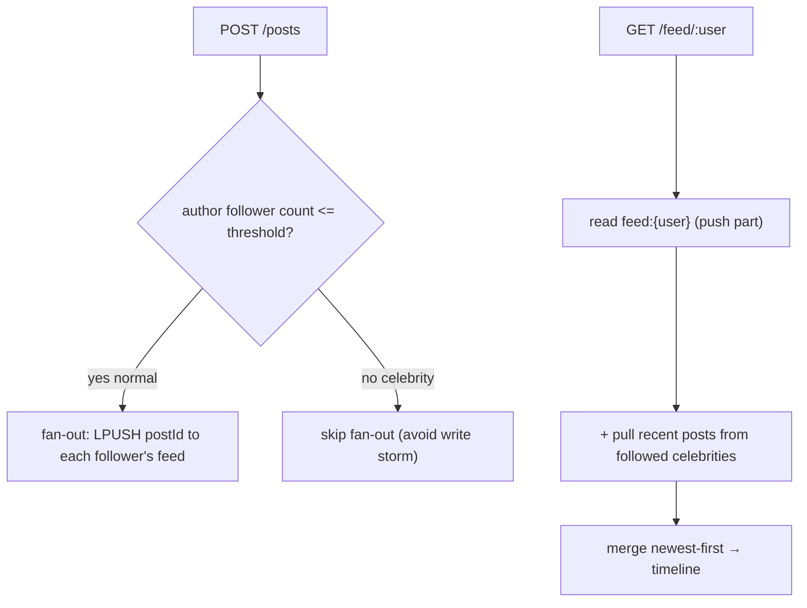

# Social Media Feed Generation — implementation

Home-timeline generation implementing the [design doc](../18-social-media-feed-generation.md): a **hybrid
fan-out** — push (fan-out-on-write) for normal authors, pull-at-read for celebrities — using Redis feed
lists + MongoDB posts.

## Stack

- **Node.js + TypeScript + Express**
- **Redis** — `feed:{user}` materialized lists, `followers/following` sets, `posts:{author}` recent lists
- **MongoDB** — durable posts

## Architecture



## Endpoints

| Method | Path | Purpose |
| --- | --- | --- |
| POST | `/api/follow` `{follower, followee}` | Follow |
| POST | `/api/posts` `{authorId, text}` | Post (push or pull depending on author) |
| GET | `/api/feed/:userId?limit=` | Home timeline (hybrid) |

## Design-doc mapping

- **Fan-out-on-write** → normal authors push `postId` into each follower's `feed:{user}` list (capped).
- **Celebrity problem** → `shouldFanout(followerCount, threshold)` skips fan-out for celebrities; their
  followers **pull** `posts:{celeb}` at read.
- **Merge** → `mergeTimelines` combines the push feed + celebrity pulls, deduped and time-sorted (post ids
  are lexicographically time-sortable).

## Run it

```bash
docker compose up --build          # http://localhost:3118
```

```bash
npm install && npm test            # 4 unit tests (fan-out decision, merge, id ordering)
npm run typecheck
```

## Verification

- `npm test` covers the push/pull decision, timeline merge/dedupe/sort, and post-id monotonicity.
  `npm run typecheck` passes. Hybrid fan-out runs against Redis + Mongo under `docker compose up`.
