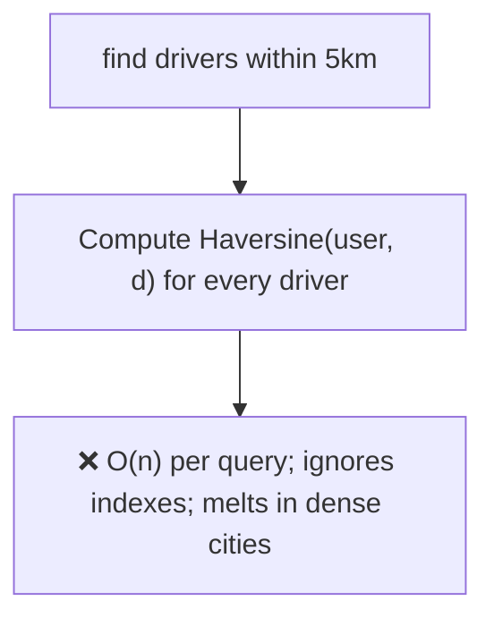
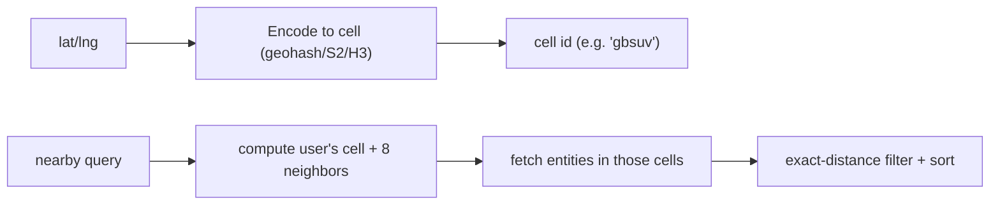
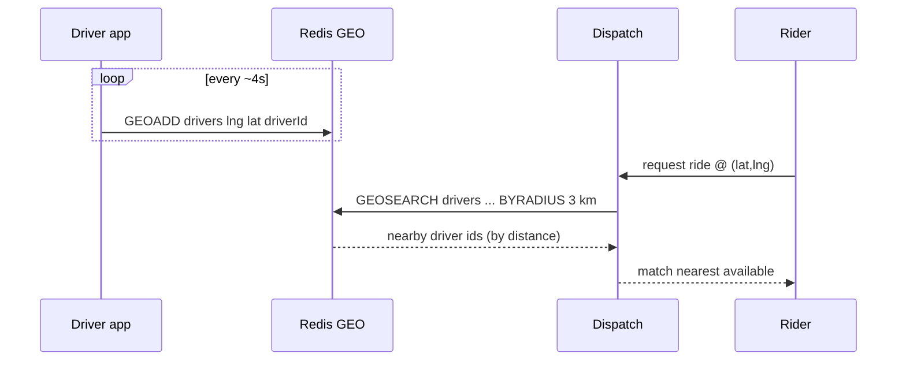

# 19. Geo-Spatial Search ("Nearby")

> **In one line:** Answer "find the nearest drivers/restaurants within X km" efficiently by indexing
> locations with a spatial index (MongoDB 2dsphere `$geoNear`, or geohash / Google S2 / Uber H3 cells)
> instead of computing distance to every row.

> **Original prompt:** Design a "Nearby Drivers" API using MongoDB `$geoNear` and geospatial indexes.

## Overview

"Nearby" queries are painful with ordinary indexes because proximity is **two-dimensional** — you can't
B-tree your way to "within 5 km" the way you can for a single sorted column. Scanning every location and
computing Haversine distance is O(n) and dies at scale. The fix is a **spatial index** that maps 2D
coordinates onto a structure supporting range/radius queries: an R-tree (MongoDB `2dsphere`), or mapping
locations to **grid cells** (geohash, S2, H3) so "nearby" becomes "same/adjacent cells."

## Functional Requirements

- Given a lat/lng and radius (or "k nearest"), return matching entities sorted by distance.
- Update entity locations frequently (drivers move every few seconds).
- Filter by attributes (available drivers, cuisine, open now).
- Reasonable freshness for moving objects.

## Non-Functional Requirements

| Property | Target |
|---|---|
| Query latency | Radius/kNN in a few ms, not O(n) scans |
| Write throughput | High for moving objects (driver pings) |
| Accuracy | Correct near radius boundaries; account for Earth curvature |
| Scale | Millions of entities, dense in cities (skew) |

## Why Not Naive Distance-to-All



Even a bounding-box `WHERE lat BETWEEN ... AND lng BETWEEN ...` on separate B-trees helps only weakly (two
independent 1D ranges, poor selectivity) and is wrong near the poles / antimeridian.

## Approach A — MongoDB 2dsphere + `$geoNear`

Store locations as GeoJSON, add a `2dsphere` index (an R-tree-like structure on the sphere):

```js
db.drivers.createIndex({ location: "2dsphere" });
// location: { type: "Point", coordinates: [lng, lat] }   // note: [lng, lat] order!

db.drivers.aggregate([{ $geoNear: {
  near: { type: "Point", coordinates: [lng, lat] },
  distanceField: "dist",
  maxDistance: 5000,               // meters
  query: { status: "available" },  // combine with attribute filters
  spherical: true
}}]);
```

`$geoNear` returns docs **sorted by distance** and computes real spherical distance — the index prunes to
a candidate region so it never scans all drivers. `$near`/`$geoWithin` are the query-operator variants.

## Approach B — Grid Cells (geohash / S2 / H3)

Map each 2D point to a **cell id** (a 1D string/int) so a normal index and equality lookups work:



- **Geohash:** interleaves lat/lng bits into a base-32 string; a **shared prefix ⇒ spatial proximity**.
  Query = your cell + its 8 neighbors (to catch entities just across a boundary), then refine by exact
  distance. Edge case: neighbors near cell boundaries — always include adjacent cells.
- **S2 (Google) / H3 (Uber):** more uniform cells (H3 uses hexagons → equal-distance neighbors, no
  diagonal weirdness). Uber's dispatch uses H3 to bucket drivers/riders by cell.
- Great with **Redis**: `GEOADD`/`GEOSEARCH` implements geohash-based radius search natively, ideal for
  hot, frequently-updated driver positions.

| | 2dsphere `$geoNear` | Geohash/S2/H3 cells |
|---|---|---|
| Setup | One index, built-in ops | App-side cell math + lookups |
| Moving objects | Update a point (index maintenance) | Update cell id (cheap key move) |
| Hot updates at scale | DB write pressure | Redis `GEOADD` shines |
| Neighbor edge cases | Handled internally | You must include adjacent cells |

## Moving Objects (drivers): the write-heavy twist

Drivers ping location every few seconds → **write-dominant**. Keep the live positions in **Redis
(GEO commands)** for cheap updates and fast radius reads; the DB holds durable/less-hot data. Bucketing by
H3 cell lets a dispatcher consider only the rider's cell + neighbors, dramatically shrinking the candidate
set.



## Handling Density Skew

Cities are dense, oceans empty. A fixed radius can return 5 or 5,000 results.

- **Adaptive radius:** expand the search ring until you have enough candidates (start 1 km, grow).
- **Cap + rank:** limit candidates, then rank by distance + business rules (ETA, rating).
- **Hierarchical cells** (S2/H3 support multiple resolutions) let you zoom the granularity to density.

## Scaling & Failure Scenarios

| Scenario | Response |
|---|---|
| Millions of moving drivers | Redis GEO for live positions; shard by region/cell |
| Dense metro hotspots | Adaptive radius + candidate cap; finer cell resolution |
| Antimeridian / poles | Use spherical ops (2dsphere) or S2/H3 (globally consistent), not naive lat/lng boxes |
| Redis position store loss | Soft state — drivers re-ping within seconds |
| Global scale | Partition by geographic region; a query rarely crosses regions |

## Security & Privacy

- Location is highly sensitive — coarsen/round precision for display; never expose exact coordinates of
  other users beyond what's needed.
- Authorize who can query whose location; rate-limit to prevent scraping the driver fleet.
- Retention limits on location history (tracking/privacy law).

## Performance

- Spatial index prunes candidates to a small region → radius/kNN in ms.
- Redis GEO handles high-frequency position updates + reads without DB pressure.
- Refine exact distance only on the small candidate set, not the whole dataset.

## Trade-offs & Pitfalls

- **Haversine over all rows** → O(n); use a spatial index.
- **`[lat, lng]` vs `[lng, lat]`** — GeoJSON/Mongo want **`[lng, lat]`**; swapping them silently returns
  wrong results.
- **Ignoring boundary cells** in geohash → missing entities just across a cell edge; include neighbors.
- **Fixed radius in variable density** → empty or flooded results; adapt.
- **Storing hot driver pings in the primary DB** → write overload; use Redis GEO.

## Interview Questions & Answers

- **Why can't a normal index do "nearby"?** Proximity is 2D; B-trees sort 1D. Two independent range
  filters are weakly selective and wrong near poles/antimeridian.
- **How does `$geoNear` work?** A `2dsphere` (R-tree-like) index prunes to a candidate region and returns
  docs sorted by true spherical distance.
- **What are geohash/S2/H3?** Schemes that map 2D points to 1D cell ids so shared prefixes/cells mean
  proximity; query your cell + neighbors, then refine.
- **How do you handle constantly-moving drivers?** Keep live positions in Redis GEO (cheap `GEOADD` +
  `GEOSEARCH`); bucket by H3 cell for dispatch.
- **How do you handle dense cities?** Adaptive radius, candidate caps, finer cell resolution.
- **A common bug?** Coordinate order — GeoJSON expects `[lng, lat]`.
