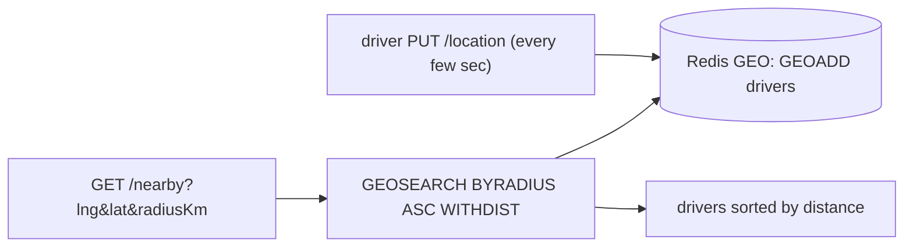

# Geo-Spatial Search ("Nearby") — implementation

A "nearby drivers" service implementing the [design doc](../19-geo-spatial-search.md): **Redis GEO**
(`GEOADD`/`GEOSEARCH`) for cheap high-frequency location updates and fast radius queries, plus a Haversine
distance helper.

## Stack

- **Node.js + TypeScript + Express**
- **Redis GEO** — geohash-backed sorted set of live driver positions

## Architecture



## Endpoints

| Method | Path | Purpose |
| --- | --- | --- |
| PUT | `/api/drivers/:id/location` `{lng, lat}` | Upsert a driver's live position |
| DELETE | `/api/drivers/:id` | Remove a driver |
| GET | `/api/nearby?lng=&lat=&radiusKm=&count=` | Nearby drivers, nearest-first, with distance |

## Design-doc mapping

- **Spatial index** → Redis GEO stores positions in a geohash-scored sorted set; `GEOSEARCH BYRADIUS`
  prunes to the region and returns results **sorted by distance** — no O(n) scan.
- **Moving objects** → `GEOADD` is a cheap O(log n) update, ideal for frequent driver pings.
- **Coordinate order** → API takes explicit `{lng, lat}` (the classic GeoJSON `[lng, lat]` gotcha).
- **Haversine** → `haversineKm` for exact distance refinement / server-side checks.

## Run it

```bash
docker compose up --build          # http://localhost:3119
curl -XPUT localhost:3119/api/drivers/d1/location -H 'content-type: application/json' -d '{"lng":-74.0,"lat":40.71}'
curl 'localhost:3119/api/nearby?lng=-74.0&lat=40.71&radiusKm=5'
```

```bash
npm install && npm test            # 4 unit tests (Haversine distances + coord validation)
npm run typecheck
```

## Verification

- `npm test` covers Haversine (same point, NYC→LA ≈ 3936 km, 1° lat ≈ 111 km) and coordinate bounds.
  `npm run typecheck` passes. Radius search runs against Redis GEO under `docker compose up`.
