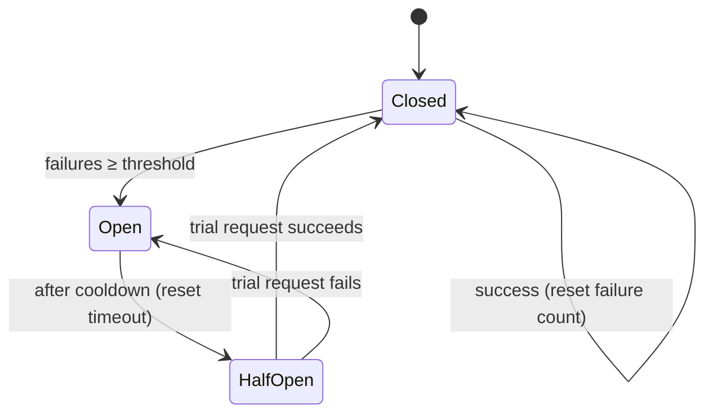
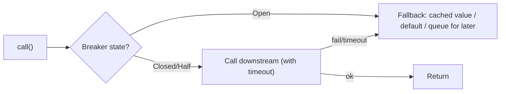

# 20. Circuit Breaker Pattern

> **In one line:** Wrap calls to a flaky downstream so that after N consecutive failures the breaker
> "opens" and **fails fast** (no more calls) for a cooldown, then cautiously tests recovery — preventing a
> single failing dependency from cascading into a full outage.

> **Original prompt:** Implement a function wrapper that stops calling a failing downstream service after
> N failures.

## Overview

In a distributed system, a slow or dead dependency is more dangerous than an obvious crash: callers keep
hammering it, each request blocks on a timeout, threads/connections pile up, and the *caller* falls over
too — a **cascading failure**. The **circuit breaker** (Michael Nygard, *Release It!*) borrows from
electrical breakers: detect that the downstream is unhealthy and **stop sending traffic** for a while,
failing fast and giving it room to recover. It converts slow, resource-exhausting failures into fast,
cheap ones.

## Functional Requirements

- Wrap a downstream call; track its success/failure.
- **Open** (stop calling) after a failure threshold; return an error/fallback immediately.
- After a cooldown, allow a **trial** request; close on success, re-open on failure.
- Expose state/metrics for observability.

## Non-Functional Requirements

| Property | Target |
|---|---|
| Fail-fast | Open state returns in ~0 ms (no downstream call, no timeout wait) |
| Recovery | Auto-detect downstream healing without manual intervention |
| Overhead | Negligible per-call bookkeeping |
| Safety | Don't flood a recovering service with a thundering herd |

## The State Machine



- **Closed** (normal): calls pass through; count failures. Cross the threshold → **Open**.
- **Open** (tripped): **reject immediately** (fail fast / fallback) without calling downstream. After a
  `resetTimeout`, move to **Half-Open**.
- **Half-Open** (probing): allow **one** (or a few) trial call. Success → **Closed** (recovered). Failure
  → back to **Open** (still broken). This single-probe gate prevents slamming a fragile service.

## Reference Implementation (Node.js)

```js
class CircuitBreaker {
  constructor(fn, { failureThreshold = 5, resetTimeout = 10000 } = {}) {
    this.fn = fn;
    this.failureThreshold = failureThreshold;
    this.resetTimeout = resetTimeout;
    this.state = 'CLOSED';
    this.failures = 0;
    this.nextAttempt = 0;             // when Open may transition to Half-Open
  }

  async call(...args) {
    if (this.state === 'OPEN') {
      if (Date.now() < this.nextAttempt) throw new Error('CircuitOpen: failing fast');
      this.state = 'HALF_OPEN';       // cooldown elapsed → allow a trial
    }
    try {
      const result = await this.fn(...args);
      this.onSuccess();
      return result;
    } catch (err) {
      this.onFailure();
      throw err;
    }
  }

  onSuccess() { this.failures = 0; this.state = 'CLOSED'; }

  onFailure() {
    this.failures++;
    if (this.state === 'HALF_OPEN' || this.failures >= this.failureThreshold) {
      this.state = 'OPEN';
      this.nextAttempt = Date.now() + this.resetTimeout;   // start cooldown
    }
  }
}
```

Production libraries (**opossum** in Node, Resilience4j/Hystrix in the JVM) add rolling-window failure
rates, timeouts, and metrics — but this is the core.

## What Counts as a "Failure"?

- **Timeouts** (the important one — a *slow* dependency is what exhausts you), 5xx, connection errors.
- **Not** business 4xx (a `404`/`400` is a valid answer, not a downstream outage) — counting these trips
  the breaker wrongly.
- Prefer a **rolling window failure *rate*** (e.g., >50% of the last 20 calls) over a raw consecutive
  count — more robust under mixed traffic than "5 in a row."

## Fallbacks & Companion Patterns



- **Fallback:** serve stale cache, a default, a degraded response, or enqueue for later — graceful
  degradation beats a hard error.
- **Timeouts** are mandatory *inside* the breaker — without a timeout, "slow" never becomes "failure."
- **Bulkheads** (isolate resource pools per dependency), **retries with backoff+jitter**, and **rate
  limiting** are the sibling resilience patterns; retries *without* a breaker amplify the outage.

## Scaling & Distributed Considerations

| Concern | Handling |
|---|---|
| Per-instance vs shared state | Usually **per-instance** (simple, no coordination); each caller protects itself |
| Shared breaker state | Possible via Redis, but adds latency/complexity — often unnecessary |
| Thundering herd on recovery | Half-Open allows only a trickle; add jitter to reset timeouts across instances |
| Many dependencies | One breaker **per downstream** (per host/route), not one global breaker |

## Observability

- Emit state transitions (Closed→Open is an incident signal), failure rates, and rejected-call counts.
- Alert on breakers opening — it's an early, precise indicator of a dependency problem.
- Dashboards per dependency reveal *which* service is degrading before users notice.

## Security

- Fail-fast avoids resource exhaustion (a DoS-amplifier if unbounded timeouts stack up).
- Ensure fallbacks don't leak sensitive defaults or bypass authorization.
- Don't let the open-state error reveal internal topology to clients.

## Trade-offs & Pitfalls

- **No timeout** → the breaker never sees "slow" as failure; slow calls still exhaust you.
- **Counting 4xx as failures** → breaker trips on valid business responses.
- **Retrying without a breaker** → retries multiply load on an already-failing service (retry storm).
- **One global breaker** → a single flaky dependency blocks calls to healthy ones; scope per dependency.
- **Half-Open floods** → letting many trial calls through re-kills a recovering service; probe with one.

## Interview Questions & Answers

- **What problem does it solve?** Cascading failure: a slow/dead dependency exhausts the caller's
  resources; the breaker fails fast and lets the downstream recover.
- **Explain the three states.** Closed (normal, counting failures), Open (reject immediately for a
  cooldown), Half-Open (one trial call → close on success, re-open on failure).
- **What counts as a failure?** Timeouts and 5xx/connection errors — not business 4xx. Prefer a rolling
  failure *rate*.
- **Why is a timeout essential?** Without it, "slow" never converts to "failure," so the breaker never
  trips on the most dangerous case.
- **Per-instance or shared state?** Usually per-instance for simplicity; shared (Redis) is possible but
  rarely worth the coordination cost.
- **How does it avoid re-killing a recovering service?** Half-Open lets only a single probe through before
  fully closing.
