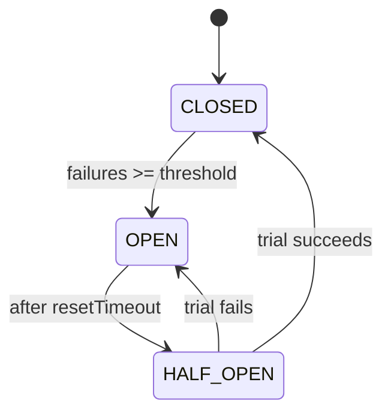

# Circuit Breaker Pattern — implementation

A circuit breaker implementing the [design doc](../20-circuit-breaker-pattern.md): after repeated
downstream failures it **fails fast** for a cooldown, then **probes** recovery — preventing a failing
dependency from cascading. Includes a flaky-downstream demo.

## Stack

- **Node.js + TypeScript + Express** (dependency-free breaker in `src/circuit-breaker.ts`)

## State machine



## Endpoints (demo)

| Method | Path | Purpose |
| --- | --- | --- |
| GET | `/api/health` | Liveness |
| GET | `/api/state` | Current breaker state |
| POST | `/api/downstream/fail-rate` `{rate}` | Toggle simulated downstream failure rate (0..1) |
| GET | `/api/call` | Call the downstream **through** the breaker (503 + fallback when open) |

## Design-doc mapping

- **Three states** → CLOSED (count failures), OPEN (fail fast for `resetTimeout`), HALF_OPEN (one trial).
- **Fail fast** → OPEN returns a `CircuitOpenError` immediately without calling downstream.
- **Auto-recovery** → after cooldown, a single HALF_OPEN probe closes (success) or re-opens (failure).
- **Fallback** → the `/api/call` handler serves a graceful degraded response when the breaker is open.
- **Injectable clock** → the breaker takes a `now()` for deterministic unit tests.

## Run it

```bash
docker compose up --build          # http://localhost:3120
curl -XPOST localhost:3120/api/downstream/fail-rate -H 'content-type: application/json' -d '{"rate":1}'
for i in $(seq 1 8); do curl -s localhost:3120/api/call; echo; done   # watch it open
```

```bash
npm install && npm test            # 5 unit tests (open, fail-fast, half-open close/reopen, reset)
npm run typecheck
```

## Verification

- `npm test` covers opening after threshold, failing fast without calling downstream, half-open trial
  close/re-open, and failure-count reset on success. `npm run typecheck` passes.
