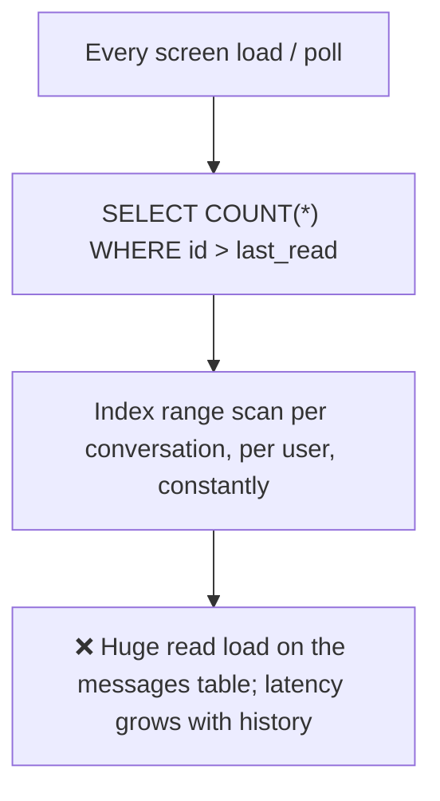
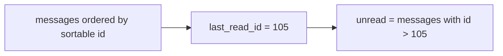

# 21. Design an Unread Message Counter

> **In one line:** Show accurate per-conversation and total unread badges for millions of users without
> running a heavy `COUNT(*)` on every screen load — by maintaining incremental counters and a
> `last_read` watermark instead of counting rows.

> **Original prompt:** Implement a scalable solution to calculate unread chat messages without executing
> heavy database counts.

## Overview

The unread badge is on every screen, so it's read constantly — and the naive `SELECT COUNT(*) FROM
messages WHERE conversation=? AND id > last_read` runs that count on every poll for every conversation.
At scale that's a firehose of counting queries over your biggest table. The fix is to stop **counting**
and start **tracking**: keep a maintained counter (incremented on receive, reset on read) and/or a
`last_read` watermark so unread is O(1) to read.

## Functional Requirements

- Per-conversation unread count and a **total** unread badge per user.
- Increment when a message arrives for a user (and they're not viewing that chat).
- Reset to zero (or recompute) when the user reads a conversation.
- Correct across multiple devices (read on phone clears the badge on web).

## Non-Functional Requirements

| Property | Target |
|---|---|
| Read cost | O(1) badge read; no per-load `COUNT(*)` |
| Write cost | O(1) increment per delivered message |
| Freshness | Near-real-time badge updates |
| Correctness | Converges to the true unread count; multi-device consistent |

## Why `COUNT(*)` Doesn't Scale



Counting is O(unread) and repeated endlessly. You want a value you can **read directly**.

## Approach A — Watermark (`last_read_message_id`)

Store, per (user, conversation), the id of the last message they've read. Unread = messages after it.



- **Read (reset):** opening a chat sets `last_read_id = latest_message_id` — one tiny write; badge → 0.
- **Multi-device:** the watermark is the single source of truth; reading on any device advances it, and
  other devices reconcile to it.
- **The count itself:** deriving `count(id > last_read)` is still a count — cheap for small unreads, but
  pair it with a maintained counter (below) for O(1) badges. The watermark's real power is **correctness**
  and multi-device reads; the counter gives **speed**.

## Approach B — Maintained Counter (Redis)

Keep the number directly and mutate it on events:

```text
# message delivered to user U in conversation C (and U isn't actively viewing C)
HINCRBY unread:{U} {C} 1        # per-conversation
INCR    unread_total:{U}         # total badge
# U reads conversation C
HDEL    unread:{U} {C}           # or HSET to 0
DECRBY  unread_total:{U} <that conv's count>
```

- Reading the badge is a single `GET`/`HGETALL` — O(1), no message-table access.
- Redis hash per user holds per-conversation counts; a separate total for the app badge.
- **Combine A + B:** counter for fast reads, watermark for authoritative reconciliation and to rebuild the
  counter if it drifts.

```mermaid
sequenceDiagram
  participant S as Chat service
  participant R as Redis (unread counters)
  participant U as User devices
  S->>R: message to U → HINCRBY unread:U C 1
  R-->>U: push new total badge
  U->>S: opens conversation C (read)
  S->>R: reset unread:U C = 0; set last_read = latest
  R-->>U: badge updated on all devices
```

## Consistency & Drift Reconciliation

Counters can drift (missed event, crash, double-increment). Guard rails:

- Make increments **idempotent** where possible (tie to message delivery, dedup on message id).
- **Reconcile** periodically or on read: recompute the true count from the watermark (`count(id >
  last_read)`) and correct the cached counter. The watermark is cheap truth; the counter is fast cache.
- On "mark all read," set watermark to latest and zero the counter atomically.

## Data Model

| Key/Field | Store | Purpose |
|---|---|---|
| `membership(user, conv).last_read_id` | DB (durable) | Source of truth for unread boundary; multi-device |
| `unread:{user}` hash `{conv → count}` | Redis | Fast per-conversation badges |
| `unread_total:{user}` | Redis | Fast app icon badge |

Durable truth (watermark) in the DB; hot counters in Redis, rebuildable from truth.

## Scaling & Failure Scenarios

| Scenario | Response |
|---|---|
| Millions of badge reads/sec | Served from Redis O(1); DB untouched |
| Redis loss | Rebuild counters from `last_read` watermarks (durable) |
| Counter drift | Periodic/on-read reconciliation against the watermark |
| Group chat with many members | Increment each member's counter async via fan-out (like feed/chat) |
| Huge group (celebrity channel) | Fan-out-on-read: compute unread from watermark on demand instead of per-member counters |
| Read on device A | Advance shared watermark → devices B/C reconcile to 0 |

## Security

- Derive the user from the session; a user can only read/reset **their own** counters.
- Don't leak other users' unread state; authorize conversation membership.
- Rate-limit read/reset events (a client shouldn't spam watermark writes).

## Performance

- Badge read = one Redis op; the messages table is never counted on the hot path.
- Increments are O(1) and async off the delivery path.
- Reconciliation is bounded (count only the small unread tail above the watermark).

## Trade-offs & Pitfalls

- **`COUNT(*)` per screen load** → the whole problem; maintain a counter/watermark instead.
- **Counter without a watermark** → drift with no way to self-correct; keep durable truth to reconcile.
- **Per-member counters for huge groups** → fan-out storm; switch to on-read computation for big channels.
- **Non-idempotent increments** → badges inflate on retries; tie increments to message ids.
- **Ignoring multi-device** → badge clears on one device but not others; use a shared watermark.

## Interview Questions & Answers

- **Why not `COUNT(*)`?** It counts rows on every read across your biggest table — O(unread) repeated
  endlessly; doesn't scale.
- **What's the watermark approach?** Store `last_read_message_id` per (user, conversation); unread =
  messages after it — cheap, multi-device correct.
- **What's the counter approach?** Maintain the number in Redis (`HINCRBY`/reset) so the badge is an O(1)
  read.
- **How do you combine them?** Counter for speed, watermark for authoritative truth and to rebuild/reconcile
  the counter.
- **How do you keep counts from drifting?** Idempotent increments + periodic/on-read reconciliation from
  the watermark.
- **Huge group chats?** Compute unread on-read from the watermark instead of per-member counter fan-out.
