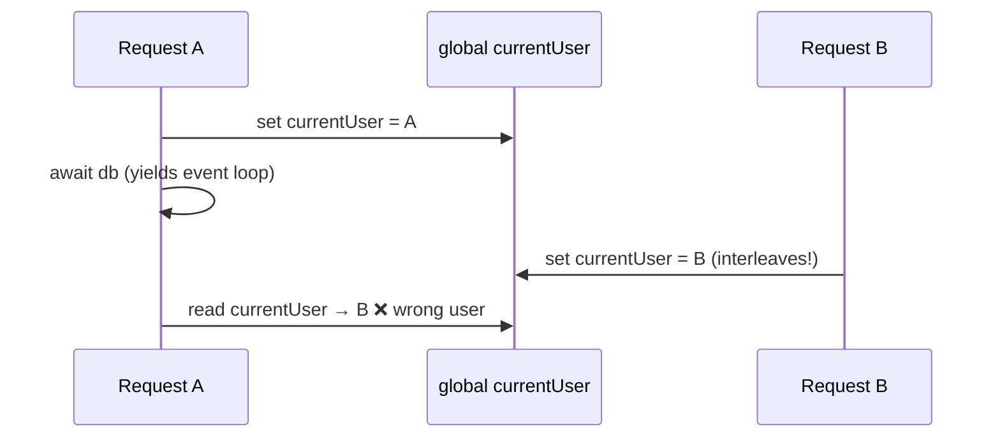
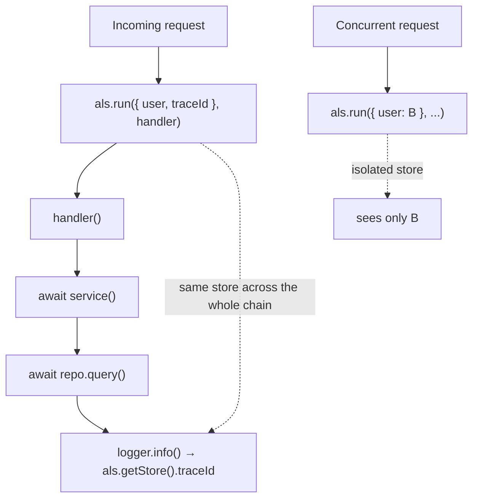
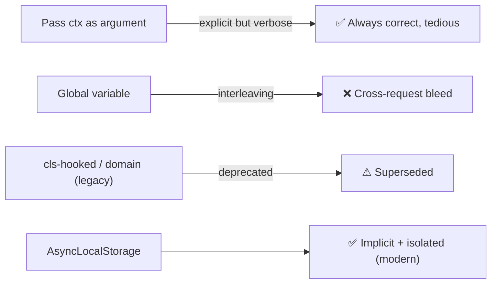

# 22. Node.js AsyncLocalStorage (Request Context)

> **In one line:** Carry per-request context (user, trace id, tenant) implicitly through deep async call
> chains — without threading it as an argument through every function — using Node's
> `AsyncLocalStorage`, the safe replacement for the old global/`domain` hacks.

> **Original prompt:** Use `AsyncLocalStorage` to store user/session context securely across asynchronous
> operation chains.

## Overview

Node.js is single-threaded with an event loop, so there is no "thread-local storage" to stash per-request
data. But you constantly need the current request's identity deep inside code — a logger wanting the
`traceId`, a repository wanting the `tenantId` — and you don't want to pass a `ctx` object through 12 layers
of functions. Storing it in a **module-level variable** is catastrophic: concurrent requests interleave on
the event loop and overwrite each other's context. `AsyncLocalStorage` (ALS) solves exactly this: it keeps
a **store bound to the async execution path**, so each request sees only its own context even as their
async operations interleave.

## Functional Requirements

- Establish a context (user, `traceId`, tenant) at the start of a request.
- Read that context anywhere downstream — across `await`, callbacks, `setTimeout`, promises — without
  passing it explicitly.
- Isolate contexts across concurrent requests (no cross-talk).

## Non-Functional Requirements

| Property | Target |
|---|---|
| Correctness | Zero context bleed between concurrent requests |
| Ergonomics | No `ctx` parameter threaded everywhere |
| Overhead | Low (ALS has some cost via async_hooks — measure hot paths) |

## The Bug It Prevents



Because requests share the event loop and `await` yields, a shared global is overwritten by whichever
request runs next. This is a **security bug** (User A acts as User B). ALS binds the store to the async
chain, not to a shared variable.

## How AsyncLocalStorage Works

ALS is built on `async_hooks`: Node tracks the chain of async resources (the "async context") as execution
hops across `await`s and callbacks. `als.run(store, fn)` sets a store for `fn` **and everything it
asynchronously spawns**; `als.getStore()` retrieves the store bound to the currently-executing async
context.



## Implementation (Express middleware)

```js
import { AsyncLocalStorage } from 'node:async_hooks';
export const als = new AsyncLocalStorage();

// 1) establish context per request
app.use((req, res, next) => {
  const store = { traceId: req.headers['x-request-id'] ?? crypto.randomUUID(), user: req.user };
  als.run(store, () => next());   // everything downstream shares this store
});

// 2) read it anywhere — no argument threading
export function log(msg) {
  const { traceId } = als.getStore() ?? {};
  console.log(JSON.stringify({ traceId, msg }));
}

// deep in a repository, three awaits later:
async function findOrders() {
  const { user } = als.getStore();     // current request's user, correct under concurrency
  return db.orders.find({ tenant: user.tenantId });
}
```

The context flows through `await`, `.then()`, `setTimeout`, `EventEmitter` callbacks — anywhere the async
chain leads — without being passed explicitly.

## Primary Use Cases

| Use case | What ALS carries |
|---|---|
| **Request-scoped logging / tracing** | `traceId` auto-added to every log line (correlation, see problem 15) |
| **Auth context** | Current user/permissions for downstream authorization |
| **Multi-tenancy** | `tenantId` so every query is scoped to the right tenant |
| **Transaction propagation** | The active DB transaction/connection for this request |

## Pitfalls & Edge Cases

- **Context loss:** some libraries break the async chain (custom thread pools, certain queue callbacks, or
  code that stores callbacks and calls them outside `als.run`). `getStore()` returns `undefined` there —
  always null-check and, if needed, re-establish context (`als.run`) at the boundary.
- **Overhead:** ALS uses `async_hooks`, which adds per-async-op cost. It's fine for request context;
  benchmark before using it in the hottest inner loops.
- **Don't abuse it as global state:** ALS is for *ambient request context*, not a dumping ground for
  everything — over-reliance hides data flow and hurts testability.
- **`enterWith` caution:** `als.enterWith(store)` sets context without a wrapping callback and can leak
  into sibling operations if misused; prefer `run` with a clear scope.

## Relationship to Other Approaches



ALS is the built-in, supported successor to the deprecated `domain` module and userland `cls-hooked`.

## Security

- The core security win: **no cross-request identity bleed** — critical when the context is *who the user
  is*. A shared global here is an authorization vulnerability.
- Don't put secrets in the store longer than needed; the store lives for the request's async lifetime.
- Validate/derive context from authenticated sources at the boundary; never trust client-set trace/tenant
  headers for authorization decisions.

## Performance

- Establish context once per request (one `als.run` at the edge); reads are cheap map lookups.
- Keep the store small (ids and references, not large objects).
- Profile if used on very hot paths; the async_hooks machinery isn't free.

## Trade-offs & Pitfalls

- **Global/module variable for context** → concurrent request bleed (correctness + security bug).
- **Threading `ctx` everywhere** → correct but verbose; ALS removes the boilerplate.
- **Assuming context always survives** → breaks across some async boundaries; null-check and re-wrap.
- **Using ALS as general global state** → obscures data flow; scope it to genuine request context.

## Interview Questions & Answers

- **Why not a module-level `currentUser`?** Requests interleave on the event loop across `await`; a shared
  global gets overwritten → wrong user (a security bug).
- **What does `AsyncLocalStorage` do?** Binds a store to the async execution chain so each request reads
  its own context through `await`s/callbacks, isolated from others.
- **How is it implemented?** On top of `async_hooks`, which tracks async-resource parent/child context.
- **Typical uses?** Request-scoped logging/trace ids, auth/user context, multi-tenancy, transaction
  propagation.
- **What breaks it?** Code that escapes the async chain (custom pools, stored callbacks invoked outside
  `run`); `getStore()` is `undefined` — null-check and re-establish.
- **What did it replace?** The deprecated `domain` module and `cls-hooked`.
