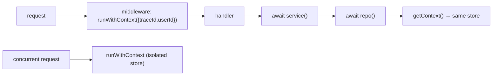

# AsyncLocalStorage Request Context — implementation

Per-request context propagation implementing the [design doc](../22-async-local-storage.md): Node's
**AsyncLocalStorage** carries `traceId`/`userId` implicitly through async call chains, with **no
cross-request bleed**.

## Stack

- **Node.js + TypeScript + Express** (uses built-in `node:async_hooks`)

## How it works



## Endpoints

| Method | Path | Purpose |
| --- | --- | --- |
| GET | `/api/health` | Liveness |
| GET | `/api/whoami` | Reads user/trace from context deep in an async chain (send `x-user-id`, `x-request-id`) |

## Design-doc mapping

- **Implicit context** → `runWithContext` binds a store for the request; `getContext` reads it across
  `await`s — no `ctx` argument threaded everywhere.
- **No cross-request bleed** → each request gets its own ALS store even as their async ops interleave (a
  shared global variable would be overwritten — the security bug this prevents).
- **Auto-correlated logging** → `log()` attaches the current `traceId` automatically.

## Run it

```bash
docker compose up --build          # http://localhost:3122
curl -H 'x-user-id: alice' -H 'x-request-id: t-123' localhost:3122/api/whoami
```

```bash
npm install && npm test            # 4 unit tests incl. the concurrent no-bleed guarantee
npm run typecheck
```

## Verification

- `npm test` proves context survives deep async chains AND that two concurrent `runWithContext` scopes do
  not leak into each other. `npm run typecheck` passes.
