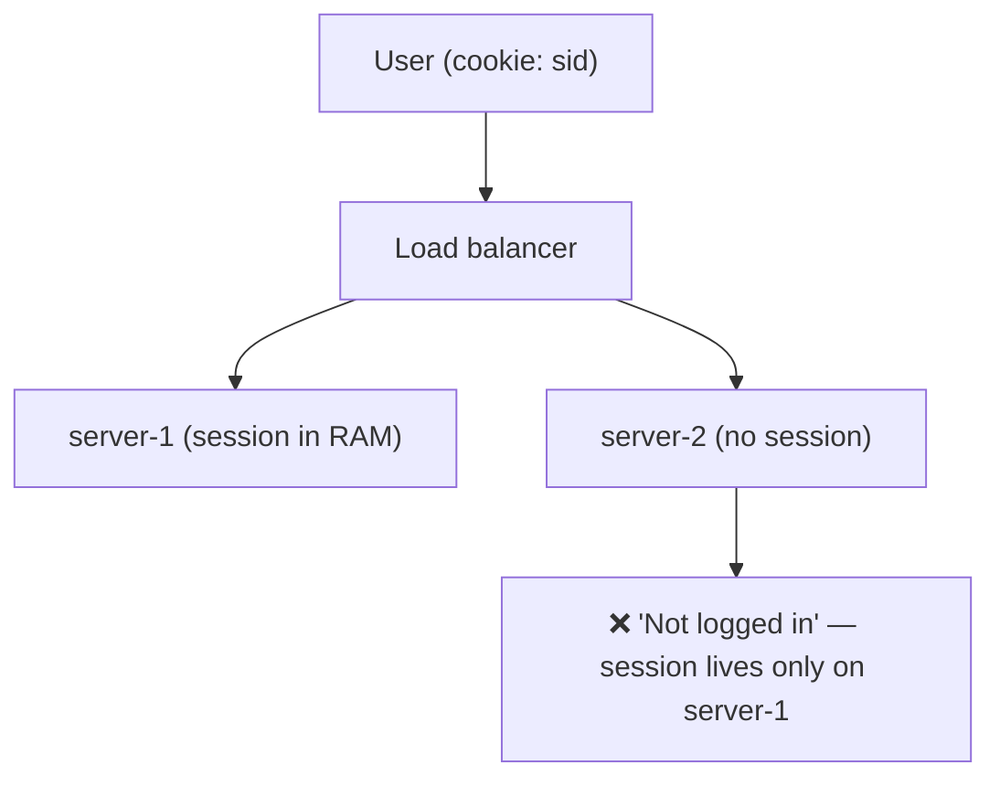
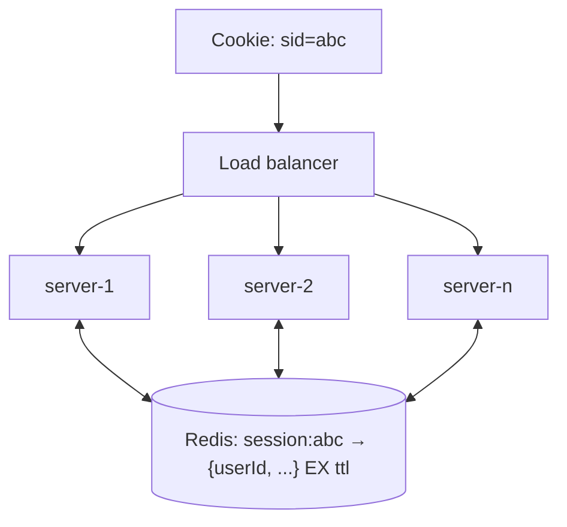
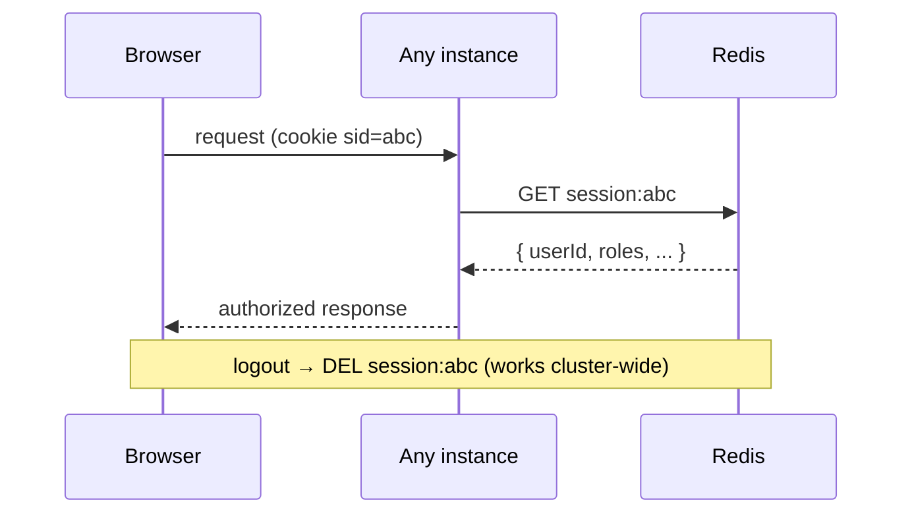

# 23. Distributed Session Store

> **In one line:** Keep users logged in across a horizontally-scaled server cluster by moving session
> state out of each process's memory into a shared store (Redis) — so any instance can serve any request
> — and understand when to prefer stateless tokens instead.

> **Original prompt:** Set up Express-session backed by Redis to keep users authenticated across a
> multi-instance server cluster.

## Overview

The default `express-session` keeps sessions in the Node process's **memory**. With one server, fine. Add
a second instance behind a load balancer and it breaks immediately: a user logs in on `server-1`
(session in its RAM), the next request lands on `server-2` (no such session) → logged out. This is the
**stateful-server-behind-a-load-balancer** problem. Two families of solutions: externalize the session to
a **shared store** (Redis), or make auth **stateless** (JWT) so there's no server-side session at all.

## Functional Requirements

- Sessions survive across all instances (any instance serves any request).
- Sessions survive individual instance restarts/crashes.
- Support logout / revocation and expiry (TTL).
- Reasonable read/write latency on every authenticated request.

## Non-Functional Requirements

| Property | Target |
|---|---|
| Statelessness of app tier | App instances hold no session state → freely scalable |
| Latency | Session lookup adds ≤ a few ms per request |
| Availability | Session store HA; instance loss doesn't log users out |
| Security | Session ids unguessable; revocation possible |

## The Problem: In-Memory Sessions + Multiple Instances



## Fix A — Sticky Sessions (a weak patch)

Configure the LB to pin a user to one instance (by cookie/IP). It "works" but:

- That instance is a SPOF for the user — it restarts → they're logged out.
- Breaks even load balancing and autoscaling (can't drain freely).
- Doesn't survive deploys. **Avoid as the primary solution.**

## Fix B — Shared Session Store (Redis) — the standard

Store sessions in Redis; the cookie holds only an opaque **session id**; any instance looks it up.



```js
import RedisStore from 'connect-redis';
app.use(session({
  store: new RedisStore({ client: redis }),
  secret: process.env.SESSION_SECRET,
  resave: false, saveUninitialized: false,
  cookie: { httpOnly: true, secure: true, sameSite: 'lax', maxAge: 30*60*1000 },
}));
```

- App instances become **stateless** → add/remove/restart freely.
- Redis TTL gives automatic expiry; deleting the key = instant **logout/revocation**.
- Redis is fast (sub-ms) and purpose-built for this ephemeral, high-churn data.



## Fix C — Stateless JWT (no server session)

Put the identity in a **signed token** the client carries; the server verifies the signature — no lookup.

| | Redis sessions (stateful) | JWT (stateless) |
|---|---|---|
| Server state | Shared store | None |
| Revocation | Easy (delete key) | Hard (valid until expiry) — needs a denylist/short TTL |
| Per-request cost | Redis lookup | Signature verify (no I/O) |
| Payload size | Cookie holds tiny id | Token carries claims (bigger) |
| Best for | Need revocation, server-side session data | Pure scalability, microservices, mobile |

The mature answer is often **both**: short-lived stateless access tokens + a **refresh token stored
server-side** (Redis/DB) that *is* revocable — combining stateless request handling with real logout.

## Security of Session IDs / Cookies

- Session id must be **cryptographically random** (unguessable) — session fixation/prediction is a classic
  attack.
- Cookie flags: `HttpOnly` (no JS access → mitigates XSS theft), `Secure` (HTTPS only), `SameSite`
  (CSRF mitigation).
- **Regenerate the session id on privilege change** (login) to prevent fixation.
- TTL + idle timeout; store minimal data server-side, referenced by the id.

## Scaling & Failure Scenarios

| Scenario | Response |
|---|---|
| Add/remove instances | Stateless app tier scales freely; sessions in Redis |
| Instance crash | No session loss — state is external; user keeps their session |
| Redis is a SPOF | Redis HA (Sentinel/Cluster/replicas); it's now the critical dependency |
| Redis failover blip | Brief lookup errors; short ret/backoff; consider read replicas |
| Mass logout / breach | Delete keys by pattern / bump a global token version |

## Performance

- One fast Redis `GET` per authenticated request (sub-ms); connection-pool to Redis.
- Keep session payloads small (ids/claims, not blobs); lazy-load heavy user data.
- JWT variant removes the lookup entirely at the cost of revocation complexity.

## Trade-offs & Pitfalls

- **In-memory sessions with >1 instance** → random logouts; externalize.
- **Sticky sessions as the fix** → SPOF per user, breaks autoscaling/deploys.
- **JWT without a revocation story** → can't truly log a user out until expiry; add refresh-token
  server state or a denylist.
- **Guessable session ids / missing cookie flags** → hijacking, XSS/CSRF exposure.
- **Storing large objects in the session** → Redis bloat and per-request bandwidth; store references.

## Interview Questions & Answers

- **Why do in-memory sessions break with multiple servers?** The session lives in one process's RAM; a
  request routed elsewhere doesn't find it → logged out.
- **How does a Redis session store fix it?** Sessions live in a shared store keyed by an opaque cookie id;
  any stateless instance can look them up.
- **Sticky sessions — good idea?** Only as a stopgap; it creates a per-user SPOF and breaks
  autoscaling/deploys.
- **Sessions vs JWT?** Redis sessions = easy revocation + server state, needs a lookup; JWT = stateless,
  no lookup, but hard to revoke. Often combine (stateless access token + revocable refresh token).
- **How do you secure the session id/cookie?** Cryptographically random id; `HttpOnly`/`Secure`/`SameSite`
  cookies; regenerate id on login; TTL.
- **Now Redis is a SPOF — how do you handle it?** Run it HA (Sentinel/Cluster/replicas) with retries.
