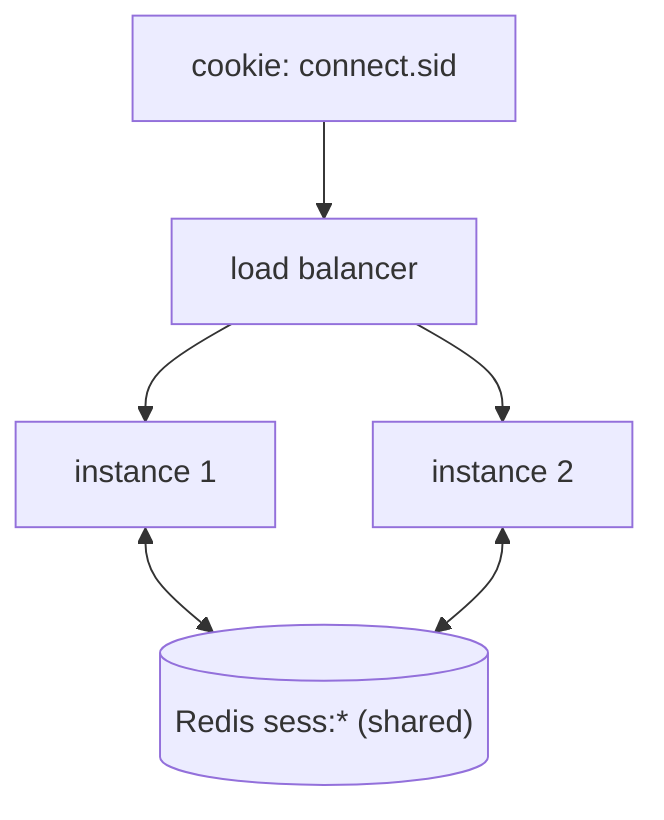

# Distributed Session Store — implementation

Keeps users logged in across a multi-instance cluster, implementing the
[design doc](../23-distributed-session-store.md): sessions live in **Redis** (via `connect-redis`) so the
app tier is **stateless** and any instance can serve any request.

## Stack

- **Node.js + TypeScript + Express** + `express-session`
- **Redis** session store (`connect-redis`)

## Architecture



## Endpoints

| Method | Path | Purpose |
| --- | --- | --- |
| GET | `/api/health` | Liveness + serving pid |
| POST | `/api/login` `{userId}` | Create session (regenerates id → anti-fixation) |
| GET | `/api/me` | Current user (works on any instance) |
| POST | `/api/logout` | Destroy session (cluster-wide) |

## Design-doc mapping

- **Shared store** → sessions in Redis keyed by the opaque cookie id; the app holds no session state →
  scale horizontally.
- **Revocation** → `req.session.destroy()` deletes the Redis key → logout works across all instances.
- **Cookie hardening** → `buildCookieOptions` sets HttpOnly always, Secure in production, SameSite=lax;
  `regenerate` on login prevents session fixation.

## Run it

```bash
docker compose up --build --scale app=3    # sessions survive across all 3 instances
```

```bash
npm install && npm test            # 3 unit tests (cookie hardening config)
npm run typecheck
```

## Verification

- `npm test` covers Secure-in-production, HttpOnly-always, SameSite, and maxAge. `npm run typecheck`
  passes. Cross-instance session persistence runs under `docker compose up --scale app=3`.
