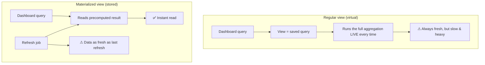
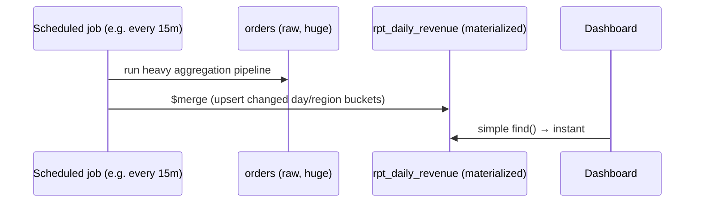

# 24. Database Views & Materialized Views

> **In one line:** Speed up heavy reporting dashboards by precomputing expensive aggregations into a
> **materialized view** (a stored, refreshable result) instead of re-running a giant `GROUP BY` on every
> page load — trading storage and freshness for read speed.

> **Original prompt:** Design and implement MongoDB materialized views to optimize heavy reporting
> dashboards.

## Overview

Dashboards run the same expensive analytical query — "revenue by region by day," joining/aggregating
millions of rows — over and over, on every refresh, for every viewer. Recomputing it live crushes the
database and makes dashboards slow. A **view** gives a clean named abstraction over that query; a
**materialized view** goes further and **stores the computed result**, so reads are instant and the heavy
work runs only on a schedule. The core trade-off is **freshness vs speed/cost**.

## Functional Requirements

- Expose complex aggregations (sums, counts, rollups over time/dimensions) to dashboards.
- Serve dashboard reads fast, regardless of raw data volume.
- Refresh the precomputed data on a schedule or incrementally.
- Keep raw/transactional data separate from the reporting representation.

## Non-Functional Requirements

| Property | Target |
|---|---|
| Read latency | Dashboard loads in ms, independent of raw row count |
| DB load | Heavy aggregation runs once per refresh, not per view |
| Freshness | Tunable (minutes/hours) per business tolerance |
| Isolation | Reporting queries don't contend with OLTP writes |

## View vs Materialized View



| | Regular view | Materialized view |
|---|---|---|
| Storage | None (virtual) | Stores results |
| Read cost | Full query each time | Cheap lookup |
| Freshness | Always live | As of last refresh |
| Best for | Simplify/secure queries; light aggregation | Heavy, repeated aggregations |

## MongoDB Specifics

- **`db.createView(name, source, pipeline)`** creates a **read-only, non-materialized** view — it's a
  saved aggregation pipeline that runs on every read. Good for abstraction/security, **not** for speeding
  up heavy queries.
- **Materialized views in MongoDB** are built with the aggregation pipeline's **`$merge`** (or legacy
  `$out`) as the final stage: run the heavy `$group`/`$lookup` pipeline and write results into a real
  collection. Re-run on a schedule to refresh; `$merge` can **incrementally upsert** changed buckets
  rather than rewriting everything.

```js
// materialize "daily revenue by region" into a real collection, refreshably
db.orders.aggregate([
  { $match: { status: "paid" } },
  { $group: { _id: { day: "$day", region: "$region" }, revenue: { $sum: "$totalCents" }, orders: { $sum: 1 } } },
  { $merge: { into: "rpt_daily_revenue", on: "_id", whenMatched: "replace", whenNotMatched: "insert" } }
]);
// dashboards read rpt_daily_revenue directly (indexed, tiny, instant)
```



## Refresh Strategies

| Strategy | How | Trade-off |
|---|---|---|
| **Full rebuild** | Recompute the whole result each run | Simple; expensive for large data |
| **Incremental** | Only reprocess new/changed partitions (e.g. today's data) via `$merge` upsert | Efficient; needs a change boundary (timestamp/day) |
| **On-write / streaming** | Update the MV as events arrive (CDC / change streams) | Freshest; most complex |
| **On-demand** | Refresh when a dashboard requests, cache the result | Good for rarely-viewed reports |

Choose by **freshness tolerance**: financial close might tolerate hourly; a "live ops" board might need
change-stream updates.

## Where This Fits (CQRS flavor)

Materialized views are a lightweight **read-model**: the write side stays normalized/transactional; the
read side is a denormalized, precomputed projection optimized for queries. This is the same idea as
fan-out-on-write feeds and read replicas — **precompute the read shape**.

## Scaling & Failure Scenarios

| Scenario | Response |
|---|---|
| Raw data grows huge | Incremental refresh over time partitions; index the MV on dashboard filters |
| Refresh job overlaps itself | Lock/serialize refresh; skip if previous still running |
| Reporting load hurts OLTP | Run aggregation against a **secondary/replica**, not the primary |
| Stale data complaints | Show "data as of <refresh time>"; tighten interval or go incremental |
| Refresh fails | MV keeps last good data; alert; retry — reads degrade to slightly staler, not broken |

## Security

- Views are also an **authorization tool**: expose a view with only permitted columns/rows instead of the
  raw table (column/row-level security).
- Ensure the MV doesn't materialize sensitive fields into a less-protected collection.
- Restrict who can trigger/modify refresh jobs.

## Performance

- Index the materialized collection on the dashboard's filter/sort keys — it's small, so indexes are cheap
  and reads are instant.
- Push heavy aggregation to a replica to isolate from writes.
- Incremental `$merge` avoids rewriting unchanged history each cycle.

## Trade-offs & Pitfalls

- **Regular view expecting speedup** → it re-runs the query live; only materialized views cache results.
- **Full rebuild on huge data every minute** → expensive; go incremental.
- **Serving stale MV without saying so** → user confusion; surface the "as of" timestamp.
- **Running reporting aggregations on the primary** → OLTP contention; use a replica.
- **Over-materializing** → many MVs to maintain; materialize only genuinely hot, expensive queries.

## Interview Questions & Answers

- **View vs materialized view?** A view is a saved query run live (always fresh, slow); a materialized
  view stores precomputed results (instant reads, as-fresh-as-last-refresh).
- **How do you make a materialized view in MongoDB?** Run the aggregation pipeline with a final `$merge`
  (or `$out`) into a real collection; refresh on a schedule.
- **How do you refresh efficiently?** Incrementally — `$merge`-upsert only changed partitions (e.g.
  today's buckets), not a full rebuild.
- **What's the core trade-off?** Read speed + lower DB load vs data freshness and extra storage.
- **How does this relate to CQRS?** It's a precomputed read-model separate from the transactional write
  model.
- **How do you avoid hurting production writes?** Run the aggregation against a replica and index the MV
  for dashboard queries.
