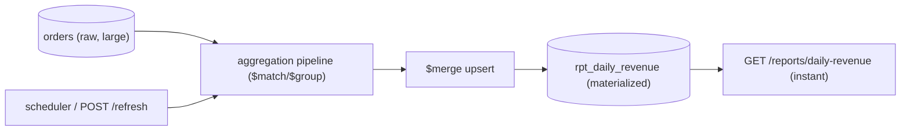

# Database Views (Materialized) — implementation

Materialized views for reporting, implementing the [design doc](../24-database-view-creation.md): a heavy
aggregation is **persisted into a collection via `$merge`** and refreshed on a schedule, so dashboards read
precomputed results instantly instead of re-running a giant `GROUP BY`.

## Stack

- **Node.js + TypeScript + Express**
- **MongoDB** — raw `orders`, materialized `rpt_daily_revenue`

## Architecture



## Endpoints

| Method | Path | Purpose |
| --- | --- | --- |
| POST | `/api/orders` `{day, region, totalCents, status}` | Seed raw orders |
| POST | `/api/refresh` | Rebuild the materialized view now |
| GET | `/api/reports/daily-revenue` | Read the precomputed view (fast) |
| GET | `/api/reports/daily-revenue/live` | Live aggregation (the expensive path, for comparison) |

## Design-doc mapping

- **Materialized view** → the pipeline's final `$merge` upserts results into `rpt_daily_revenue`.
- **Scheduled refresh** → a timer re-runs the aggregation (tunable freshness); also on-demand via
  `/refresh`.
- **Read speed vs freshness** → dashboards read the tiny precomputed collection; the live endpoint shows
  the costly alternative.

## Run it

```bash
docker compose up --build          # http://localhost:3124
```

```bash
npm install && npm test            # 3 unit tests (pipeline shape + pure aggregation logic)
npm run typecheck
```

## Verification

- `npm test` covers the pipeline ending in `$merge` and the pure daily-revenue aggregation (sums paid
  orders by day+region, ignores non-paid). `npm run typecheck` passes. `$merge` materialization runs
  against Mongo under `docker compose up`.
