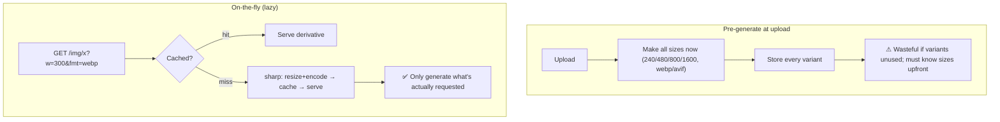
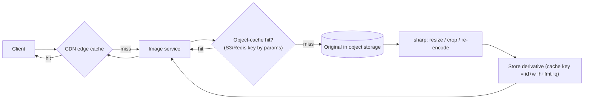

# 25. Image Optimization Pipeline

> **In one line:** Serve the right-sized, right-format image for every device on demand — intercept an
> image request, transform it with `sharp` (resize, re-encode to WebP/AVIF), and **cache the result** so
> the expensive processing happens once per variant, not per request.

> **Original prompt:** Build a system that intercepts image requests, processes them using `sharp`, and
> caches the resized assets.

## Overview

Uploading a 4 MB photo and shipping those original bytes to a phone that displays it at 300 px wastes
bandwidth, tanks page speed, and burns CDN cost. An image optimization pipeline generates **derivatives**
(thumbnails, responsive widths, modern formats) so each client gets an appropriately small image. The key
design decisions: **when** to transform (upload-time vs on-the-fly), and how to **cache** so CPU-heavy
processing isn't repeated. The winning pattern is **on-the-fly transform + aggressive multi-layer cache**.

## Functional Requirements

- Serve resized/cropped variants by request (`?w=300&format=webp`).
- Convert to efficient formats (WebP/AVIF) with quality control.
- Cache derivatives; regenerate only on cache miss.
- Preserve the original as the source of truth; derivatives are disposable.

## Non-Functional Requirements

| Property | Target |
|---|---|
| Cache-hit latency | Served from CDN/edge in ms (no processing) |
| Processing | Each unique variant generated **once**, then cached |
| Bandwidth | Deliver the smallest acceptable image per client |
| Safety | Untrusted image bytes processed in a sandbox |

## Two Strategies: Pre-generate vs On-the-fly



**On-the-fly** wins for flexibility (any width/format on demand) and avoids generating unused variants;
its risk (repeated CPU cost) is neutralized by caching. **Pre-generate** suits a small, fixed set of known
sizes.

## Architecture (on-the-fly + cache)



- **Cache key = a hash of all transform params** (`imageId + width + height + format + quality + fit`) so
  each unique variant is stored once and reused.
- **Layers:** CDN (edge, most hits) → derivative store (S3/Redis) → generate as last resort. Most requests
  never reach the service.
- Originals live in object storage; derivatives are regenerable, so they can expire/evict freely.

## Processing with sharp

`sharp` (libvips-backed) is fast and memory-efficient (streams, doesn't load the whole decoded bitmap
naively):

```js
const key = hash(`${id}:${w}:${h}:${fmt}:${q}:${fit}`);
let buf = await cache.get(key);
if (!buf) {
  const original = await storage.get(id);         // source of truth
  buf = await sharp(original)
    .rotate()                                       // honor EXIF orientation
    .resize(w, h, { fit: 'cover', withoutEnlargement: true })
    .toFormat(fmt, { quality: q })                  // webp/avif
    .toBuffer();
  await cache.set(key, buf);                         // store derivative
}
res.set('Cache-Control', 'public, max-age=31536000, immutable').type(fmt).send(buf);
```

## Format & Responsive Delivery

- **Content negotiation:** inspect the `Accept` header (or a client hint) → serve AVIF/WebP to browsers
  that support them, fall back to JPEG. Vary the cache on format.
- **Responsive images:** the frontend uses `srcset`/`sizes` to request the width it needs; the pipeline
  serves that width. Deliver DPR-aware variants for retina.
- **`Cache-Control: immutable` + content-hashed URLs** let browsers/CDN cache forever; a new image = a new
  URL (see cache invalidation, problem 26).

## Preventing Abuse & Cache Explosion

Arbitrary `?w=` values let an attacker request millions of unique sizes, exploding your cache and CPU
("cache-buster DoS"):

- **Whitelist allowed dimensions/formats** (e.g., a fixed set of widths) or clamp/round requested sizes.
- **Sign transform URLs** (HMAC) so only your app can request a given transform.
- Rate-limit the generation path; serve stale/placeholder under overload.

## Scaling & Failure Scenarios

| Scenario | Response |
|---|---|
| Viral image, huge traffic | CDN serves the cached variant; origin barely touched |
| Cold cache / new sizes | First request generates + caches; subsequent are hits |
| CPU spike from generation | Whitelist sizes; autoscale image workers; queue if needed |
| Cache-buster attack | Signed URLs / clamped dimensions kill unbounded variants |
| Derivative store loss | Regenerate from originals on demand (derivatives are disposable) |

## Security

- **Sandbox `sharp`/libvips** — image decoders are a rich CVE source (malicious files, decompression
  bombs); run in a constrained container, cap dimensions/pixels, set memory/time limits.
- Validate content-type and magic bytes; reject oversized/malformed inputs before processing.
- **Strip EXIF/GPS metadata** on output (privacy) while honoring orientation.
- Signed URLs prevent unauthorized/abusive transforms.

## Performance

- Cache-hit path never runs `sharp` — pure CDN/edge delivery.
- `sharp` streams and uses libvips for low memory + high throughput; prefer WebP/AVIF for big byte savings.
- Long, immutable cache lifetimes on content-hashed URLs maximize hit rates.

## Trade-offs & Pitfalls

- **Regenerating on every request** (no cache) → CPU meltdown; cache by param hash.
- **Serving originals to all clients** → wasted bandwidth and slow pages.
- **Unbounded arbitrary sizes** → cache/CPU explosion; whitelist or sign.
- **Processing untrusted images unsandboxed** → RCE/DoS via decoder exploits.
- **Forgetting EXIF orientation** → sideways images; forgetting to strip EXIF → privacy leak.

## Interview Questions & Answers

- **Pre-generate all sizes or on-the-fly?** On-the-fly + caching is more flexible and avoids unused
  variants; caching removes the repeated-CPU downside.
- **What's the cache key?** A hash of all transform params (id + width + height + format + quality + fit)
  so each variant is generated once.
- **Where does caching happen?** CDN edge (most hits) → derivative store (S3/Redis) → generate on miss.
- **How do you serve modern formats safely?** Content-negotiate via `Accept`, vary the cache, fall back to
  JPEG.
- **How do you stop a cache-buster attack?** Whitelist/clamp dimensions and sign transform URLs.
- **Why sandbox the processor?** Image decoders (libvips) have exploitable CVEs and decompression-bomb
  risks; constrain CPU/memory/pixels.
