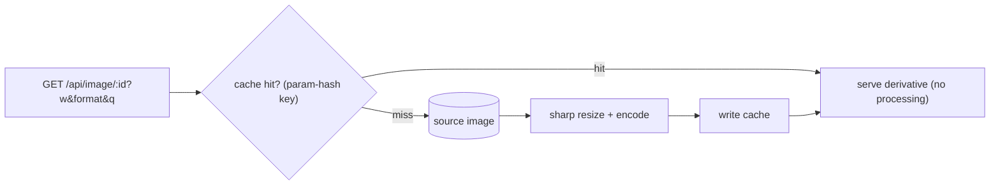

# Image Optimization Pipeline — implementation

On-the-fly image optimization implementing the [design doc](../25-image-optimization-pipeline.md):
**sharp** resizes + re-encodes (WebP/AVIF/JPEG) on demand, results are **cached by a transform-param
hash**, and a width **whitelist** prevents cache-buster abuse.

## Stack

- **Node.js + TypeScript + Express**
- **sharp** (libvips) for fast resize/encode
- Local `source/` + `cache/` dirs as an object-storage/CDN-cache stand-in

## Architecture



## Endpoints

| Method | Path | Purpose |
| --- | --- | --- |
| PUT | `/api/source/:id` (raw image bytes) | Upload a source image (validated) |
| GET | `/api/image/:id?w=&format=&q=&fit=` | Optimized delivery (cached; `x-cache: HIT/MISS`) |

## Design-doc mapping

- **On-the-fly + cache** → first request generates and caches by a **param hash**; repeats are pure
  cache hits with `immutable` cache headers.
- **Anti cache-buster** → `parseTransform` clamps width to a whitelist and validates format/quality, so
  an attacker can't explode the cache with infinite sizes.
- **Format negotiation** → WebP/AVIF/JPEG/PNG selectable; never upscales (`withoutEnlargement`).
- **Safety** → sharp validates uploads; run it in the container sandbox.

## Run it

```bash
docker compose up --build          # http://localhost:3125
curl -XPUT --data-binary @photo.jpg -H 'content-type: image/jpeg' localhost:3125/api/source/p1
curl 'localhost:3125/api/image/p1?w=400&format=webp' -o out.webp
```

```bash
npm install && npm test            # 4 unit tests (transform parsing + cache key) — no sharp needed
npm run typecheck
```

## Verification

- `npm test` covers width whitelisting, format/quality validation, and deterministic cache keys.
  `npm run typecheck` passes. Actual resizing/caching runs under `docker compose up` (sharp).
