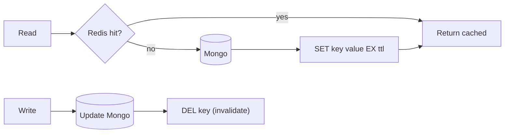
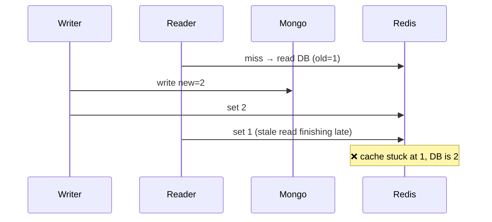
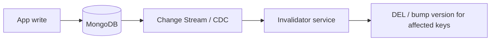

# 26. Cache Invalidation

> **In one line:** Keep a Redis cache consistent with the MongoDB source of truth — evict or update the
> right keys the moment a document changes — while navigating "one of the two hard things in computer
> science" and avoiding stale reads, thundering herds, and inconsistency.

> **Original prompt:** Create a system that automatically flushes specific Redis keys whenever a
> corresponding MongoDB document updates.

## Overview

Caching is easy; **invalidation** is the hard part. A cache trades freshness for speed, so the whole game
is deciding *when* the cached copy is no longer valid and getting rid of it — for the right keys, at the
right time, without a race that leaves stale data cached "forever." The naive "cache on read, forget to
evict on write" is the #1 source of "why is the app showing old data?" bugs.

## Functional Requirements

- Serve hot reads from Redis; fall back to Mongo on miss.
- When a document is created/updated/deleted, the corresponding cache entries become invalid.
- Handle keys derived from a document (the entity **and** any lists/aggregates that include it).
- Bound staleness (TTL as a safety net).

## Non-Functional Requirements

| Property | Target |
|---|---|
| Consistency | No indefinitely-stale reads; converge quickly after a write |
| Read latency | Cache-hit reads in ~1 ms |
| Write path | Invalidation adds minimal latency; never leaves cache ahead of truth |
| Resilience | Cache failure degrades to DB, not to wrong data |

## The Baseline: Cache-Aside (lazy)

Cache-aside is the default: read fills the cache on miss; **writes invalidate** (delete) the key so the
next read repopulates from truth. Deleting (not updating) the key avoids caching a value that another
concurrent write might have superseded.

## Invalidate vs Update, and the Ordering Race

**Update-the-cache** on write risks a classic race:

Safer rule: **write DB, then delete the cache key** ("write-then-invalidate"). The next read repopulates.
Even then, a rare read-repopulate can race a delete; mitigate with short TTLs and, for strictness,
techniques like delayed double-delete or versioned keys.

## Mapping Document Changes → Keys (the real work)

A document affects more than its own key. You must know the **dependency graph**:

- `product:{id}` (the entity)
- `products:category:{c}` (lists it appears in)
- `products:featured`, search results, aggregates/counts

Strategies to invalidate the right set:

| Strategy | How |
|---|---|
| **Direct key** | Deterministic key from id → `DEL product:{id}` |
| **Tag/group invalidation** | Track keys under a tag (`SADD tag:cat:5 <key>`); on change, delete all members |
| **Versioned/namespaced keys** | Bump a version (`cat:5:v` ++); keys embed the version → old keys become unreachable and expire (no scan) |
| **TTL as backstop** | Even with active invalidation, short TTLs cap worst-case staleness |

Versioned keys are elegant: you never hunt down individual keys — incrementing the namespace version
"invalidates" a whole group instantly, and stale keys evict on TTL.

## Automatic Invalidation: change-driven

To make invalidation *automatic* (the prompt's ask), drive it from the write itself:

- **MongoDB Change Streams** (or CDC via the oplog) emit document changes; an invalidator subscribes and
  evicts the mapped keys — decoupled from application write code, so no path can "forget" to invalidate.
- Or invalidate inline in the write path (simpler, but every writer must remember). Change-stream-driven
  is more robust across many services.

## Cache Failure Modes to Design Against

- **Thundering herd / stampede:** a hot key expires and thousands of requests hit the DB at once. Fix:
  per-key **lock/single-flight** (one request repopulates, others wait), or **stale-while-revalidate**
  (serve slightly stale while one refreshes).
- **Cache penetration:** requests for keys that don't exist bypass the cache to the DB every time. Fix:
  cache negative results (short TTL) or a Bloom filter of existing ids.
- **Hot key:** one key so popular it overloads a shard. Fix: client-side/local cache, replicate.

## Scaling & Failure Scenarios

| Scenario | Response |
|---|---|
| Write forgets to invalidate | Change-stream-driven invalidation removes reliance on app discipline; TTL backstops |
| Stampede on expiry | Single-flight lock or stale-while-revalidate |
| Fan-out invalidation (many derived keys) | Tag groups or versioned namespaces (O(1) group invalidation) |
| Redis down | Degrade to DB reads (slower, correct) — never serve wrong data |
| Multi-region caches | Propagate invalidations via pub/sub; accept brief regional staleness |

## Security

- Cache authorization-scoped data carefully — don't serve one user's cached private data to another (key
  by user/tenant where relevant).
- Invalidate on permission changes too (a revoked-access read shouldn't hit a stale allowed cache).
- Negative-cache carefully to avoid leaking existence via timing.

## Performance

- Cache-hit reads are ~1 ms; invalidation is a delete/version-bump (cheap).
- Versioned/tag invalidation avoids `KEYS`/`SCAN` (O(keyspace)) — never scan to find keys to evict.
- TTLs bound staleness and cap memory without active eviction everywhere.

## Trade-offs & Pitfalls

- **Caching on read, not evicting on write** → indefinite stale reads (the classic bug).
- **Updating the cache instead of deleting** → the ordering race can pin stale values; prefer
  write-then-invalidate.
- **Using `KEYS`/`SCAN` to find keys to evict** → O(keyspace) stalls; use tags/versioned namespaces.
- **No TTL backstop** → a missed invalidation is stale forever.
- **No stampede protection** → hot-key expiry DoSes the DB.

## Interview Questions & Answers

- **Why is cache invalidation hard?** You must evict exactly the right keys at the right time; miss one
  and reads go stale, or race the write and pin stale data.
- **Update or delete the cache on write?** Prefer delete (write-then-invalidate) — updating races
  concurrent repopulation and can cache stale values.
- **How do you invalidate all keys derived from a document?** Tag groups or versioned/namespaced keys
  (bump a version → whole group invalid), avoiding key scans.
- **How do you make invalidation automatic?** Drive it from MongoDB Change Streams/CDC into an invalidator
  service, so no write path can forget.
- **How do you handle a hot key expiring under load?** Single-flight lock or stale-while-revalidate to
  prevent a stampede.
- **What if Redis is down?** Fall back to the DB (slower but correct); never serve wrong data.
