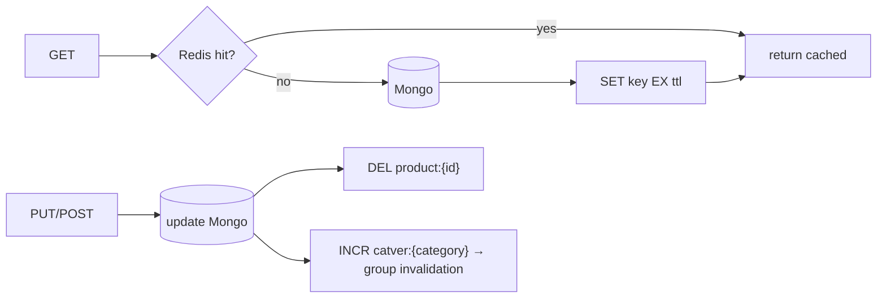

# Cache Invalidation — implementation

Cache-aside with correct invalidation, implementing the [design doc](../26-cache-invalidation.md):
**write-then-invalidate** on entity keys, **versioned/namespaced keys** for O(1) group invalidation, and a
**TTL backstop**.

## Stack

- **Node.js + TypeScript + Express**
- **Redis** cache, **MongoDB** source of truth

## Architecture



## Endpoints

| Method | Path | Purpose |
| --- | --- | --- |
| GET | `/api/products/:id` | Cache-aside read (`source: cache\|db`) |
| POST | `/api/products` | Create → bump category version |
| PUT | `/api/products/:id` | Update → **delete** entity key + bump category version |
| GET | `/api/categories/:category/products` | List via a **versioned** key |

## Design-doc mapping

- **Write-then-invalidate** → on update we **delete** the entity key (not overwrite) to avoid the
  stale-repopulate race; next read refills from truth.
- **Group invalidation** → list keys embed `catver:{category}`; `INCR` on it instantly invalidates every
  list for that category (old keys become unreachable and expire) — no `KEYS`/`SCAN`.
- **TTL backstop** → every cached entry has a TTL so a missed invalidation is never stale forever.
- **CDC alternative** → in a replica set, MongoDB Change Streams could drive invalidation automatically;
  here we invalidate inline (works on a standalone Mongo).

## Run it

```bash
docker compose up --build          # http://localhost:3126
```

```bash
npm install && npm test            # 3 unit tests (key builders + versioned invalidation)
npm run typecheck
```

## Verification

- `npm test` covers entity/version/list key construction and version-bump invalidation. `npm run
  typecheck` passes. Cache-aside + invalidation run against Redis + Mongo under `docker compose up`.
