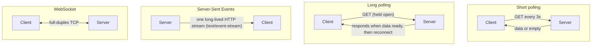
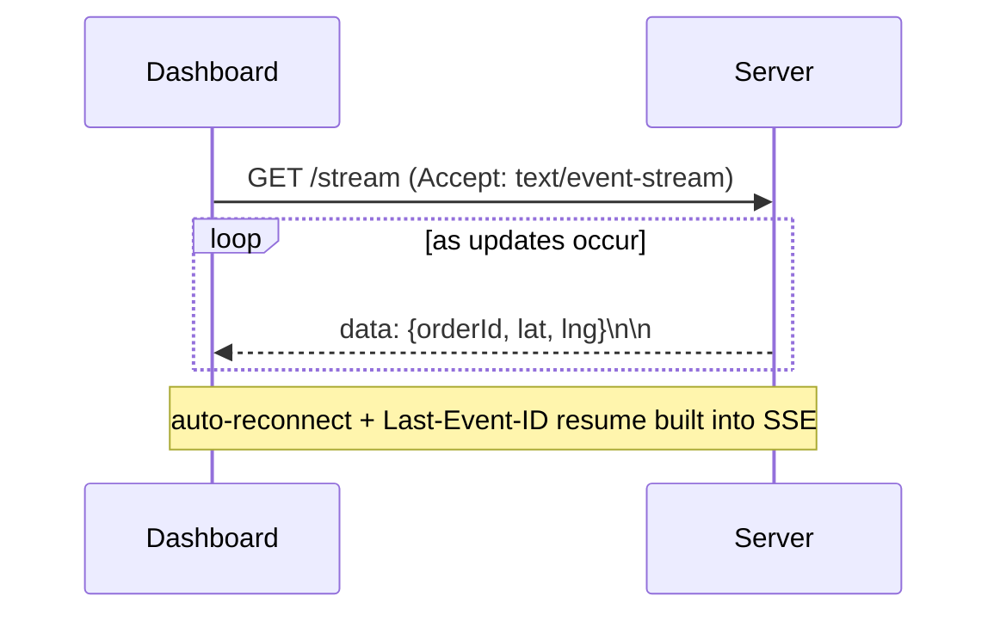
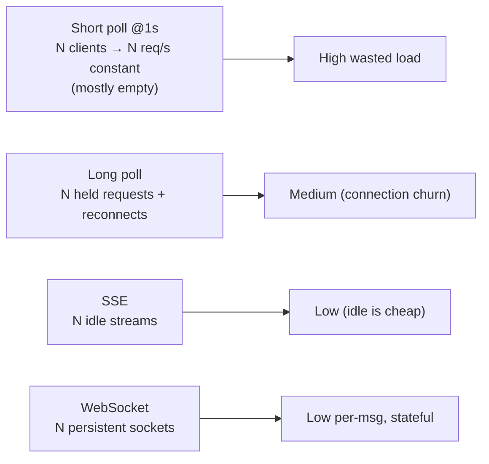

# 27. Polling vs WebSockets (Real-Time Delivery)

> **In one line:** Choose the right real-time transport for a live delivery-tracking dashboard —
> short polling, long polling, Server-Sent Events, or WebSockets — by weighing latency, server cost, and
> connection overhead against how "live" the data truly needs to be.

> **Original prompt:** Contrast the performance footprint of short/long polling vs WebSockets for a live
> delivery-tracking dashboard.

## Overview

"Real-time" is a spectrum, not a switch. Before reaching for WebSockets, the engineer's job is to match
the transport to the requirement: how fresh must the data be, how many concurrent clients, one-way or
two-way, and what's the server cost of each model? A delivery-tracking map updating every few seconds has
very different needs from a trading terminal. This problem is about **transport trade-offs**.

## Functional Requirements

- Push driver-location / order-status updates to a dashboard as they change.
- Support many concurrent viewers.
- Mostly **server → client** (the dashboard rarely sends data up).
- Degrade gracefully on flaky networks and proxies.

## Non-Functional Requirements

| Property | Target |
|---|---|
| Freshness | Updates visible within ~1–5 s (tracking), tighter if required |
| Server cost | Minimize wasted requests / idle connections |
| Scale | Thousands–millions of concurrent dashboards |
| Robustness | Reconnect, resume, work through proxies/firewalls |

## The Four Transports

| Transport | Direction | Connection | Latency | Server cost | Best for |
|---|---|---|---|---|---|
| **Short polling** | req/resp | new request each interval | up to interval | wasteful (many empty polls) | simple, low-freshness, low scale |
| **Long polling** | req/resp (held) | reconnect after each message | near real-time | holds a request per client | real-time-ish without WS; broad compatibility |
| **SSE** | server→client only | one long-lived HTTP stream | real-time | one connection/client, cheap | one-way live feeds (dashboards, notifications) |
| **WebSocket** | full-duplex | one persistent TCP | real-time | one connection/client, stateful | two-way, high-frequency (chat, games) |

## Short vs Long Polling

- **Short polling** = ask on a timer. Simple and stateless, but the freshness/cost trade-off is brutal:
  poll every second for updates that arrive every minute → 59 wasted round trips, and updates still lag up
  to the interval. Fine for tiny scale or "good enough" freshness.
- **Long polling** = the server **holds** the request open until data is available (or a timeout), then
  the client immediately reconnects. Near-real-time and works everywhere HTTP does, but each client ties
  up a request/connection and there's reconnect overhead per message.

## SSE vs WebSocket (the real choice for a dashboard)

A tracking dashboard is **overwhelmingly one-way** (server pushes locations; client rarely talks back).
That's exactly SSE's sweet spot:

- **SSE:** one long-lived HTTP response streaming events; built-in auto-reconnect and `Last-Event-ID`
  resume; runs over plain HTTP/2 (no special protocol upgrade); simpler to operate. Limitation: one-way
  and (over HTTP/1.1) subject to per-domain connection limits — mostly moot over HTTP/2.
- **WebSocket:** full-duplex, lower per-message overhead, needed when the client also sends frequent data
  (chat, collaborative editing, games). More operational complexity (stateful, sticky, backplane for
  fan-out — see problem 01).

**For this dashboard: SSE is the right default** — real-time, cheap, simple, one-way. Reach for WebSocket
only if the dashboard needs frequent client→server messaging.

## Cost / Footprint Comparison

Persistent connections (SSE/WS) cost little when idle and avoid the request-churn tax; polling pays per
request whether or not there's data.

## Scaling & Failure Scenarios

| Scenario | Response |
|---|---|
| Millions of dashboards | SSE/WS both need many concurrent connections → horizontal nodes + LB (like problem 01) |
| Fan-out to all viewers | Pub/sub backplane (Redis) so any node can push to its connected clients |
| Flaky networks | SSE auto-reconnect + `Last-Event-ID`; WS needs manual reconnect/backoff + resume cursor |
| Corporate proxies block WS | SSE (plain HTTP) or long-polling fallback |
| Idle connection limits | HTTP/2 multiplexing for SSE; tune OS FD limits for WS |

## Security

- Authenticate the stream (token on connect); authorize which orders a dashboard may see.
- WSS/HTTPS everywhere; rate-limit connection attempts.
- Don't leak other customers' delivery locations — scope events to the authorized set.

## Performance

- Prefer persistent connections (SSE/WS) over polling to eliminate wasted requests.
- Batch/coalesce rapid updates (send the latest location, not every GPS tick) to cut message volume.
- Compress and keep payloads small; push deltas, not full snapshots.

## Trade-offs & Pitfalls

- **Short polling for real-time** → wasteful and laggy; only for trivial cases.
- **WebSockets by reflex** → operational overhead (stateful, sticky, backplane) you may not need for
  one-way data; SSE is often simpler and sufficient.
- **Ignoring proxies/firewalls** → WS can be blocked; have an SSE/long-poll fallback.
- **No reconnect/resume** → clients silently miss updates after a blip; use `Last-Event-ID`/cursors.
- **Sending every raw update** → floods clients; coalesce.

## Interview Questions & Answers

- **Short vs long polling?** Short = poll on a timer (wasteful, laggy); long = server holds the request
  until data, then client reconnects (near real-time, connection churn).
- **SSE vs WebSocket?** SSE = one-way server→client stream over HTTP, auto-reconnect, simple; WebSocket =
  full-duplex, needed for frequent client→server messaging, more complex.
- **Which for a tracking dashboard, and why?** SSE — data flows server→client, so you get real-time
  updates cheaply without WebSocket's operational overhead.
- **When would you switch to WebSockets?** When the client must send frequent messages too (chat,
  collaboration, gaming).
- **How do you scale persistent connections?** Many stateful nodes behind an LB + a pub/sub backplane to
  fan out updates.
- **How do clients recover missed events?** SSE `Last-Event-ID` resume (or a cursor for WS).
